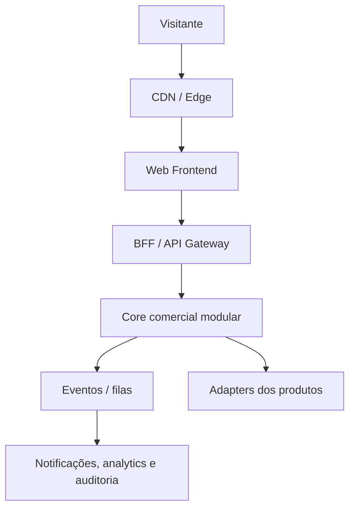
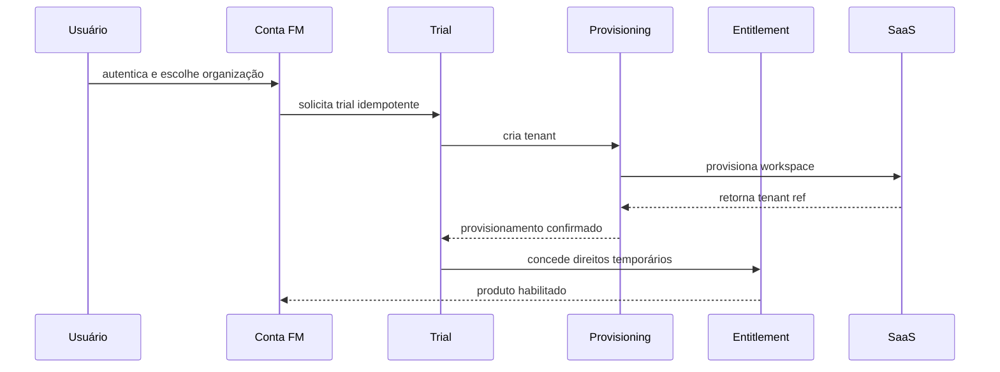

# SITE COMERCIAL FM TECNOLOGIA

## FASE 0 — INVENTÁRIO E READINESS

**Documento mestre de diagnóstico, decisões e liberação de execução** 
**Versão:** 1.2 
**Data:** 08 de setembro de 2026 
**Status:** FASE 0 ATUALIZADA — NO-GO PARA PROGRAMAÇÃO 
**Repositório auditado:** `faabio3131/fm-tecnologia-web-platform` 
**Autoridade documental:** hierarquia formal definida na seção 1.4

---

## 0. Sumário executivo

O projeto não deve ser tratado como um site institucional. A arquitetura oficial determina a construção progressiva de uma **FM Technology Commerce Platform**, composta por experiência corporativa, marketplace de produtos, demonstrações, aquisição, Conta FM, trial, onboarding, provisionamento, billing, entitlement, CRM, analytics, suporte e governança.

O desenho conceitual é sólido e coerente com a ambição de suportar dezenas de produtos. A separação entre identidade central, domínio comercial e dados operacionais dos SaaS está explicitamente protegida. A arquitetura também autoriza começar com um monólito modular, desde que contratos e limites de domínio estejam claros.

Entretanto, o estado atual **não está pronto para programação definitiva**. Após a auditoria, foram oficialmente fechadas a nomenclatura canônica de Kordena e a identidade visual da FM Tecnologia. Permanecem ausentes os dossiês completos dos produtos, preços, políticas comerciais, domínios, documentos legais, contratos de provisionamento e integrações detalhadas. O pacote de identidade e assets foi produzido, mas sua incorporação ao repositório oficial ainda é uma ação operacional pendente.

O portfólio inicial conhecido passa a registrar seis produtos/tecnologias: **Kordena, Iron Fit, Vendedor IA, CampaIA, Super Core Extreme e ERP Core**. **Kordena é o nome canônico oficial**; “Coordena” é nomenclatura antiga/erro documental e não deve ser usada como marca ativa. A identificação formal desses seis itens revoga, para eles, o placeholder “A IDENTIFICAR”, mas não comprova automaticamente disponibilidade comercial, trial, pricing, certificação ou homologação.

**Decisão de readiness:**

- **FASE 0 documental:** concluída por este inventário.
- **Readiness para iniciar código definitivo:** **NO-GO**.
- **Próximo bloco recomendado:** completar os dossiês dos seis itens identificados, certificar Kordena e Iron Fit, incorporar os assets finais ao repositório oficial e fechar as decisões P0 ainda abertas.
- **Primeiro bloco de programação após o GO:** fundação do repositório, contratos arquiteturais e Design System FM — sem implementar trial, billing ou integrações operacionais antes dos respectivos contratos.

---

## 1. Escopo, fontes e método

### 1.1 Fontes efetivamente encontradas

| ID | Fonte | Estado | Autoridade no diagnóstico |
|---|---|---:|---|
| FONTE-01 | `01 - ARQUITETURA MESTRE - SITE COMERCIAL FM TECNOLOGIA.pdf`, versão 1.0, setembro de 2026 | Lida integralmente, 7 páginas | Nível 2 — Arquitetura Mestre |
| FONTE-02 | Pasta “07 — ARQUITETURA DO SITE COMERCIAL FM TECNOLOGIA” | Inventariada; contém somente FONTE-01 | Contêiner documental da FONTE-01 |
| FONTE-03 | Repositório `faabio3131/fm-tecnologia-web-platform`, branch `main` | Apenas `.gitignore` e `README.md` | Evidência do estado técnico atual |
| FONTE-04 | README do repositório | Confirma o propósito da plataforma | Evidência suplementar, consistente com FONTE-01 |
| FONTE-05 | Documentação oficial do Next.js, NestJS, PostgreSQL e OpenID Connect | Consulta de viabilidade da stack | Suporte somente à recomendação técnica; não altera a arquitetura oficial |
| FONTE-06 | Decisões executivas expressas do Diretor após a auditoria, registradas em 08/09/2026 | Incorporadas nas versões 1.1 e 1.2 | Nível 1 — autoridade superior para as decisões expressamente fechadas |

### 1.2 Legenda de classificação

- **[FATO]** Informação declarada em fonte oficial ou observada diretamente no repositório/pasta.
- **[INFERÊNCIA]** Interpretação coerente com os fatos, mas ainda não formalmente aprovada.
- **[PENDENTE]** Decisão, dado, contrato ou asset necessário que não foi encontrado.
- **[RECOMENDAÇÃO]** Proposta deste inventário para fechar lacunas sem alterar silenciosamente a arquitetura.
- **[DECISÃO OFICIAL]** Deliberação fechada após a auditoria e incorporada ao baseline documental.

### 1.3 Limites respeitados

- Nenhum código foi criado ou alterado.
- Nenhuma decisão de produto, preço, domínio, trial ou provedor foi inventada; somente as decisões oficiais de nomenclatura e branding recebidas após a auditoria foram incorporadas.
- Nenhuma arquitetura oficial foi substituída.
- Somente os seis produtos/tecnologias expressamente identificados pela decisão executiva foram incorporados ao portfólio; nenhum outro nome foi criado.
- O GitHub foi usado em modo de auditoria e documentação; o estado vazio do repositório foi preservado.

### 1.4 Hierarquia de autoridade documental

| Nível | Fonte | Papel e regra de prevalência |
|---:|---|---|
| 1 | Decisões executivas expressas do Diretor | Autoridade superior; prevalece quando fecha ou revisa uma decisão |
| 2 | `01 - ARQUITETURA MESTRE - SITE COMERCIAL FM TECNOLOGIA.pdf` | Arquitetura-mãe oficial, subordinada apenas às decisões executivas expressas |
| 3 | `docs/FASE_0_INVENTARIO_E_READINESS.md` | Consolidação executiva e diagnóstico vigente; fonte de verdade documental desta fase |
| 4 | `docs/baseline-executivo/**` | Tradução estruturada/executável das decisões aprovadas, sem autoridade para contradizer os níveis superiores |

**Regra de reconciliação:** em caso de divergência entre o Baseline Executivo e este documento mestre da Fase 0, a divergência deve ser reconciliada antes de qualquer programação. Não podem existir duas fontes independentes de verdade.

---

# A) ESTADO ATUAL

## 2. Estado documental, técnico e comercial

### 2.1 Diagnóstico por dimensão

| Dimensão | Estado observado | Readiness | Evidência / impacto |
|---|---|---:|---|
| Arquitetura conceitual | Existe e cobre 15 camadas, jornadas, serviços, eventos e roadmap | Parcialmente pronta | Boa direção, ainda sem contratos detalhados |
| Inventário de produtos | Portfólio inicial de seis produtos/tecnologias formalmente identificado | Resolvido para identificação | Dossiês, owners e evidências comerciais continuam pendentes |
| Posicionamento dos produtos | Classificação executiva inicial definida; público e proposta de valor ainda não documentados por produto | Parcialmente pronto | Permite organização editorial, mas não claims comerciais completos |
| Estágio comercial | Desenvolvimento/P&D definido para quatro itens; Kordena e Iron Fit informados como prontos, sujeitos a certificação | Parcialmente pronto | “Pronto” não equivale a homologado, certificado, vendável ou elegível a trial |
| Arquitetura da informação | Organização Home/Marketplace aprovada; taxonomia detalhada, slugs e conteúdo ainda pendentes | Parcialmente pronta | Três grupos executivos definidos; rotas e content model ainda precisam de aprovação |
| Marca e Design System | Identidade oficial aprovada | Resolvido | Connected Modular refinado v1.0, Brand Baseline v1.0, paleta, tipografia, tokens e versões dark/light aprovados |
| Assets | Pacote de assets produzido | Parcialmente pronto | Assets finais precisam ser incorporados ao repositório oficial e inventariados por manifest |
| Domínio e subdomínios | Modelo conceitual definido; nomes finais ausentes | Bloqueado | A própria arquitetura exige decisão antes da implementação |
| Trial e onboarding | Jornada e capacidades conceituais definidas | Bloqueado | Políticas, elegibilidade, estados e adapters não definidos por produto |
| Identidade / Conta FM | Modelo conceitual definido | Bloqueado | IdP, login, recuperação, MFA e federação não decididos |
| Billing | Limites arquiteturais definidos | Bloqueado | Provedor, moeda, impostos, cobrança e catálogo pendentes |
| Entitlement | Separação e entidades conceituais definidas | Bloqueado | Contrato técnico por produto inexistente |
| Provisionamento | Necessidade e evento `TenantProvisioned` definidos | Bloqueado | Nenhum adapter, SLA, idempotency key ou rollback documentado |
| Legal e LGPD | Lista de documentos e princípios definida | Bloqueado | Textos, DPO/canal, consentimentos e política de cookies ausentes |
| CRM e automação | Requisitos conceituais definidos | Pendente | Ferramentas, owner, funil, cadências e consentimentos pendentes |
| Analytics | Métricas conceituais definidas | Pendente | Taxonomia de eventos, ferramenta e consent mode ausentes |
| Suporte | Help Center e Support Adapter previstos | Bloqueado | Canal, SLA, ownership e fluxo de escalonamento ausentes |
| Repositório | Criado, branch `main`, sem implementação | Pronto para receber baseline | Apenas README e `.gitignore`; nenhum legado a preservar |
| CI/CD e ambientes | Exigidos pela arquitetura | Ausentes | Dev/staging/prod, previews, gates e rollback ainda não configurados |

### 2.2 O que já está decidido oficialmente

1. **[FATO]** A plataforma será a porta comercial do ecossistema FM Tecnologia, não apenas presença institucional.
2. **[FATO]** Deve suportar autosserviço e vendas consultivas/Enterprise.
3. **[FATO]** Deve escalar para dezenas de produtos sem redesenho estrutural.
4. **[FATO]** O produto precisa aparecer por catálogo e por solução/segmento.
5. **[FATO]** A Conta FM será uma identidade central capaz de acessar vários produtos.
6. **[FATO]** Identidade, billing, trial e entitlement não podem ser misturados às bases operacionais dos SaaS.
7. **[FATO]** O site não terá acesso direto irrestrito às bases dos produtos.
8. **[FATO]** O frontend comercial será protegido por BFF/API Gateway.
9. **[FATO]** O provedor de pagamentos ficará atrás de uma camada de integração.
10. **[FATO]** Conteúdo comercial não controla permissões; entitlement é regra separada.
11. **[FATO]** O CMS não controla billing ou entitlement.
12. **[FATO]** O início pode usar monólito modular, desde que contratos e limites sejam explícitos.
13. **[FATO]** Operações financeiras devem ser idempotentes e auditáveis.
14. **[FATO]** A identidade deve suportar MFA, especialmente para administradores e Enterprise.
15. **[FATO]** O site público deve continuar disponível em falhas parciais de serviços internos.
16. **[FATO]** A experiência deve ser premium, limpa, tecnológica, humana, rápida e confiável, sem estética genérica de template de IA.
17. **[FATO]** Não podem ser publicados números, clientes, credenciais ou certificações inventadas.
18. **[FATO]** Antes do código definitivo devem ser confirmados domínio, produtos, status comercial, público, trial, preços, identidade, assets, legal, suporte, stack/hosting e integração com os produtos.
19. **[DECISÃO OFICIAL]** Kordena é o nome canônico; “Coordena” é nomenclatura antiga/erro documental.
20. **[DECISÃO OFICIAL]** A identidade visual oficial foi aprovada: símbolo Connected Modular refinado v1.0, Brand Baseline v1.0, paleta, tipografia, tokens e versões dark/light.
21. **[DECISÃO OFICIAL]** O pacote de assets foi produzido e deve ser incorporado ao repositório oficial.
22. **[DECISÃO OFICIAL]** O portfólio inicial conhecido é composto por Kordena, Iron Fit, Vendedor IA, CampaIA, Super Core Extreme e ERP Core.
23. **[DECISÃO OFICIAL]** Kordena e Iron Fit são os produtos principais e terão página pública e destaque na Home/Marketplace; sua disponibilidade comercial final depende de certificação/evidência específica.
24. **[DECISÃO OFICIAL]** Vendedor IA, CampaIA e ERP Core estão em desenvolvimento, terão página pública e devem aparecer explicitamente como “Em desenvolvimento”, sem disponibilidade comercial.
25. **[DECISÃO OFICIAL]** Super Core Extreme é tecnologia/plataforma estratégica em Pesquisa & Desenvolvimento, terá página pública e posicionamento próprio de Tecnologia/P&D, sem ser apresentado como SaaS comercial disponível.
26. **[DECISÃO OFICIAL]** Existência no portfólio, lifecycle, visibilidade no website, prontidão técnica, certificação, disponibilidade comercial, trial, pricing e ambiente de produção/homologação são estados independentes.
27. **[DECISÃO OFICIAL]** A Home/Marketplace será organizada em Produtos Principais, O que estamos construindo e Tecnologia & P&D.
28. **[DECISÃO OFICIAL]** A hierarquia de autoridade documental da seção 1.4 está aprovada.

### 2.3 O que ainda não está decidido

O projeto possui arquitetura de intenção, identidade visual e portfólio inicial aprovados, mas ainda não possui o **baseline executável completo**. Estão ausentes dossiês completos, evidências de certificação/comercialização, políticas de trial e pricing, contratos de domínio e integração; os assets finais ainda precisam entrar no repositório oficial. O risco maior não é técnico: é converter indevidamente “produto identificado” ou “produto pronto” em disponibilidade comercial sem evidência.

---

# B) INVENTÁRIO CONSOLIDADO

## 3. Inventário da arquitetura oficial

### 3.1 As 15 camadas canônicas

| # | Camada oficial | Responsabilidade | Estado de especificação |
|---:|---|---|---|
| 1 | Corporate Experience | Marca, Home, empresa, confiança e entrada dos funis | Macro definida; conteúdo e design pendentes |
| 2 | Product Marketplace | Catálogo escalável e navegação por categorias | Macro definida; taxonomia e catálogo pendentes |
| 3 | Product Experience / Demos | Páginas, screenshots, vídeos, tours e demos | Estrutura definida; assets ausentes |
| 4 | Trial & Conversion Engine | Elegibilidade, período, limites, expiração, conversão e grace period | Conceitual; políticas por produto ausentes |
| 5 | FM Identity / Account | Usuário, organização, memberships, papéis, segurança e acesso multiproduto | Conceitual; IdP e fluxos detalhados ausentes |
| 6 | Onboarding | Configuração orientada à ativação por produto | Conceitual; definições por produto ausentes |
| 7 | Billing & Subscription | Catálogo financeiro, assinatura, invoices, ciclos e webhooks | Conceitual; provedor e regras fiscais pendentes |
| 8 | CRM / Sales | Lead, origem, campanha, estágio, owner e Enterprise | Conceitual; ferramenta/processo pendentes |
| 9 | Marketing Automation | Mensagens e campanhas orientadas a eventos | Conceitual; canais e consentimentos pendentes |
| 10 | Analytics / Product Telemetry | Web, funil comercial e ativação de produto | Métricas macro definidas; eventos/ferramenta pendentes |
| 11 | Support / Help Center | Autoatendimento, suporte e roteamento | Previsto; operação pendente |
| 12 | Trust, Security & Legal | Segurança, confiança, LGPD, termos e políticas | Requisitos definidos; evidências/textos pendentes |
| 13 | Integration / API Layer | BFF, adapters, webhooks, retries, DLQ e observabilidade | Princípios definidos; contratos pendentes |
| 14 | Administration / CMS | Conteúdo, catálogo, trial policies, leads, flags e auditoria | Escopo definido; RBAC/UX/ferramenta pendentes |
| 15 | Observability & Operations | Logs, métricas, traces, uptime, alertas e saúde comercial | Requisitos definidos; implementação pendente |

### 3.2 Topologia lógica oficial

O “core comercial modular” representa Identity, Organization, Catalog, Trial, Entitlement, Billing, Onboarding e CRM Adapter. Essa simplificação visual não elimina os limites oficiais entre os domínios.

### 3.3 Serviços lógicos inventariados

- Web Frontend.
- BFF/API Gateway.
- Identity Service.
- Organization Service.
- Product Catalog.
- Trial Service.
- Entitlement Service.
- Billing Service.
- Onboarding Service.
- Lead/CRM Adapter.
- Notification Service.
- CMS.
- Analytics/Event Collector.
- Media Service.
- Support Adapter.
- Admin Portal.
- Audit/Observability.

### 3.4 Eventos oficiais recomendados

- `LeadCreated`
- `AccountCreated`
- `OrganizationCreated`
- `TrialStarted`
- `TenantProvisioned`
- `OnboardingStepCompleted`
- `ActivationReached`
- `TrialExpiring`
- `SubscriptionCreated`
- `PaymentConfirmed`
- `SubscriptionCanceled`
- `ProductEnabled`
- `ProductDisabled`

**[PENDENTE]** Para serem implementáveis, esses eventos ainda precisam de versão, owner, schema, campos obrigatórios, dados pessoais permitidos, idempotency key, ordering, retenção, consumidor, política de retry e compatibilidade retroativa.

### 3.5 Modelo conceitual oficial

| Relação | Significado |
|---|---|
| User → Membership → Organization | Pessoa pode participar de uma ou mais organizações com papéis específicos |
| Organization → Trial/Subscription | Trials e assinaturas pertencem à organização, não somente ao usuário |
| Trial/Subscription → Product/Plan | Acesso comercial está ligado a produto e plano |
| Product/Plan → Entitlements | Capacidades efetivas são concedidas por direitos explícitos |
| Organization → ProductTenantRef | A plataforma mantém referência segura ao tenant no SaaS, não os dados operacionais dele |
| Lead/Opportunity → Person/Organization/Product | Funil comercial preserva contexto da intenção |
| Consent, AuditEvent, CampaignAttribution, OnboardingProgress | Governança, compliance, atribuição e ativação completam o núcleo |

---

## 4. Inventário dos produtos e tecnologias do portfólio

### 4.1 Resultado objetivo

**[DECISÃO OFICIAL]** O portfólio inicial conhecido da FM Tecnologia contém seis produtos/tecnologias: **Kordena, Iron Fit, Vendedor IA, CampaIA, Super Core Extreme e ERP Core**. A identificação do portfólio está resolvida para esses seis nomes. Isso não significa que todos estejam comercialmente disponíveis nem que possuam dossiê, trial, pricing, certificação ou produção homologada.

**Reconciliação com a arquitetura original:** AI Web Builder permanece apenas como capacidade futura citada no PDF e não integra o portfólio inicial de seis itens. Sua eventual promoção a produto exige nova decisão executiva e atualização deste registry.

### 4.2 Product Registry Mestre

| Produto | Nome canônico | Lifecycle | Visibilidade website | Prioridade | Disponibilidade comercial | Trial | Pricing | Certificação | Página própria | Evidência / origem | Pendências |
|---|---|---|---:|---|---|---|---|---|---:|---|---|
| Kordena | **Kordena** | PENDENTE_EVIDENCIA; informado pelo Diretor como produto pronto | SIM | Produto principal; destaque Home/Marketplace | PENDENTE_EVIDENCIA | PENDENTE_EVIDENCIA | PENDENTE_EVIDENCIA | PENDENTE_EVIDENCIA | SIM | Decisão executiva do Diretor, 08/09/2026; “Coordena” é nomenclatura antiga/erro documental | Certificação e evidência de prontidão; status comercial final; trial; pricing; produção/homologação; dossiê |
| Iron Fit | **Iron Fit** | PENDENTE_EVIDENCIA; informado pelo Diretor como produto pronto | SIM | Produto principal; destaque Home/Marketplace | PENDENTE_EVIDENCIA | PENDENTE_EVIDENCIA | PENDENTE_EVIDENCIA | PENDENTE_EVIDENCIA | SIM | Decisão executiva do Diretor, 08/09/2026 | Certificação e evidência de prontidão; status comercial final; trial; pricing; produção/homologação; dossiê |
| Vendedor IA | **Vendedor IA** | `in_development` | SIM | O que estamos construindo | NÃO | NÃO DISPONÍVEL | PENDENTE_EVIDENCIA | PENDENTE_EVIDENCIA | SIM | Decisão executiva do Diretor, 08/09/2026 | Dossiê, evidências, critérios de evolução, eventual política comercial futura |
| CampaIA | **CampaIA** | `in_development` | SIM | O que estamos construindo | NÃO | NÃO DISPONÍVEL | PENDENTE_EVIDENCIA | PENDENTE_EVIDENCIA | SIM | Decisão executiva do Diretor, 08/09/2026 | Dossiê, evidências, critérios de evolução, eventual política comercial futura |
| Super Core Extreme | **Super Core Extreme** | `research_and_development` | SIM | Tecnologia & P&D | NÃO; não tratar como SaaS comercial disponível | NÃO DISPONÍVEL | PENDENTE_EVIDENCIA; não publicar oferta | PENDENTE_EVIDENCIA | SIM | Decisão executiva do Diretor, 08/09/2026 | Posicionamento próprio de Tecnologia/P&D, dossiê e critérios de evolução |
| ERP Core | **ERP Core** | `in_development` | SIM | O que estamos construindo | NÃO | NÃO DISPONÍVEL | PENDENTE_EVIDENCIA | PENDENTE_EVIDENCIA | SIM | Decisão executiva do Diretor, 08/09/2026 | Dossiê, evidências, critérios de evolução, eventual política comercial futura |

Regras vivas do registry:

1. Somente nomes aprovados entram como produtos identificados.
2. “Coordena” pode aparecer apenas em histórico, migração ou correção documental, sempre remetendo a Kordena.
3. Os seis itens acima substituem o placeholder “demais produtos — A IDENTIFICAR”; novos itens futuros continuam exigindo decisão executiva antes de serem nomeados.
4. Página pública não equivale a produto comercialmente disponível.
5. Cada novo produto exige dossiê, owners e estado comercial antes de entrar no marketplace.

### 4.3 Governança obrigatória de estados independentes

Os seguintes estados devem ser registrados e governados de forma independente:

- existência no portfólio;
- estágio de desenvolvimento/lifecycle;
- visibilidade no website;
- prontidão técnica;
- certificação;
- disponibilidade comercial;
- disponibilidade de trial;
- pricing;
- produção/homologação.

Um produto pode existir no portfólio e possuir página pública sem estar disponível para compra ou trial. Nunca converter automaticamente “produto pronto” em “produção homologada”, “trial liberado”, “preço aprovado”, “pagamento disponível” ou “certificação concluída”. Cada transição exige evidência e decisão específicas.

### 4.4 Arquitetura escalável de lifecycle

O Marketplace deve suportar a evolução abaixo sem redesenho estrutural:

`research_and_development` → `in_development` → `beta` → `available`

A mudança de lifecycle altera conteúdo, badge, CTA e permissões comerciais. Não exige reconstrução da arquitetura do site.

| Lifecycle / disponibilidade | Comunicação obrigatória | CTAs permitidos | CTAs proibidos enquanto indisponível |
|---|---|---|---|
| `research_and_development` | Tecnologia/P&D, com transparência sobre o estágio | Conhecer o projeto; Demonstrar interesse; Acompanhar lançamento; Falar com a FM | Comprar agora; Começar trial; Assinar; alegar disponibilidade imediata |
| `in_development` | Badge e texto explícitos “Em desenvolvimento” | Conhecer o projeto; Demonstrar interesse; Acompanhar lançamento; Falar com a FM | Comprar agora; Começar trial; Assinar; alegar disponibilidade imediata |
| `beta` | Escopo, elegibilidade e limitações aprovados | Somente CTAs autorizados pela política de beta | Compra, assinatura ou trial público sem aprovação específica |
| `available` | Disponibilidade sustentada por certificação e decisão comercial | CTAs aprovados para compra, trial, assinatura ou contato | Qualquer CTA não coberto por política comercial vigente |

### 4.5 Dossiê obrigatório para cada produto

Antes de qualquer alegação de disponibilidade comercial, compra, assinatura ou trial, cada produto deve possuir uma ficha completa aprovada. Páginas públicas de itens indisponíveis podem usar um dossiê editorial mínimo aprovado, desde que exibam o lifecycle com transparência e usem somente os CTAs permitidos na seção 4.4.

1. Nome canônico e marcas permitidas.
2. Categoria primária e categorias secundárias.
3. Status: conceito, desenvolvimento, alpha, beta fechado, trial público, comercial ou descontinuado.
4. Posicionamento em uma frase.
5. Público-alvo primário e secundário.
6. Problema central e resultado prometido.
7. Proposta de valor comprovável.
8. Benefícios e funcionalidades reais.
9. Workflows demonstráveis.
10. Diferenciais que podem ser sustentados.
11. Integrações reais e planejadas, claramente separadas.
12. Segurança e privacidade verificáveis.
13. Planos, preços, add-ons e Enterprise.
14. Política de trial e requisito de cartão.
15. Primeira ação de valor e evento de ativação.
16. Onboarding mínimo.
17. Contrato de entitlement.
18. Contrato de provisionamento e desprovisionamento.
19. Canal de suporte e SLA.
20. Logo, ícone, screenshots, vídeos, tour e Open Graph.
21. Owner de produto, owner técnico e owner comercial.
22. URL do app e ambientes de teste/homologação.

---

## 5. Arquitetura de páginas e navegação

### 5.1 Navegação global

**[FATO]** Menu oficial recomendado: `Produtos | Soluções | Preços | Recursos | Empresa | Entrar`, com CTAs persistentes `Comece grátis` e, quando apropriado, `Fale com a FM`.

**[RECOMENDAÇÃO]** Usar mega menu de Produtos orientado por categoria, com catálogo central; manter “Marketplace” como conceito e possível título da experiência, sem necessariamente adicionar outro item redundante ao menu. A decisão entre `/produtos` e `/marketplace` como rota canônica deve ser tomada no baseline de URLs.

### 5.2 Home

**[DECISÃO OFICIAL]** A Home e o Product Marketplace adotarão a mesma organização conceitual:

- **Produtos Principais:** Kordena e Iron Fit.
- **O que estamos construindo:** Vendedor IA, CampaIA e ERP Core.
- **Tecnologia & P&D:** Super Core Extreme.

Essa organização define destaque e transparência editorial, não disponibilidade comercial automática.

| Ordem | Seção obrigatória | Objetivo | Dependência |
|---:|---|---|---|
| 1 | Hero | Explicar a FM em segundos e apresentar software real em movimento | Mensagem aprovada + assets reais |
| 2 | Produtos em destaque | Apresentar Kordena e Iron Fit como produtos principais sem antecipar disponibilidade comercial | Certificação, evidências e status comercial explícito |
| 3 | “Veja funcionando” | Provar valor com microdemo, vídeo ou tour | Vídeos/screenshots reais |
| 4 | Soluções por segmento | Permitir entrada pelo problema/mercado | Taxonomia de soluções |
| 5 | Benefícios e resultados | Comunicar impacto antes de lista de features | Claims aprovados |
| 6 | Tecnologia FM | Demonstrar plataforma, IA, segurança e integração sem exageros | Mensagens técnicas verificadas |
| 7 | Trial | Explicar baixa fricção e como começar | Produto e política elegíveis |
| 8 | Business / Enterprise | Abrir o funil consultivo | Processo comercial e contato |
| 9 | Confiança e segurança | Demonstrar práticas reais, sem certificações inventadas | Evidências e políticas |
| 10 | Ecossistema / Conta FM | Explicar acesso multiproduto | Arquitetura de identidade validada |
| 11 | Conteúdo / cases | Aumentar autoridade quando houver material real | Cases e autorizações |
| 12 | CTA final | Converter conforme contexto | Roteamento de CTA |
| 13 | Rodapé completo | Navegação, legal, contato, status e recursos | Conteúdo legal e canais |

### 5.3 Produtos

**Função:** página editorial que explica o ecossistema e orienta a escolha. Deve conter introdução curta, os seis itens do portfólio organizados nos três grupos aprovados, comparação por necessidade quando fizer sentido, benefícios da Conta FM e CTA para o catálogo completo.

**[PENDENTE]** Definir se “Produtos” será a própria experiência de marketplace ou uma landing editorial separada.

### 5.4 Marketplace

**Estrutura necessária:**

- Agrupamento editorial aprovado: Produtos Principais; O que estamos construindo; Tecnologia & P&D.
- Busca e filtros escaláveis por categoria, segmento, problema e disponibilidade.
- Cards com nome, categoria, proposta de valor, preview, status e CTA.
- Estados claros e governados pelo lifecycle: Pesquisa & Desenvolvimento, Em desenvolvimento, Beta ou Disponível.
- Catálogo alimentado por uma definição central, sem conteúdo duplicado nas páginas de soluções.
- Paginação ou carregamento progressivo para dezenas de produtos.
- URLs canônicas e metadados de SEO por categoria.
- Analytics de impressão, filtro, clique e início de trial.
- Regra obrigatória: produto não comercializado não aparece como disponível.
- Produtos públicos indisponíveis usam somente CTAs informativos ou de interesse; nunca compra, assinatura ou trial.

### 5.5 Página individual de produto

1. Hero próprio e promessa verificável.
2. Demonstração curta ou vídeo real.
3. Problema e resultado.
4. Benefícios.
5. Workflows principais.
6. Funcionalidades reais.
7. Screenshots, tour e demonstrações.
8. Integrações, separando disponível de planejado.
9. Segurança e privacidade comprováveis.
10. Planos e preços ou CTA Enterprise.
11. FAQ.
12. Trial e política de cartão.
13. Enterprise/contato.
14. CTA final.

Cada produto pode usar um accent visual próprio, mas continua submetido aos tokens, componentes, acessibilidade e comportamento do Design System FM.

Os módulos de preço, compra, assinatura e trial são condicionais. Para Vendedor IA, CampaIA, ERP Core e Super Core Extreme, devem ser substituídos por status transparente e CTAs informativos enquanto a disponibilidade comercial estiver como NÃO.

### 5.6 Soluções

**Função:** entrada por segmento, problema ou use case, sem duplicar a fonte central do produto.

Estrutura recomendada: Hero do problema → dores e resultados → workflows → produtos aplicáveis → prova/demonstração → integrações → segurança → recursos relacionados → CTA contextual.

Categorias citadas como possibilidades: academias, restaurantes, varejo, gestão, vendas, marketing, atendimento e IA. **[PENDENTE]** Confirmar quais categorias têm conteúdo e produto realmente prontos para lançamento.

### 5.7 Preços

**Estrutura necessária:**

- Seletor por produto.
- Planos, preços, moeda, ciclo, impostos e limites claros.
- Comparação de features em linguagem comercial.
- Add-ons e condições.
- Trial e política de cartão.
- Upgrade/downgrade/cancelamento.
- FAQ de cobrança.
- CTA de autosserviço para SMB e `Fale conosco` para Enterprise.

**[PENDENTE]** Nenhum preço, plano ou política está documentado. A página não pode ser concluída antes do catálogo comercial.

### 5.8 Recursos

Hub escalável para demonstrações, central de ajuda, documentação, blog/knowledge hub, webinars, guias, integrações, segurança/trust center, status e conteúdos por segmento. Na primeira versão, publicar apenas áreas com conteúdo real; links vazios prejudicam confiança.

### 5.9 Empresa

Página de autoridade institucional com missão, visão, princípios, abordagem de produto, segurança, contato, carreiras quando existirem e informações corporativas verificáveis. Evitar “números de vaidade”, clientes ou credenciais não comprovadas.

### 5.10 Login

**Objetivo:** autenticar na Conta FM e redirecionar pelo contexto.

Fluxos necessários: entrar, criar conta, verificar e-mail, recuperar senha, MFA, consentimentos, convite para organização, troca de organização, sessão e logout. O login não deve pedir novamente credenciais específicas de cada SaaS quando a federação/SSO estiver disponível.

### 5.11 Conta FM

Área autenticada central com:

- Perfil e segurança.
- Organizações e memberships.
- Produtos habilitados.
- Trials e progresso.
- Assinaturas e billing profile.
- Convites e papéis.
- Preferências e consentimentos.
- Acesso aos apps.
- Suporte.
- Auditoria visível de eventos sensíveis quando apropriado.

**Limite:** a Conta FM gerencia identidade e direitos; não replica o backoffice operacional completo de cada produto.

---

## 6. Jornada completa do CTA “Comece grátis”

### 6.1 Regras de roteamento do CTA

| Origem do CTA | Produto conhecido? | Ação correta |
|---|---:|---|
| Página individual de produto | Sim | Iniciar jornada já vinculada ao produto/plano elegível |
| Card do marketplace | Sim | Confirmar produto e abrir autenticação/cadastro |
| Home genérica | Não necessariamente | Abrir seletor leve de produto/solução antes do cadastro |
| Página de solução | Pode haver vários | Recomendar produtos e pedir seleção |
| Enterprise | Sim ou não | Direcionar para qualificação comercial, não forçar trial de autosserviço |

### 6.2 Happy path canônico

1. Visitante clica em `Comece grátis`.
2. Plataforma registra origem, campanha, página, produto e consentimento aplicável.
3. Produto é resolvido; se estiver ausente, usuário escolhe produto/necessidade.
4. Catálogo valida que o produto está disponível e possui TrialPolicy ativa.
5. Usuário entra ou cria Conta FM.
6. E-mail é verificado conforme política de risco.
7. Usuário cria ou seleciona uma Organization.
8. Sistema coleta somente dados mínimos da empresa necessários ao produto.
9. Usuário aceita termos gerais, termos do produto e termos do trial versionados.
10. Trial Service valida elegibilidade e impede duplicidade/abuso.
11. É criada uma reserva idempotente de trial.
12. Provisioning Adapter solicita a criação do tenant/workspace no produto.
13. O produto retorna `ProductTenantRef`; nenhum dado operacional é copiado para o site.
14. Entitlement Service concede direitos temporários do plano de trial.
15. Trial muda para ativo somente após provisionamento confirmado.
16. Onboarding Engine inicia a definição específica do produto.
17. Usuário executa a primeira ação de valor.
18. Product Analytics registra o evento de ativação, preservando minimização de dados.
19. Notificações orientam uso, retomada e expiração conforme consentimento/base legal.
20. Plataforma recomenda plano compatível.
21. Usuário escolhe plano e inicia assinatura.
22. Billing cria checkout/mandato no provedor por adapter.
23. Webhook assinado é validado e processado de forma idempotente.
24. `PaymentConfirmed` ativa a Subscription.
25. Entitlements pagos substituem os direitos temporários sem interromper o tenant.
26. Conta FM passa a exibir o produto como ativo.

### 6.3 Abandono e retomada

Cada passo deve persistir um estado retomável, sem armazenar senha ou dados desnecessários. O usuário deve retornar ao último passo válido. Mensagens de retomada dependem de consentimento e devem usar link seguro, expirável e sem segredo na URL.

### 6.4 Falhas e compensações mínimas

| Falha | Comportamento exigido |
|---|---|
| Conta criada, organização não concluída | Salvar draft e permitir retomada |
| Trial inelegível | Explicar regra e oferecer plano/contato, sem criar tenant |
| Provisionamento temporariamente indisponível | Estado `provisioning_pending`, retry controlado, mensagem clara |
| Tenant criado, entitlement falhou | Compensar ou manter tenant bloqueado até reconciliação; nunca liberar acesso indefinido |
| Webhook duplicado | Processamento idempotente, sem dupla assinatura/fatura |
| Pagamento aprovado, entitlement pendente | Estado reconciliável, fila e alerta operacional |
| Expiração do trial | Grace period conforme política; depois bloquear direitos, não apagar dados silenciosamente |
| Usuário abandona checkout | Manter trial/estado anterior e permitir retomada |

### 6.5 Estados mínimos recomendados

- Registration: `started`, `account_created`, `verified`, `organization_pending`, `completed`, `abandoned`.
- Trial: `requested`, `eligibility_rejected`, `provisioning_pending`, `active`, `expiring`, `grace`, `converted`, `expired`, `canceled`, `failed`.
- Provisioning: `requested`, `in_progress`, `succeeded`, `failed_retryable`, `failed_terminal`, `compensated`.
- Subscription: `pending`, `active`, `past_due`, `suspended`, `canceled`, `expired`.
- Entitlement: `pending`, `active`, `restricted`, `revoked`.

Esses nomes são **[RECOMENDAÇÃO]** e precisam ser validados nos contratos detalhados.

---

## 7. Arquitetura de identidade, trial, onboarding, provisionamento, billing e entitlement

### 7.1 Separação obrigatória de domínios

| Domínio | Fonte de verdade | Pode conhecer | Não pode controlar |
|---|---|---|---|
| Identity | Usuário, credenciais/federação, sessões, MFA | IDs de memberships e organizações | Dados operacionais dos produtos |
| Organization | Organizações, memberships e papéis centrais | Usuários e produtos vinculados | Cobrança e feature flags operacionais |
| Product Catalog | Produtos, editions, planos, preços comerciais e TrialPolicy | Metadata aprovada | Credenciais ou dados do tenant |
| Trial | Elegibilidade, ciclo e estado do trial | Organization, Product, Plan e ProductTenantRef | Cobrança confirmada |
| Onboarding | Definição e progresso de ativação | Produto, tenant ref e eventos necessários | Permissões comerciais definitivas |
| Provisioning | Adapter e estado de criação do tenant | IDs mínimos e configuração autorizada | Identidade central ou preço |
| Billing | Customer/billing profile, assinatura, invoice e webhooks | Organization, Price e status financeiro | Conteúdo do site ou dados operacionais |
| Entitlement | Direitos efetivos por organização/produto/plano | Trial/Subscription válidos | Conteúdo comercial e dados operacionais |
| Produto SaaS | Operação do negócio | Identidade federada, tenant e entitlements necessários | Billing central ou credenciais globais |

### 7.2 Sequência de ativação governada

### 7.3 Contrato padronizado para qualquer novo produto

Cada SaaS deve entrar na plataforma por um `Product Integration Contract` contendo:

- Metadata comercial e assets.
- Pricing e TrialPolicy.
- OnboardingDefinition e ActivationDefinition.
- EntitlementContract versionado.
- ProvisioningAdapter e, quando aplicável, DeprovisioningAdapter.
- Identity federation/SSO contract.
- Events contract.
- Health/reconciliation contract.
- SupportRoute.
- Security/privacy data map.
- Owners e SLA.

### 7.4 Invariantes de segurança

1. Nenhum CTA concede acesso antes de elegibilidade e aceite válidos.
2. Nenhum webhook financeiro é confiado sem assinatura, replay protection e idempotência.
3. Nenhum texto de CMS altera permissão.
4. Nenhum produto consulta diretamente tabelas centrais; usa contratos/adapters.
5. Nenhuma Conta FM recebe acesso irrestrito à base operacional.
6. Toda mudança sensível registra ator, horário, motivo e correlation ID.
7. A troca de organização recalcula contexto e direitos.
8. O tenant ref não substitui autorização.
9. Falha de billing não apaga dados operacionais sem política aprovada.
10. Ambientes e credenciais são segregados.

---

## 8. Inventário de assets

### 8.1 Estado dos assets

| Tipo | Fato documentado | Estado atual |
|---|---|---|
| Documento de arquitetura | 1 PDF localizado na pasta oficial durante a auditoria | Existente |
| Símbolo FM | Connected Modular refinado v1.0 aprovado | Produzido; incorporação ao repositório pendente |
| Brand Baseline | Brand Baseline v1.0 aprovado | Produzido; incorporação ao repositório pendente |
| Paleta, tipografia e tokens | Conjunto oficial aprovado | Produzido; incorporação ao repositório pendente |
| Versões dark/light | Versões oficiais aprovadas | Produzidas; incorporação ao repositório pendente |
| Pacote institucional de assets | Pacote produzido no contexto da identidade aprovada | Incorporar ao repositório com manifest, formatos, versões e licenças |
| Logos/ícones específicos dos produtos | Não documentados nesta atualização | A IDENTIFICAR por produto |
| Screenshots e workflows demonstráveis | Não documentados nesta atualização | Faltantes por produto |
| Vídeos, microdemos e tours | Não documentados nesta atualização | Faltantes por produto |
| Imagens Open Graph por rota/produto | Não documentadas nesta atualização | Faltantes |
| Copy deck e cases/depoimentos autorizados | Não documentados nesta atualização | Faltantes |

**Controle de evidência:** a auditoria inicial não localizou esses arquivos na pasta oficial. A decisão posterior confirma que o pacote foi produzido e aprovado, mas não informa nesta atualização sua composição arquivo a arquivo. Por isso, a incorporação ao repositório oficial e o Asset Manifest continuam obrigatórios.

### 8.2 Pacote mínimo de assets por produto

- Logo principal em SVG e PNG.
- Ícone/app mark.
- Variações clara, escura e monocromática.
- Screenshots desktop e mobile sem dados pessoais.
- Capturas dos 3 a 5 workflows mais importantes.
- Microdemo silenciosa otimizada.
- Vídeo curto com legenda e transcrição.
- Poster/fallback do vídeo.
- Imagem Open Graph.
- Alt texts aprovados.
- Termos de uso/licença e autorização de qualquer imagem de terceiros.

### 8.3 Critério de asset real

Nenhum mockup pode sugerir funcionalidade inexistente. Dados exibidos devem ser fictícios e seguros. Screenshots precisam ser produzidos em ambiente de demonstração estável, sem PII, segredos, URLs internas ou informações de clientes.

---

## 9. Domínios e subdomínios

### 9.1 O que está documentado

**[FATO]** Existe apenas uma estrutura conceitual: domínio principal da FM para marca/comercial; rotas `/produtos`, `/solucoes`, `/precos`, `/recursos`, `/empresa` e rota de produto. Subdomínios podem separar conta, help e aplicações. Produtos podem ter domínios próprios se preservarem relação clara com a FM.

### 9.2 O que está pendente

- Domínio principal e titularidade.
- Estratégia `www` versus apex.
- Subdomínio de Conta FM.
- Subdomínio de ajuda.
- Subdomínio de status.
- Domínio/subdomínio de staging e previews.
- Domínios dos produtos e URLs dos apps.
- Política de redirects, canonical e migração.
- DNS, CDN/WAF, e-mail transacional e registros SPF/DKIM/DMARC.
- Certificados e renovação.

### 9.3 Convenção recomendada para decisão

Sem fixar nomes ainda, avaliar:

- `dominio-principal` para experiência comercial.
- `conta.dominio-principal` para Conta FM.
- `ajuda.dominio-principal` para Help Center.
- `status.dominio-principal` para status público.
- `app-produto.dominio-principal` ou domínio próprio do produto para aplicação.
- `api.dominio-principal` somente se necessário publicamente; BFF pode permanecer interno.

---

## 10. Integrações externas e dependências técnicas

| Integração / dependência | Necessidade oficial | Estado | Decisão obrigatória |
|---|---|---|---|
| Produtos Iron Fit e Kordena | Provisionamento, SSO/identidade, entitlement, eventos, suporte | Não especificado | Contrato por produto |
| Provedor de identidade | Login, MFA, OIDC/SSO, recuperação e segurança | Não escolhido | Build vs managed, requisitos e custo |
| Provedor de pagamento | Checkout, invoices, webhooks, métodos e reconciliação | Não escolhido | Cobertura Brasil, impostos, PIX/cartão/boleto, assinatura |
| CRM | Leads, oportunidades, owner e histórico | Não escolhido | Processo e ferramenta |
| E-mail transacional | Verificação, onboarding, trial e billing | Não escolhido | Provedor, domínio, templates e observabilidade |
| WhatsApp | Automação autorizada | Não escolhido | BSP, opt-in, templates e compliance |
| CMS | Conteúdo versionado, preview e workflow | Não escolhido | SaaS headless vs self-hosted |
| Analytics web | Aquisição e navegação | Não escolhido | Privacidade, consent mode e retenção |
| Product analytics | Ativação e uso de features-chave | Não escolhido | Taxonomia e minimização |
| Media/video | Entrega de screenshots, vídeo e tours | Não escolhido | CDN, streaming, transcrição e custo |
| Support/help desk | Atendimento e roteamento | Não escolhido | Ferramenta, SLA e ownership |
| Observabilidade | Logs, métricas, traces, erros e uptime | Não escolhido | Stack e retenção |
| Consent/Cookies | LGPD e preferências | Não especificado | CMP e mapa de cookies |
| Cloud/hosting | Edge, frontend, API, banco, filas e storage | Não escolhido | Região, custo, portabilidade e operação |
| GitHub Actions | CI/CD, testes e previews | Repositório existe; workflows ausentes | Pipeline e proteção de branch |

---

# C) LACUNAS ENCONTRADAS

## 11. Riscos, contradições e blockers

### 11.1 Blockers críticos — estado vivo

| ID | Blocker | Estado | Evidência / ação remanescente |
|---|---|---:|---|
| BLK-01 | Inventário canônico dos produtos inexistente | **RESOLVIDO** | Portfólio inicial de seis produtos/tecnologias formalmente identificado; dossiês e estados comerciais permanecem em BLK-03, BLK-07 e BLK-08 |
| BLK-02 | Kordena versus Coordena | **RESOLVIDO** | Kordena é o nome canônico; “Coordena” é nomenclatura antiga/erro documental |
| BLK-03 | Dossiês, público, proposta de valor e evidências por produto incompletos | ABERTO | Aprovar dossiês comerciais/técnicos; a classificação executiva inicial não substitui evidência detalhada |
| BLK-04 | Domínio principal e subdomínios indefinidos | ABERTO | Decisão e verificação de titularidade |
| BLK-05 | Identidade visual e Design System concretos ausentes | **RESOLVIDO** | Connected Modular refinado v1.0, Brand Baseline v1.0, paleta, tipografia, tokens e dark/light aprovados; incorporar assets finais ao repositório oficial |
| BLK-06 | Assets reais de produto ausentes | ABERTO | Produzir/validar pacote mínimo por produto: screenshots, vídeos, tours e Open Graph |
| BLK-07 | Política de trial por produto ausente | ABERTO | Aprovar dias, cartão, elegibilidade, limites e expiração |
| BLK-08 | Planos e preços ausentes | ABERTO | Aprovar catálogo comercial |
| BLK-09 | Contratos de provisionamento/entitlement inexistentes | ABERTO | Desenhar adapters e contratos versionados |
| BLK-10 | Legal/LGPD sem textos e owners | ABERTO | Aprovação jurídica e matriz de dados |
| BLK-11 | Suporte e operação indefinidos | ABERTO | Definir canais, SLA e escalonamento |
| BLK-12 | Stack/hosting e threat model não aprovados | ABERTO | ADRs, threat model e NFRs |

### 11.2 Contradições ou ambiguidades

1. **Kordena/Coordena — RESOLVIDO:** Kordena é o nome canônico oficial. “Coordena” é nomenclatura antiga/erro documental e não deve gerar rota, identidade, catálogo ou conteúdo paralelo.
2. **“Produtos” versus “Marketplace”:** a organização conceitual foi aprovada em três grupos, mas a rota canônica entre `/produtos` e `/marketplace` permanece pendente; evitar páginas duplicadas.
3. **MVP versus gates:** o roadmap sugere Design System e páginas na Fase 1, mas os gates exigem identidade, assets e integração confirmados antes do código definitivo. Não é conflito real se a Fase 1 só começar depois do fechamento dos gates desta Fase 0.
4. **Trial do Iron Fit:** o documento diz que a arquitetura deve suportar trial sem cartão “se essa for a decisão comercial”. Portanto, “sem cartão” não é decisão aprovada.
5. **Monólito modular versus lista de serviços:** a lista representa domínios lógicos, não obrigação de microsserviços físicos. Proposta: começar modular e extrair somente por necessidade demonstrada.
6. **Produtos públicos indisponíveis — RESOLVIDO COMO REGRA:** Vendedor IA, CampaIA e ERP Core serão públicos como “Em desenvolvimento”; Super Core Extreme será público como Tecnologia/P&D. Nenhum deles pode usar CTA ou alegação de disponibilidade comercial imediata.

### 11.3 Riscos arquiteturais principais

- Construir autenticação própria sem maturidade de segurança.
- Acoplar o site diretamente às bases dos produtos.
- Misturar catálogo comercial com permissões efetivas.
- Usar CMS como banco de regras sensíveis.
- Criar uma fila/event bus complexo antes de haver demanda, ou ignorar idempotência no início.
- Implementar todos os domínios como microsserviços e elevar custo operacional prematuramente.
- Criar visual genérico com kit pronto sem direção de arte.
- Usar vídeos pesados e comprometer Core Web Vitals.
- Instrumentar analytics sem mapa de consentimento e minimização.
- Prometer IA, segurança, integrações ou resultados que ainda não existem.
- Não definir reconciliação entre pagamento, assinatura, entitlement e tenant.
- Não prever retomada de onboarding e falhas parciais.

---

# D) DECISÕES NECESSÁRIAS

## 12. Decision Register de decisões P0

### 12.1 Decisões P0 — obrigatórias antes de qualquer código definitivo

| ID | Decisão | Estado | Owner sugerido | Evidência / próxima ação |
|---|---|---:|---|---|
| DEC-01 | Nome oficial da plataforma/site e mensagem principal | ABERTO | Direção/Marca | Brand brief aprovado |
| DEC-02 | Domínio principal e mapa de subdomínios | ABERTO | Direção/Técnico | ADR + titularidade/DNS confirmados |
| DEC-03 | Lista canônica de produtos e status comercial | PARCIAL | Direção/Produto | Seis produtos/tecnologias identificados; disponibilidade comercial de Kordena e Iron Fit e evidências por produto permanecem pendentes |
| DEC-04 | Resolver Kordena/Coordena | **RESOLVIDO** | Direção/Marca/Produto | Kordena canônico; “Coordena” como nomenclatura antiga/erro documental |
| DEC-05 | Produto(s) do lançamento/MVP | ABERTO | Direção/Comercial | Release scope assinado |
| DEC-06 | Público, posicionamento e proposta de valor por produto | ABERTO | Produto/Marketing | Dossiês completos |
| DEC-07 | Política de trial por produto | ABERTO | Produto/Comercial/Risco | TrialPolicy aprovada |
| DEC-08 | Planos, preços e Enterprise | ABERTO | Comercial/Financeiro | Catálogo comercial aprovado |
| DEC-09 | Identidade visual e direção de arte | **RESOLVIDO** | Direção/Design | Connected Modular refinado v1.0, Brand Baseline v1.0, paleta, tipografia, tokens e dark/light aprovados; pacote de assets produzido; incorporar assets finais ao repositório oficial |
| DEC-10 | Pacote mínimo de assets por produto | ABERTO | Produto/Design | Asset manifest por produto validado; não confundir com o pacote institucional aprovado |
| DEC-11 | Domínios de identidade, dados e consentimentos | ABERTO | Segurança/Legal | Data map + threat model + legal checklist |
| DEC-12 | Suporte e contato comercial | ABERTO | Operações/Comercial | Canais, SLA, owner e horários |
| DEC-13 | Stack, hosting e ambientes | ABERTO | Arquitetura/Operações | ADRs aprovados |
| DEC-14 | Estratégia de integração com SaaS | ABERTO | Arquitetura/Times dos produtos | Contratos de provisionamento, SSO e entitlement |
| DEC-15 | Portfólio inicial de seis produtos/tecnologias | **RESOLVIDO** | Diretor | Kordena, Iron Fit, Vendedor IA, CampaIA, Super Core Extreme e ERP Core |
| DEC-16 | Produtos em desenvolvimento terão página pública com status transparente | **RESOLVIDO** | Diretor/Produto/Marketing | Vendedor IA, CampaIA e ERP Core públicos como “Em desenvolvimento”, sem disponibilidade comercial |
| DEC-17 | Produtos principais da Home/Marketplace | **RESOLVIDO** | Diretor/Produto | Kordena e Iron Fit definidos como produtos principais; comercialização ainda condicionada a certificação/evidência |
| DEC-18 | Posicionamento do Super Core Extreme | **RESOLVIDO** | Diretor/Produto | Tecnologia/plataforma estratégica em Pesquisa & Desenvolvimento; não apresentar como SaaS comercial disponível |
| DEC-19 | Independência dos estados técnicos e comerciais | **RESOLVIDO** | Diretor/Produto/Arquitetura | Portfólio, lifecycle, visibilidade, prontidão, certificação, comercialização, trial, pricing e homologação são dimensões independentes |
| DEC-20 | Organização conceitual da Home/Marketplace | **RESOLVIDO** | Diretor/Produto/Marketing | Produtos Principais; O que estamos construindo; Tecnologia & P&D |
| DEC-21 | Hierarquia de autoridade documental | **RESOLVIDO** | Diretor/Arquitetura | Diretor → Arquitetura Mestre → documento mestre da Fase 0 → Baseline Executivo; divergências exigem reconciliação prévia |

### 12.2 Decisões P1 — necessárias antes dos respectivos blocos

- Provedor de identidade.
- Provedor de pagamento e meios aceitos.
- CMS.
- CRM.
- E-mail/WhatsApp.
- Analytics e consent management.
- Media/video/tour.
- Observabilidade e uptime.
- Help desk.
- Política de Enterprise, DPA e subprocessadores.

---

# E) PLANO MESTRE DE EXECUÇÃO

## 13. Inventário Mestre de Execução em blocos sequenciais

### Bloco 0 — Baseline executivo e fechamento dos blockers

**Objetivo:** transformar a arquitetura conceitual em baseline aprovado. 
**Entregas:** manutenção do Decision Register e Product Registry, escopo do lançamento, owners, domínio e calendário de aprovações. 
**Definition of Done:** todas as DEC P0 possuem owner, resposta, evidência e data; contradições resolvidas; documento mestre versionado. 
**Gate G0:** zero blockers P0 abertos. Sem G0, não há programação.

### Bloco 1 — Dossiês comerciais e técnicos dos produtos

**Objetivo:** definir verdade verificável de cada produto publicado. 
**Entregas:** ficha completa, status, público, proposta de valor, features, workflows, pricing, TrialPolicy, ActivationDefinition, SupportRoute e asset manifest. 
**Definition of Done:** cada claim aponta para funcionalidade/evidência; produtos não prontos têm publicação bloqueada; nome canônico aprovado. 
**Gate G1:** dossiê 100% preenchido e assinado para cada produto do MVP.

### Bloco 2 — Incorporação e governança da identidade visual

**Objetivo:** incorporar e operacionalizar a identidade aprovada, preservando o nível de grande empresa global sem estética genérica. 
**Entregas:** pacote oficial versionado no repositório, manifest de assets, licenças, Brand Baseline v1.0, logos/símbolo Connected Modular refinado v1.0, tipografia, cores, tokens, dark/light, regras de uso, motion, iconografia e acessibilidade. 
**Definition of Done:** protótipos de Home e página de produto aprovados em desktop/mobile; AA de contraste; motion reduced; nenhuma dependência de template visual genérico. 
**Gate G2:** assets incorporados e versionados; revisão executiva, design e acessibilidade aprovada.

### Bloco 3 — Arquitetura da informação, conteúdo e SEO

**Objetivo:** fechar sitemap, taxonomia, URLs e mensagens. 
**Entregas:** sitemap, mega menu, wireframes, content model, copy deck, metadata, structured data, redirects e plano editorial. 
**Definition of Done:** cada rota tem objetivo, público, CTA, source of truth e owner; não há páginas vazias/duplicadas. 
**Gate G3:** content/design review aprovada e URLs congeladas.

### Bloco 4 — Arquitetura técnica detalhada e segurança

**Objetivo:** transformar domínios lógicos em contratos implementáveis. 
**Entregas:** C4, ADRs, NFRs, threat model, data classification, schemas, API contracts, event contracts, Product Integration Contract, deployment e disaster recovery. 
**Definition of Done:** limites de identidade/trial/billing/entitlement testáveis; falhas/compensações documentadas; custos e capacidade iniciais estimados. 
**Gate G4:** architecture, security, privacy e operations review aprovadas.

### Bloco 5 — Fundação do repositório e plataforma

**Objetivo:** primeiro código após o GO. 
**Entregas:** monorepo, frontend, BFF/core modular, packages de contratos e design tokens, lint, typecheck, testes, build, CI, previews e ambientes. 
**Definition of Done:** pipeline verde; branch protection; deploy de página técnica mínima em staging; secrets fora do código; observabilidade básica. 
**Gate G5:** lint 0 erros, typecheck/build verdes, unit/integration smoke verdes, dependency/security scan sem crítico, preview validado.

### Bloco 6 — Corporate Experience e Home premium

**Objetivo:** implementar experiência pública central. 
**Entregas:** header, mega menu, Home, Empresa, rodapé, contato e componentes responsivos. 
**Definition of Done:** copy/claims aprovados; assets reais; acessibilidade; sem layout shift relevante; fallback quando serviços internos falham. 
**Gate G6:** visual QA em breakpoints, WCAG AA aplicável, Lighthouse/Core Web Vitals em metas acordadas e E2E dos CTAs.

### Bloco 7 — Product Marketplace, Soluções e páginas de produto

**Objetivo:** publicar catálogo escalável e páginas dos produtos aprovados. 
**Entregas:** catálogo, filtros, busca, soluções e template de produto alimentados por fonte central. 
**Definition of Done:** adicionar produto por contrato de metadata sem alterar estrutura; status comercial respeitado; SEO e analytics instrumentados. 
**Gate G7:** contract tests do catálogo, E2E de navegação, revisão de conteúdo e zero produto indevidamente disponível.

### Bloco 8 — Media, CMS, Recursos e SEO operacional

**Objetivo:** permitir operação de conteúdo sem deploy do core. 
**Entregas:** CMS com preview/workflow, media pipeline, vídeos, resources hub, sitemap e structured data. 
**Definition of Done:** conteúdo versionado e revisável; CMS não controla regras sensíveis; mídia lazy e acessível. 
**Gate G8:** publicação/rollback testados, performance sob mídia validada, SEO technical audit verde.

### Bloco 9 — Conta FM e identidade

**Objetivo:** estabelecer identidade central multiproduto. 
**Entregas:** cadastro, login, verificação, recuperação, MFA, organizações, memberships, sessões, consentimentos e auditoria. 
**Definition of Done:** OIDC/federação conforme ADR; isolamento entre organizações; nenhuma credencial de produto duplicada; testes de abuso. 
**Gate G9:** threat model mitigado, auth E2E, RBAC/tenant isolation, session security e privacy review verdes.

### Bloco 10 — Trial, onboarding, provisionamento e entitlement

**Objetivo:** executar `Comece grátis` ponta a ponta para o primeiro produto aprovado. 
**Entregas:** Trial Service, Onboarding Engine, Provisioning Adapter, Entitlement Service, retomada e expiração. 
**Definition of Done:** happy path, abandono, retry, compensação, expiração e conversão simulados; dados operacionais continuam no SaaS. 
**Gate G10:** contract/E2E/integration tests 100% verdes; idempotência e reconciliação comprovadas; observabilidade ponta a ponta.

### Bloco 11 — Billing e assinatura

**Objetivo:** converter trial em cliente pago com segurança financeira. 
**Entregas:** catálogo financeiro, checkout, webhooks, subscription lifecycle, invoices, upgrade/downgrade/cancelamento e reconciliação. 
**Definition of Done:** webhooks assinados e idempotentes; estados auditáveis; falhas não duplicam cobrança; entitlements seguem fonte financeira confirmada. 
**Gate G11:** sandbox do provedor, testes de replay/duplicidade, reconciliação, segurança e aprovação financeira.

### Bloco 12 — CRM, notificações, marketing e analytics

**Objetivo:** operar funil e ativação mensurável. 
**Entregas:** lead routing, attribution, eventos, dashboards, e-mails, WhatsApp autorizado e cadências. 
**Definition of Done:** taxonomia única; consentimento respeitado; unsubscribe e retenção operacionais; métricas reconciliadas. 
**Gate G12:** data quality, privacy, deliverability e dashboards validados.

### Bloco 13 — Suporte, Trust Center, legal e Enterprise

**Objetivo:** completar confiança e funil consultivo. 
**Entregas:** Help Center, support routing, Security/Trust Center, políticas, DPA/subprocessadores quando aplicável, Enterprise lead flow. 
**Definition of Done:** canais e SLAs reais; claims de segurança comprováveis; textos legais publicados/versionados. 
**Gate G13:** jurídico, segurança, suporte e comercial aprovam.

### Bloco 14 — Área do cliente e administração

**Objetivo:** permitir autogestão e operação interna segura. 
**Entregas:** assinaturas, organizações, products access, billing profile, admin portal, feature flags e auditoria. 
**Definition of Done:** RBAC rigoroso, step-up em operações sensíveis, confirmação e motivo registrados. 
**Gate G14:** autorização negativa, auditoria e recovery testados.

### Bloco 15 — Certificação e lançamento

**Objetivo:** validar plataforma como produto comercial real. 
**Entregas:** matriz final, performance, acessibilidade, segurança, DR/rollback, runbooks, dashboards e go-live plan. 
**Definition of Done:** zero blocker crítico/alto sem aceite formal; SLOs monitorados; suporte e incident response ativos. 
**Gate G15:** aprovação executiva, produto, engenharia, segurança, legal, comercial e operações.

---

## 14. Gates de qualidade transversais

Todos os blocos de implementação devem provar:

- Escopo e delta controlados.
- Rastreabilidade a requisito e decisão.
- Code review e arquitetura review aplicáveis.
- Lint sem erros e tipagem estrita.
- Testes unitários, integração, contrato e E2E conforme risco.
- Testes negativos de autorização e isolamento multi-tenant.
- Security scan sem vulnerabilidade crítica não aceita.
- Accessibility review, teclado, foco, contraste e reduced motion.
- Visual QA em mobile, tablet e desktop.
- Performance budget e Core Web Vitals acordados.
- SEO e metadata para páginas públicas.
- Privacidade, consentimento e minimização.
- Logs estruturados, métricas, traces e correlation IDs.
- Runbook, rollback e feature flag para mudanças de risco.
- Conteúdo e claims aprovados.
- Nenhum segredo, PII de cliente ou dado real em assets/testes.

---

## 15. Recomendação técnica de stack — sem implementação

### 15.1 Princípio

**[RECOMENDAÇÃO]** Começar com uma arquitetura TypeScript end-to-end, monorepo e monólito modular para o núcleo comercial, mantendo os limites oficiais como módulos e contratos. Extrair serviços somente quando escala, segurança, ownership ou carga justificarem. Isso atende ao documento oficial, reduz custo inicial e evita um “microservice-first” prematuro.

### 15.2 Stack recomendada

| Camada | Recomendação | Razão arquitetural |
|---|---|---|
| Monorepo | pnpm workspaces + Turborepo ou equivalente | Compartilhar contratos, tokens e tooling sem misturar domínios |
| Web pública | Next.js App Router + TypeScript | SSR/SSG/ISR, metadata, imagens, streaming e SEO; documentação oficial cobre BFF, multi-tenant, OpenTelemetry e segurança |
| UI | Design System próprio sobre CSS variables/tokens e primitives acessíveis sem estilo imposto | Evitar aparência de template; manter consistência e acessibilidade |
| BFF/API | NestJS com adapter HTTP performático, em modular monolith | Módulos encapsulados, DI, guards, validation, OpenAPI, queues e evolução posterior |
| Persistência central | PostgreSQL gerenciado | Transações, integridade, auditoria e isolamento; avaliar RLS como defesa adicional, não única |
| Acesso a dados | ORM TypeScript maduro escolhido por ADR | Tipagem/migrations; escolha final depende de operação e equipe |
| Cache/filas iniciais | Redis gerenciado + workers; transactional outbox no PostgreSQL | Tarefas assíncronas, retries e eventos sem introduzir broker complexo cedo |
| Event backbone futuro | Broker dedicado somente quando carga/consumidores justificarem | Preservar evolução event-driven sem custo prematuro |
| Identidade | Provedor/servidor compatível com OpenID Connect, OAuth e MFA | Não criar autenticação sensível do zero; permitir SSO/federação |
| CMS | Headless CMS com preview, versionamento e workflow | Marketing opera sem deploy; regras sensíveis ficam fora |
| Media | Object storage + CDN; serviço de vídeo adaptativo quando necessário | Performance, formatos modernos, legendas e custo controlado |
| Billing | Payment Adapter; provedor escolhido por cobertura Brasil e assinatura | Evitar lock-in e manter webhooks/reconciliação centrais |
| Observabilidade | OpenTelemetry + error tracking + logs/métricas/traces gerenciados | Correlation IDs e visão técnica/comercial ponta a ponta |
| Infra | Containers, CDN/WAF, banco/Redis gerenciados e IaC | Portabilidade, segregação de ambientes e operação previsível |
| CI/CD | GitHub Actions, previews, staging e produção protegida | Gates automáticos e rollback governado |
| Testes | Unit/integration + contract tests + Playwright E2E + accessibility/performance | Certificar jornadas e limites reais |

### 15.3 Decisões deliberadamente não congeladas

- Provedor cloud/edge.
- Provedor de identidade.
- Provedor de pagamento.
- CMS.
- CRM.
- Analytics.
- ORM.
- Broker futuro.

Essas escolhas exigem ADR com custo, requisitos brasileiros, portabilidade, região de dados, maturidade operacional e integração com os produtos.

### 15.4 Fontes oficiais de apoio à recomendação

- Next.js App Router: https://nextjs.org/docs/app
- NestJS Modules: https://docs.nestjs.com/modules
- PostgreSQL Row Security: https://www.postgresql.org/docs/current/ddl-rowsecurity.html
- OpenID Connect Core 1.0: https://openid.net/specs/openid-connect-core-1_0.html

---

# F) PRIMEIRO BLOCO RECOMENDADO PARA O CODEX

## 16. Recomendação imediata

### Antes da programação: Bloco 0 + Bloco 1

O primeiro trabalho recomendado é **completar o Baseline Executivo e os Dossiês dos Produtos Principais**. O Codex deve organizar um questionário/registro de decisão, consolidar respostas fornecidas pelos owners e produzir:

1. Manter o Product Registry Mestre e preencher os campos hoje marcados como PENDENTE_EVIDENCIA.
2. Dossiê completo de Iron Fit.
3. Dossiê completo de Kordena.
4. Dossiês editoriais transparentes de Vendedor IA, CampaIA, ERP Core e Super Core Extreme, sem convertê-los em ofertas comerciais.
5. Escopo do lançamento e status de publicação.
6. TrialPolicy e pricing baseline.
7. Incorporação do pacote institucional aprovado ao repositório e Asset Manifest; assets de produto em trilha separada.
8. Atualização contínua do Decision Register até 18/18 resolvidos.

Esse bloco não programa e reduz o maior risco de retrabalho.

### Primeiro bloco de código depois do GO

Após G0–G4 aprovados, o Codex deve executar o **Bloco 5 — Fundação do repositório e plataforma**, com escopo controlado: monorepo, frontend, BFF modular, packages de contratos/tokens, CI, testes, preview e ambientes. A Home e as páginas comerciais só entram no bloco seguinte, já sob Design System e conteúdo aprovados.

---

# G) CRITÉRIOS OBJETIVOS PARA LIBERAR A PROGRAMAÇÃO

## 17. Decision Register vivo — 18 critérios GO / NO-GO

A programação definitiva somente será liberada quando todos os itens abaixo estiverem **RESOLVIDO**. Estados permitidos: **RESOLVIDO**, **PARCIAL** e **ABERTO**.

| ID | Critério | Estado anterior | Nova evidência | Estado atualizado | Bloqueio restante |
|---|---|---:|---|---:|---|
| GO-01 | Lista canônica de produtos atuais aprovada | PARCIAL | Portfólio inicial de seis produtos/tecnologias formalmente identificado | **RESOLVIDO** | Nenhum para identificação; dossiês e estados comerciais são tratados nos critérios seguintes |
| GO-02 | Nome Kordena/Coordena resolvido | RESOLVIDO | Kordena permanece canônico; “Coordena” permanece nomenclatura antiga/erro documental | **RESOLVIDO** | Nenhum |
| GO-03 | Produtos do MVP e status comercial aprovados | ABERTO | Kordena e Iron Fit definidos como produtos principais e informados como prontos | PARCIAL | Release scope/MVP formal, certificação, evidência de prontidão e disponibilidade comercial final |
| GO-04 | Posicionamento, público e proposta de valor por produto aprovados | ABERTO | Três grupos editoriais aprovados e Super Core Extreme posicionado em Tecnologia/P&D | PARCIAL | Público, proposta de valor e dossiê completo de cada produto |
| GO-05 | Domínio principal e subdomínios definidos/verificados | ABERTO | Nenhuma nova evidência | ABERTO | ADR, titularidade e DNS |
| GO-06 | Brand Baseline e Design System direcionados | RESOLVIDO | Identidade oficial permanece aprovada: Connected Modular refinado v1.0, Brand Baseline v1.0, paleta, tipografia, tokens e dark/light | **RESOLVIDO** | Nenhum para direção visual; incorporação dos assets é acompanhada em GO-07 |
| GO-07 | Assets mínimos reais disponíveis ou cronograma bloqueante aprovado | PARCIAL | Pacote institucional produzido | PARCIAL | Incorporar assets finais ao repositório e completar assets por produto |
| GO-08 | TrialPolicy por produto aprovada | ABERTO | Governança proíbe presumir trial a partir de “produto pronto” | ABERTO | Política de trial específica e aprovada por produto elegível |
| GO-09 | Planos/preços/Enterprise aprovados | ABERTO | Governança proíbe presumir pricing ou pagamento | ABERTO | Catálogo comercial aprovado |
| GO-10 | Conta FM: requisitos, direção de IdP, MFA e sessão definidos | ABERTO | Nenhuma nova evidência | ABERTO | ADR de identidade e requisitos |
| GO-11 | Contratos de provisionamento e entitlement do primeiro produto aprovados | ABERTO | Estados técnicos e comerciais foram separados, sem novo contrato técnico | ABERTO | Contratos versionados e owners |
| GO-12 | Mapa de dados, LGPD, consentimentos e textos legais encaminhados/aprovados | ABERTO | Nenhuma nova evidência | ABERTO | Data map, legal checklist e responsáveis |
| GO-13 | Suporte, contato, SLA e ownership definidos | ABERTO | Nenhuma nova evidência | ABERTO | Modelo operacional aprovado |
| GO-14 | Stack/hosting/ambientes aprovados por ADR | ABERTO | Produção/homologação reconhecidas como estado independente, sem escolha técnica | ABERTO | ADRs técnicos e ambientes aprovados |
| GO-15 | Threat model e NFRs aprovados | ABERTO | Nenhuma nova evidência | ABERTO | Revisão de segurança, privacidade e operações |
| GO-16 | Sitemap, URLs e content model aprovados | ABERTO | Organização Home/Marketplace e página própria para os seis itens aprovadas | PARCIAL | Sitemap completo, rota canônica Produtos/Marketplace, slugs, URLs e content model |
| GO-17 | Backlog dos primeiros blocos rastreável e estimável | ABERTO | Hierarquia documental aprovada; Baseline Executivo continua sob outro executor | ABERTO | Backlog priorizado, reconciliado, com dependências e estimativas |
| GO-18 | Definition of Done e gates incorporados ao processo | PARCIAL | Regra de reconciliação documental e governança de lifecycle adicionadas | PARCIAL | Adoção formal dos gates no processo executivo |

**Resumo vivo recalculado:** 3 RESOLVIDOS, 5 PARCIAIS e 10 ABERTOS — 18 critérios no total.

### Regra de liberação

- **GO:** 18/18 critérios aprovados, sem blocker P0 e com owners definidos.
- **GO CONDICIONAL:** permitido apenas para protótipos descartáveis claramente rotulados, sem integração real, sem produção e sem criar dívida arquitetural; exige aprovação explícita.
- **NO-GO:** qualquer item 1–15 pendente para código definitivo.

**Resultado em 08/09/2026:** **NO-GO PARA PROGRAMAÇÃO DEFINITIVA**.

---

## 18. Conclusão

A FM Tecnologia já possui uma boa arquitetura-mãe: ela protege a separação entre plataforma comercial e operação dos SaaS, prevê escala multiproduto, sustenta trial e conversão ponta a ponta e estabelece uma ambição visual e técnica correta. O que falta não é “mais código”; é transformar intenções em decisões, contratos, conteúdo e evidências.

A identidade visual, o nome Kordena, o portfólio inicial de seis itens e a organização conceitual da Home/Marketplace já estão resolvidos. Ainda assim, programar agora produziria telas antes de existirem dossiês completos, certificação/evidência de Kordena e Iron Fit, políticas comerciais, assets versionados por produto e contratos de integração. O caminho mais rápido para um resultado premium é fechar os blockers remanescentes, incorporar os assets finais ao repositório, aprovar a arquitetura técnica detalhada e somente então iniciar a fundação sob gates objetivos.

**Ordem mestre:** nenhum bloco posterior deve contornar G0–G4. Trial, billing, entitlement e provisionamento nunca devem ser incorporados diretamente às bases operacionais dos produtos nem controlados por conteúdo/CMS.
