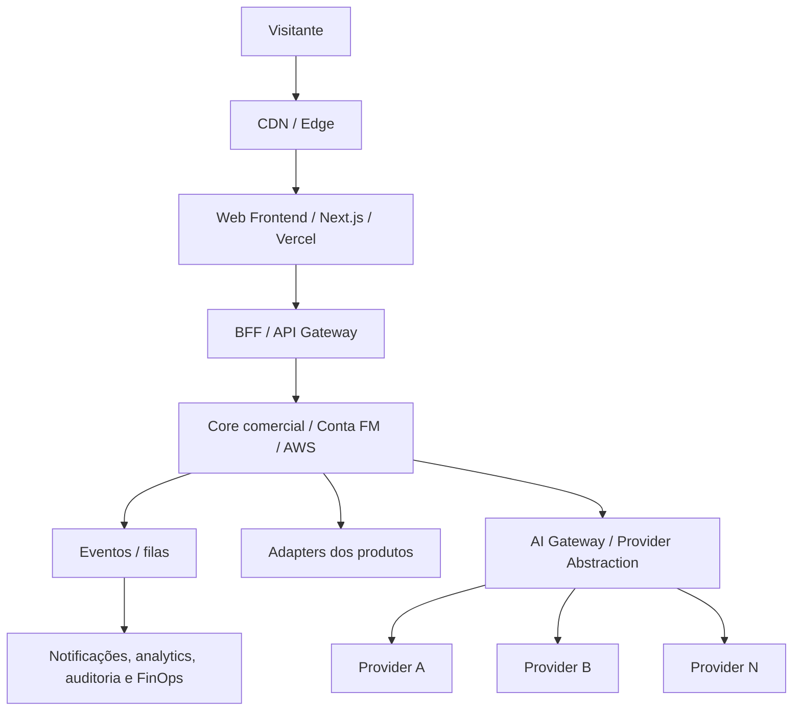
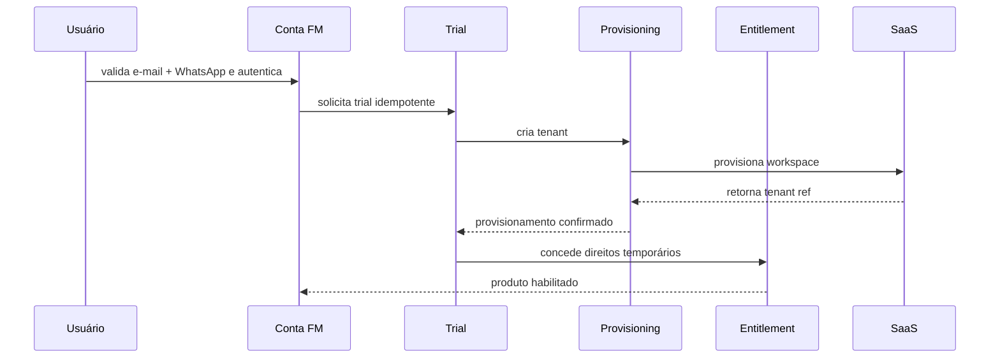

# SITE COMERCIAL FM TECNOLOGIA

## FASE 0 — INVENTÁRIO E READINESS

**Documento mestre de diagnóstico, decisões e liberação de execução** 
**Versão:** 1.3 
**Data:** 08 de setembro de 2026 
**Status:** FASE 0 ATUALIZADA — NO-GO PARA PROGRAMAÇÃO 
**Repositório auditado:** `faabio3131/fm-tecnologia-web-platform` 
**Autoridade documental:** hierarquia formal definida na seção 1.4

---

## 0. Sumário executivo

O projeto não deve ser tratado como um site institucional. A arquitetura oficial determina a construção progressiva de uma **FM Technology Commerce Platform**, composta por experiência corporativa, marketplace de produtos, demonstrações, aquisição, Conta FM, trial, onboarding, provisionamento, billing, entitlement, CRM, analytics, suporte e governança.

O desenho conceitual é sólido e coerente com a ambição de suportar dezenas de produtos. A separação entre identidade central, domínio comercial e dados operacionais dos SaaS está explicitamente protegida. A arquitetura também autoriza começar com um monólito modular, desde que contratos e limites de domínio estejam claros.

A versão 1.3 incorpora novas decisões executivas do Diretor sem apagar o histórico da v1.2. Foram oficialmente fechados: domínio desejado, política comercial-base de trial e pricing de Kordena/Iron Fit, validações obrigatórias de cadastro, modelo híbrido de aquisição, direção de infraestrutura Next.js/Vercel + AWS, estrutura legal/LGPD, canais de atendimento, posicionamento institucional, labels públicos dos itens ainda não lançados e a regra arquitetural multi-provider/multi-modelo com governança FinOps. Permanecem ausentes ou incompletos os dossiês e certificações dos produtos, registro/titularidade efetiva do domínio, assets reais de produto, contratos de provisionamento/entitlement/SSO, IdP, threat model/NFRs, sitemap/URLs e detalhes operacionais ainda marcados como pendentes.

O portfólio inicial conhecido permanece composto por seis produtos/tecnologias: **Kordena, Iron Fit, Vendedor IA, CampaIA, Super Core Extreme e ERP Core**. **Kordena é o nome canônico oficial**; “Coordena” é nomenclatura antiga/erro documental e não deve ser usada como marca ativa. A identificação formal desses seis itens não comprova automaticamente disponibilidade comercial, certificação ou homologação. Trial e pricing de Kordena/Iron Fit, porém, deixam de ser `PENDENTE_EVIDENCIA` onde expressamente aprovados nesta v1.3.

**Decisão de readiness:**

- **FASE 0 documental:** atualizada para v1.3 por este inventário.
- **Readiness para iniciar código definitivo:** **NO-GO**.
- **Próximo bloco recomendado:** completar os dossiês/certificações de Kordena e Iron Fit, registrar e comprovar `fmtecnologia.ai`, incorporar os assets finais ao repositório oficial, fechar contratos/ADRs e resolver as decisões P0 ainda parciais/abertas.
- **Primeiro bloco de programação após o GO:** fundação do repositório, contratos arquiteturais e Design System FM — sem implementar trial, billing ou integrações operacionais antes dos respectivos contratos.

---

## 1. Escopo, fontes e método

### 1.1 Fontes efetivamente encontradas

| ID | Fonte | Estado | Autoridade no diagnóstico |
|---|---|---:|---|
| FONTE-01 | `01 - ARQUITETURA MESTRE - SITE COMERCIAL FM TECNOLOGIA.pdf`, versão 1.0, setembro de 2026 | Lida integralmente, 7 páginas | Nível 2 — Arquitetura Mestre |
| FONTE-02 | Pasta “07 — ARQUITETURA DO SITE COMERCIAL FM TECNOLOGIA” | Inventariada; contém somente FONTE-01 | Contêiner documental da FONTE-01 |
| FONTE-03 | Repositório `faabio3131/fm-tecnologia-web-platform`, branch `main` | Apenas `.gitignore` e `README.md` no estado inicial auditado | Evidência do estado técnico inicial |
| FONTE-04 | README do repositório | Confirma o propósito da plataforma | Evidência suplementar, consistente com FONTE-01 |
| FONTE-05 | Documentação oficial do Next.js, NestJS, PostgreSQL e OpenID Connect | Consulta de viabilidade da stack | Suporte somente à recomendação técnica; não altera a arquitetura oficial |
| FONTE-06 | Decisões executivas expressas do Diretor após a auditoria, registradas em 08/09/2026 | Incorporadas nas versões 1.1, 1.2 e 1.3 | Nível 1 — autoridade superior para as decisões expressamente fechadas |

### 1.2 Legenda de classificação

- **[FATO]** Informação declarada em fonte oficial ou observada diretamente no repositório/pasta.
- **[INFERÊNCIA]** Interpretação coerente com os fatos, mas ainda não formalmente aprovada.
- **[PENDENTE]** Decisão, dado, contrato ou asset necessário que não foi encontrado.
- **[RECOMENDAÇÃO]** Proposta deste inventário para fechar lacunas sem alterar silenciosamente a arquitetura.
- **[DECISÃO OFICIAL]** Deliberação fechada após a auditoria e incorporada ao baseline documental.

### 1.3 Limites respeitados

- Nenhum código foi criado ou alterado.
- Nenhuma decisão de produto, preço, domínio, trial, suporte, legal, infraestrutura ou provedor foi inventada; somente decisões executivas expressas foram incorporadas.
- Nenhuma arquitetura oficial foi substituída.
- Somente os seis produtos/tecnologias expressamente identificados pela decisão executiva foram incorporados ao portfólio; nenhum outro nome foi criado.
- A escolha de `fmtecnologia.ai` não é tratada como prova de compra/registro/titularidade; esse passo continua pendente.
- Pricing e trial aprovados não são tratados como prova de certificação, homologação, billing operacional ou disponibilidade comercial final.
- A direção Next.js/Vercel + AWS não congela serviços AWS específicos, regiões, ambientes, IdP, ORM, CMS, broker ou gateway sem ADR.
- A arquitetura multi-provider/multi-modelo é uma regra de fundação; nenhum fornecedor específico é promovido a dependência exclusiva.
- O GitHub foi usado para auditoria e documentação; programação definitiva permanece bloqueada pelos gates.

### 1.4 Hierarquia de autoridade documental

| Nível | Fonte | Papel e regra de prevalência |
|---:|---|---|
| 1 | Decisões executivas expressas do Diretor | Autoridade superior; prevalece quando fecha ou revisa uma decisão |
| 2 | `01 - ARQUITETURA MESTRE - SITE COMERCIAL FM TECNOLOGIA.pdf` | Arquitetura-mãe oficial, subordinada apenas às decisões executivas expressas |
| 3 | `docs/FASE_0_INVENTARIO_E_READINESS.md` | Consolidação executiva e diagnóstico vigente; fonte de verdade documental desta fase |
| 4 | `docs/baseline-executivo/**` | Tradução estruturada/executável das decisões aprovadas, sem autoridade para contradizer os níveis superiores |

**Regra de reconciliação:** em caso de divergência entre o Baseline Executivo e este documento mestre da Fase 0, a divergência deve ser reconciliada antes de qualquer programação. Não podem existir duas fontes independentes de verdade.

**Regra de versionamento:** novas decisões materiais não alteram silenciosamente a versão anterior. Esta consolidação é formalmente **Fase 0 v1.3**, sucessora da v1.2.

---

# A) ESTADO ATUAL

## 2. Estado documental, técnico e comercial

### 2.1 Diagnóstico por dimensão

| Dimensão | Estado observado | Readiness | Evidência / impacto |
|---|---|---:|---|
| Arquitetura conceitual | Existe e cobre 15 camadas, jornadas, serviços, eventos e roadmap | Parcialmente pronta | Boa direção, ainda sem contratos detalhados |
| Inventário de produtos | Portfólio inicial de seis produtos/tecnologias formalmente identificado | Resolvido para identificação | Dossiês, owners e evidências comerciais continuam pendentes |
| Posicionamento dos produtos | Classificação executiva e labels públicos definidos; público/proposta de valor ainda incompletos por produto | Parcialmente pronto | Permite organização editorial, mas não claims comerciais completos |
| Estágio comercial | Desenvolvimento/P&D definido para quatro itens; Kordena e Iron Fit são produtos principais, sujeitos a certificação | Parcialmente pronto | “Produto principal/pronto” não equivale a homologado ou certificado |
| Arquitetura da informação | Organização Home/Marketplace aprovada; taxonomia detalhada, slugs e conteúdo ainda pendentes | Parcialmente pronta | Três grupos executivos definidos; rotas e content model ainda precisam de aprovação |
| Marca e Design System | Identidade oficial aprovada | Resolvido | Connected Modular refinado v1.0, Brand Baseline v1.0, paleta, tipografia, tokens e versões dark/light aprovados |
| Assets | Pacote de assets produzido | Parcialmente pronto | Assets finais precisam ser incorporados ao repositório oficial e inventariados por manifest |
| Domínio e subdomínios | `fmtecnologia.ai` escolhido | Parcialmente pronto | Compra/registro/titularidade e mapa de subdomínios ainda precisam ser concluídos |
| Trial e onboarding | Kordena/Iron Fit: 30 dias, sem cartão; Iron Fit limitado a 15 alunos | Parcialmente pronto | Elegibilidade, antiabuso, estados, expiração e adapters ainda precisam de contrato |
| Identidade / Conta FM | E-mail e WhatsApp obrigatoriamente validados antes de efetivar a conta | Parcialmente pronto | IdP, recuperação, MFA, sessão e federação ainda não decididos |
| Billing | Pricing-base aprovado; limites arquiteturais definidos | Parcialmente pronto | Provedor, moeda fiscal/tributos, meios de pagamento e reconciliação pendentes |
| Entitlement | Separação e entidades conceituais definidas | Bloqueado | Contrato técnico por produto inexistente |
| Provisionamento | Necessidade e evento `TenantProvisioned` definidos | Bloqueado | Nenhum adapter, SLA, idempotency key ou rollback documentado |
| Legal e LGPD | Estrutura autorizada para preparação imediata | Parcialmente pronto | Razão social/CNPJ entram após abertura; textos, data map, cookies e owners ainda pendentes |
| CRM e automação | Modelo híbrido de aquisição aprovado | Parcialmente pronto | Ferramentas, owner, funil, cadências e consentimentos pendentes |
| Analytics | Métricas conceituais + exigência FinOps de IA/custos | Parcialmente pronto | Taxonomia, ferramenta, consent mode e implementação de telemetria ausentes |
| Suporte | WhatsApp + e-mail e automação 24/7 aprovados | Parcialmente pronto | SLA, ownership, ferramenta e escalonamento pendentes; não prometer humano 24/7 |
| IA / providers | Multi-provider/multi-modelo provider-agnostic aprovado como regra de fundação | Parcialmente pronto | AI Gateway, adapters, política de roteamento/fallback e FinOps ainda precisam de contrato/ADR |
| Infraestrutura | Next.js/Vercel para Web + AWS para núcleo comercial/Conta FM/provisionamento | Parcialmente pronta | Topologia, serviços, regiões, ambientes, IaC, DR e custos precisam de ADR |
| Institucional | Empresa, missão e valores; sem página pessoal do fundador | Parcialmente pronto | Copy final e dados formais da empresa ainda pendentes |
| Repositório | Criado, branch `main`, sem implementação no estado auditado | Pronto para receber baseline | Programação definitiva permanece bloqueada |
| CI/CD e ambientes | Exigidos pela arquitetura | Ausentes | Dev/staging/prod, previews, gates e rollback ainda não configurados |

### 2.2 O que já está decidido oficialmente

1. **[FATO]** A plataforma será a porta comercial do ecossistema FM Tecnologia, não apenas presença institucional.
2. **[DECISÃO OFICIAL]** Deve suportar autosserviço e vendas consultivas/Enterprise; o modelo de aquisição híbrido está aprovado.
3. **[FATO]** Deve escalar para dezenas de produtos sem redesenho estrutural.
4. **[FATO]** O produto precisa aparecer por catálogo e por solução/segmento.
5. **[FATO]** A Conta FM será uma identidade central capaz de acessar vários produtos.
6. **[FATO]** Identidade, billing, trial e entitlement não podem ser misturados às bases operacionais dos SaaS.
7. **[FATO]** O site não terá acesso direto irrestrito às bases dos produtos.
8. **[FATO]** O frontend comercial será protegido por BFF/API Gateway.
9. **[FATO]** O provedor de pagamentos ficará atrás de uma camada de integração.
10. **[FATO]** Conteúdo comercial não controla permissões; entitlement é regra separada.
11. **[FATO]** O CMS não controla billing ou entitlement.
12. **[FATO]** O início pode usar monólito modular, desde que contratos e limites sejam explícitos.
13. **[FATO]** Operações financeiras devem ser idempotentes e auditáveis.
14. **[FATO]** A identidade deve suportar MFA, especialmente para administradores e Enterprise.
15. **[FATO]** O site público deve continuar disponível em falhas parciais de serviços internos.
16. **[FATO]** A experiência deve ser premium, limpa, tecnológica, humana, rápida e confiável, sem estética genérica de template de IA.
17. **[FATO]** Não podem ser publicados números, clientes, credenciais ou certificações inventadas.
18. **[FATO]** Antes do código definitivo devem ser confirmados domínio, produtos, status comercial, público, trial, preços, identidade, assets, legal, suporte, stack/hosting e integração com os produtos.
19. **[DECISÃO OFICIAL]** Kordena é o nome canônico; “Coordena” é nomenclatura antiga/erro documental.
20. **[DECISÃO OFICIAL]** A identidade visual oficial foi aprovada: símbolo Connected Modular refinado v1.0, Brand Baseline v1.0, paleta, tipografia, tokens e versões dark/light.
21. **[DECISÃO OFICIAL]** O pacote de assets foi produzido e deve ser incorporado ao repositório oficial.
22. **[DECISÃO OFICIAL]** O portfólio inicial conhecido é composto por Kordena, Iron Fit, Vendedor IA, CampaIA, Super Core Extreme e ERP Core.
23. **[DECISÃO OFICIAL]** Kordena e Iron Fit são os produtos principais e terão página pública e destaque na Home/Marketplace; sua disponibilidade comercial final depende de certificação/evidência específica.
24. **[DECISÃO OFICIAL]** Vendedor IA, CampaIA e ERP Core estão em desenvolvimento, terão página pública e devem aparecer como **“Em desenvolvimento · Em breve”**, sem disponibilidade comercial.
25. **[DECISÃO OFICIAL]** Super Core Extreme é tecnologia/plataforma estratégica em Pesquisa & Desenvolvimento, terá página pública e deve aparecer como **“Tecnologia & P&D · Em desenvolvimento”**, sem ser apresentado como SaaS comercial disponível.
26. **[DECISÃO OFICIAL]** Existência no portfólio, lifecycle, visibilidade no website, prontidão técnica, certificação, disponibilidade comercial, trial, pricing e ambiente de produção/homologação são estados independentes.
27. **[DECISÃO OFICIAL]** A Home/Marketplace será organizada em Produtos Principais, O que estamos construindo e Tecnologia & P&D.
28. **[DECISÃO OFICIAL]** A hierarquia de autoridade documental da seção 1.4 está aprovada.
29. **[DECISÃO OFICIAL]** O domínio escolhido é `fmtecnologia.ai`; compra/registro/titularidade ainda precisam ser efetivamente concluídos e verificados.
30. **[DECISÃO OFICIAL]** Kordena terá teste grátis de **30 dias**, **sem cartão**.
31. **[DECISÃO OFICIAL]** Iron Fit terá teste grátis de **30 dias**, **sem cartão**, limitado a **15 alunos** durante o período gratuito.
32. **[DECISÃO OFICIAL]** O cadastro exige validação obrigatória de **e-mail e WhatsApp antes de efetivar a conta**.
33. **[DECISÃO OFICIAL]** Os preços serão públicos no site, com plano mensal e anual.
34. **[DECISÃO OFICIAL]** Kordena: **R$ 299/mês** ou **R$ 2.990/ano**.
35. **[DECISÃO OFICIAL]** Iron Fit: **R$ 269/mês** ou **R$ 2.690/ano**.
36. **[DECISÃO OFICIAL]** Enterprise: **preço sob consulta**.
37. **[DECISÃO OFICIAL]** Direção de infraestrutura: **Next.js/Vercel para a camada Web + AWS para o núcleo comercial, Conta FM e provisionamento**, mantendo os SaaS isolados por contratos/adapters.
38. **[DECISÃO OFICIAL]** A estrutura Legal/LGPD deve ser preparada agora; razão social, CNPJ e demais dados formais entram após a abertura oficial da empresa.
39. **[DECISÃO OFICIAL]** Atendimento: **WhatsApp + e-mail**, com **automação 24/7**; não prometer atendimento humano 24/7 enquanto isso não existir.
40. **[DECISÃO OFICIAL]** O institucional será centrado na empresa, missão e valores; não haverá página pessoal do fundador.
41. **[DECISÃO OFICIAL]** Todos os produtos FM e o site permanecem **multi-provider e multi-modelo**, sem dependência arquitetural de um único fornecedor de IA.
42. **[DECISÃO OFICIAL]** Funcionalidades de IA do site devem consumir uma camada abstrata/AI Gateway com adapters de provedores; não devem chamar diretamente SDK/API específica a partir do frontend ou da lógica de domínio.
43. **[DECISÃO OFICIAL]** Chaves e segredos de provedores de IA permanecem no backend e nunca devem ser expostos no navegador.
44. **[DECISÃO OFICIAL]** O roteamento de IA poderá considerar capacidade, qualidade, custo, latência, disponibilidade e contexto, com fallback governado quando compatível.
45. **[DECISÃO OFICIAL]** FinOps/AI Cost Governance deverá registrar, quando aplicável: tenant, produto, tarefa, provedor, modelo, consumo/tokens, custo, latência, resultado, falha e correlation ID.
46. **[DECISÃO OFICIAL]** A arquitetura deve permitir incluir/trocar Google, OpenAI, Anthropic, NVIDIA e outros providers sem reescrever o domínio consumidor; o uso atual de Google API nos produtos não cria lock-in para o site.
47. **[DECISÃO OFICIAL]** Metas iniciais de custo operacional alocável por tenant: Kordena com alvo de até **R$ 50/mês** e limite de atenção de **R$ 75/mês**; Iron Fit com alvo de até **R$ 45/mês** e limite de atenção de **R$ 67/mês**. São metas de engenharia financeira, não garantia de lucro líquido.

### 2.3 O que ainda não está decidido

O projeto possui arquitetura de intenção, identidade visual, portfólio inicial, pricing-base, trial-base, direção de infraestrutura, aquisição, suporte e princípios multi-provider/FinOps aprovados, mas ainda não possui o **baseline executável completo**. Permanecem ausentes dossiês completos, evidências de certificação/comercialização, detalhes contratuais de trial, contratos de identidade/provisionamento/entitlement, registro/titularidade do domínio, assets reais de produto, provider de identidade, billing/gateway/impostos, data map/textos jurídicos finais, SLA/ownership de suporte, threat model/NFRs, sitemap/URLs e backlog reconciliado. O risco maior continua sendo converter indevidamente uma decisão comercial em prova técnica inexistente.

---

# B) INVENTÁRIO CONSOLIDADO

## 3. Inventário da arquitetura oficial

### 3.1 As 15 camadas canônicas

| # | Camada oficial | Responsabilidade | Estado de especificação |
|---:|---|---|---|
| 1 | Corporate Experience | Marca, Home, empresa, confiança e entrada dos funis | Macro definida; institucional centrado na empresa; copy final pendente |
| 2 | Product Marketplace | Catálogo escalável e navegação por categorias | Macro definida; taxonomia e catálogo detalhado pendentes |
| 3 | Product Experience / Demos | Páginas, screenshots, vídeos, tours e demos | Estrutura definida; assets reais ausentes |
| 4 | Trial & Conversion Engine | Elegibilidade, período, limites, expiração, conversão e grace period | 30 dias sem cartão aprovados para Kordena/Iron Fit; Iron Fit até 15 alunos; detalhes contratuais pendentes |
| 5 | FM Identity / Account | Usuário, organização, memberships, papéis, segurança e acesso multiproduto | E-mail + WhatsApp obrigatórios antes de efetivar conta; IdP/MFA/federação pendentes |
| 6 | Onboarding | Configuração orientada à ativação por produto | Conceitual; definições por produto ausentes |
| 7 | Billing & Subscription | Catálogo financeiro, assinatura, invoices, ciclos e webhooks | Pricing-base aprovado; provedor e regras fiscais pendentes |
| 8 | CRM / Sales | Lead, origem, campanha, estágio, owner e Enterprise | Modelo híbrido aprovado; ferramenta/processo pendentes |
| 9 | Marketing Automation | Mensagens e campanhas orientadas a eventos | Conceitual; canais e consentimentos pendentes |
| 10 | Analytics / Product Telemetry | Web, funil comercial, ativação e custos | Métricas macro + FinOps aprovados; eventos/ferramenta pendentes |
| 11 | Support / Help Center | Autoatendimento, suporte e roteamento | WhatsApp/e-mail + automação 24/7; SLA/ownership pendentes |
| 12 | Trust, Security & Legal | Segurança, confiança, LGPD, termos e políticas | Estrutura legal autorizada; textos/evidências/data map pendentes |
| 13 | Integration / API Layer | BFF, adapters, webhooks, retries, DLQ, AI Gateway e observabilidade | Princípios definidos; contratos pendentes |
| 14 | Administration / CMS | Conteúdo, catálogo, trial policies, leads, flags e auditoria | Escopo definido; RBAC/UX/ferramenta pendente |
| 15 | Observability & Operations | Logs, métricas, traces, uptime, alertas e saúde comercial | Requisitos + metas FinOps definidos; implementação pendente |

### 3.2 Topologia lógica oficial

O “core comercial” representa Identity, Organization, Catalog, Trial, Entitlement, Billing, Onboarding e CRM Adapter. A direção Vercel/AWS não elimina os limites oficiais entre os domínios nem cria acesso direto aos SaaS.

### 3.3 Serviços lógicos inventariados

- Web Frontend.
- BFF/API Gateway.
- Identity Service.
- Organization Service.
- Product Catalog.
- Trial Service.
- Entitlement Service.
- Billing Service.
- Onboarding Service.
- Lead/CRM Adapter.
- Notification Service.
- CMS.
- Analytics/Event Collector.
- Media Service.
- Support Adapter.
- Admin Portal.
- Audit/Observability.
- AI Gateway / Provider Abstraction Layer.
- AI Provider Adapters.
- AI Cost Governance / FinOps.

### 3.4 Eventos oficiais recomendados

- `LeadCreated`
- `AccountCreated`
- `EmailVerified`
- `WhatsAppVerified`
- `OrganizationCreated`
- `TrialStarted`
- `TenantProvisioned`
- `OnboardingStepCompleted`
- `ActivationReached`
- `TrialExpiring`
- `SubscriptionCreated`
- `PaymentConfirmed`
- `SubscriptionCanceled`
- `ProductEnabled`
- `ProductDisabled`
- `AIRequestCompleted`
- `AIRequestFailed`
- `AICostRecorded`

**[PENDENTE]** Para serem implementáveis, esses eventos ainda precisam de versão, owner, schema, campos obrigatórios, dados pessoais permitidos, idempotency key, ordering, retenção, consumidor, política de retry e compatibilidade retroativa.

### 3.5 Modelo conceitual oficial

| Relação | Significado |
|---|---|
| User → Membership → Organization | Pessoa pode participar de uma ou mais organizações com papéis específicos; efetivação da conta exige e-mail e WhatsApp validados |
| Organization → Trial/Subscription | Trials e assinaturas pertencem à organização, não somente ao usuário |
| Trial/Subscription → Product/Plan | Acesso comercial está ligado a produto e plano |
| Product/Plan → Entitlements | Capacidades efetivas são concedidas por direitos explícitos |
| Organization → ProductTenantRef | A plataforma mantém referência segura ao tenant no SaaS, não os dados operacionais dele |
| Lead/Opportunity → Person/Organization/Product | Funil comercial preserva contexto da intenção e suporta autosserviço/Enterprise |
| AIRequest → Provider/Model/UsageCost | Execução de IA é abstraída e mensurada sem tornar o domínio dependente do fornecedor |
| Consent, AuditEvent, CampaignAttribution, OnboardingProgress | Governança, compliance, atribuição e ativação completam o núcleo |

---

## 4. Inventário dos produtos e tecnologias do portfólio

### 4.1 Resultado objetivo

**[DECISÃO OFICIAL]** O portfólio inicial conhecido da FM Tecnologia contém seis produtos/tecnologias: **Kordena, Iron Fit, Vendedor IA, CampaIA, Super Core Extreme e ERP Core**. A identificação do portfólio está resolvida para esses seis nomes. Isso não significa que todos estejam comercialmente disponíveis nem que possuam dossiê, certificação ou produção homologada.

**Reconciliação com a arquitetura original:** AI Web Builder permanece apenas como capacidade futura citada no PDF e não integra o portfólio inicial de seis itens. Sua eventual promoção a produto exige nova decisão executiva e atualização deste registry.

### 4.2 Product Registry Mestre

| Produto | Nome canônico | Lifecycle | Visibilidade website | Prioridade | Disponibilidade comercial | Trial | Pricing | Certificação | Página própria | Evidência / origem | Pendências |
|---|---|---|---:|---|---|---|---|---|---:|---|---|
| Kordena | **Kordena** | PENDENTE_EVIDENCIA; informado pelo Diretor como produto pronto | SIM | Produto principal; destaque Home/Marketplace | PENDENTE_EVIDENCIA até certificação/homologação | **30 dias; sem cartão** | **R$ 299/mês; R$ 2.990/ano; Enterprise sob consulta** | PENDENTE_EVIDENCIA | SIM | Decisões executivas do Diretor, 08/09/2026 | Certificação, homologação, dossiê, TrialPolicy detalhada, integração e CTA final |
| Iron Fit | **Iron Fit** | PENDENTE_EVIDENCIA; informado pelo Diretor como produto pronto | SIM | Produto principal; destaque Home/Marketplace | PENDENTE_EVIDENCIA até certificação/homologação | **30 dias; sem cartão; máximo 15 alunos** | **R$ 269/mês; R$ 2.690/ano; Enterprise sob consulta** | PENDENTE_EVIDENCIA | SIM | Decisões executivas do Diretor, 08/09/2026 | Certificação, homologação, dossiê, integração e CTA final |
| Vendedor IA | **Vendedor IA** | `in_development` | SIM | O que estamos construindo | NÃO | NÃO DISPONÍVEL | NÃO PUBLICAR OFERTA | PENDENTE_EVIDENCIA | SIM | Decisão executiva do Diretor, 08/09/2026 | Dossiê, evidências e critérios de evolução |
| CampaIA | **CampaIA** | `in_development` | SIM | O que estamos construindo | NÃO | NÃO DISPONÍVEL | NÃO PUBLICAR OFERTA | PENDENTE_EVIDENCIA | SIM | Decisão executiva do Diretor, 08/09/2026 | Dossiê, evidências e critérios de evolução |
| Super Core Extreme | **Super Core Extreme** | `research_and_development` | SIM | Tecnologia & P&D | NÃO; não tratar como SaaS comercial disponível | NÃO DISPONÍVEL | NÃO PUBLICAR OFERTA | PENDENTE_EVIDENCIA | SIM | Decisão executiva do Diretor, 08/09/2026 | Posicionamento próprio de Tecnologia/P&D, dossiê e critérios de evolução |
| ERP Core | **ERP Core** | `in_development` | SIM | O que estamos construindo | NÃO | NÃO DISPONÍVEL | NÃO PUBLICAR OFERTA | PENDENTE_EVIDENCIA | SIM | Decisão executiva do Diretor, 08/09/2026 | Dossiê, evidências e critérios de evolução |

Regras vivas do registry:

1. Somente nomes aprovados entram como produtos identificados.
2. “Coordena” pode aparecer apenas em histórico, migração ou correção documental, sempre remetendo a Kordena.
3. Os seis itens acima substituem o placeholder “demais produtos — A IDENTIFICAR”; novos itens futuros continuam exigindo decisão executiva antes de serem nomeados.
4. Página pública não equivale a produto comercialmente disponível.
5. Pricing ou TrialPolicy aprovados não equivalem a certificação/homologação nem liberam CTA transacional automaticamente.
6. Cada novo produto exige dossiê, owners e estado comercial antes de entrar no marketplace.
7. Todos os produtos e o site preservam arquitetura multi-provider/multi-modelo; provider específico não integra a identidade do produto.

### 4.3 Governança obrigatória de estados independentes

Os seguintes estados devem ser registrados e governados de forma independente:

- existência no portfólio;
- estágio de desenvolvimento/lifecycle;
- visibilidade no website;
- prontidão técnica;
- certificação;
- disponibilidade comercial;
- disponibilidade/política de trial;
- pricing;
- produção/homologação.

Um produto pode existir no portfólio e possuir página pública sem estar disponível para compra ou trial. Nunca converter automaticamente “produto pronto”, “trial aprovado” ou “preço aprovado” em “produção homologada”, “pagamento disponível” ou “certificação concluída”. Cada transição exige evidência e decisão específicas.

### 4.4 Arquitetura escalável de lifecycle

O Marketplace deve suportar a evolução abaixo sem redesenho estrutural:

`research_and_development` → `in_development` → `beta` → `available`

A mudança de lifecycle altera conteúdo, badge, CTA e permissões comerciais. Não exige reconstrução da arquitetura do site.

| Lifecycle / disponibilidade | Comunicação obrigatória | CTAs permitidos | CTAs proibidos enquanto indisponível |
|---|---|---|---|
| `research_and_development` | **Tecnologia & P&D · Em desenvolvimento** | Conhecer o projeto; Demonstrar interesse; Acompanhar lançamento; Falar com a FM | Comprar agora; Começar trial; Assinar; alegar disponibilidade imediata |
| `in_development` | **Em desenvolvimento · Em breve** | Conhecer o projeto; Demonstrar interesse; Acompanhar lançamento; Falar com a FM | Comprar agora; Começar trial; Assinar; alegar disponibilidade imediata |
| `beta` | Escopo, elegibilidade e limitações aprovados | Somente CTAs autorizados pela política de beta | Compra, assinatura ou trial público sem aprovação específica |
| `available` | Disponibilidade sustentada por certificação e decisão comercial | CTAs aprovados para compra, trial, assinatura ou contato | Qualquer CTA não coberto por política comercial vigente |

### 4.5 Dossiê obrigatório para cada produto

Antes de qualquer alegação de disponibilidade comercial, compra, assinatura ou trial efetivamente liberado, cada produto deve possuir uma ficha completa aprovada. Páginas públicas de itens indisponíveis podem usar um dossiê editorial mínimo aprovado, desde que exibam o lifecycle com transparência e usem somente os CTAs permitidos na seção 4.4.

1. Nome canônico e marcas permitidas.
2. Categoria primária e categorias secundárias.
3. Status: conceito, desenvolvimento, alpha, beta fechado, trial público, comercial ou descontinuado.
4. Posicionamento em uma frase.
5. Público-alvo primário e secundário.
6. Problema central e resultado prometido.
7. Proposta de valor comprovável.
8. Benefícios e funcionalidades reais.
9. Workflows demonstráveis.
10. Diferenciais que podem ser sustentados.
11. Integrações reais e planejadas, claramente separadas.
12. Segurança e privacidade verificáveis.
13. Planos, preços, add-ons e Enterprise.
14. Política de trial e requisito de cartão/limites.
15. Primeira ação de valor e evento de ativação.
16. Onboarding mínimo.
17. Contrato de entitlement.
18. Contrato de provisionamento e desprovisionamento.
19. Canal de suporte e SLA.
20. Logo, ícone, screenshots, vídeos, tour e Open Graph.
21. Owner de produto, owner técnico e owner comercial.
22. URL do app e ambientes de teste/homologação.
23. Quando houver IA: contrato com AI Gateway, provider policies, roteamento/fallback e FinOps.

---

## 5. Arquitetura de páginas e navegação

### 5.1 Navegação global

**[FATO]** Menu oficial recomendado: `Produtos | Soluções | Preços | Recursos | Empresa | Entrar`, com CTAs persistentes `Comece grátis` e, quando apropriado, `Fale com a FM`.

**[DECISÃO OFICIAL]** O modelo de aquisição será híbrido: autosserviço para quem deseja testar sozinho + fluxo consultivo para contas maiores/Enterprise.

**[RECOMENDAÇÃO]** Usar mega menu de Produtos orientado por categoria, com catálogo central; manter “Marketplace” como conceito e possível título da experiência, sem necessariamente adicionar outro item redundante ao menu. A decisão entre `/produtos` e `/marketplace` como rota canônica deve ser tomada no baseline de URLs.

### 5.2 Home

**[DECISÃO OFICIAL]** A Home e o Product Marketplace adotarão a mesma organização conceitual:

- **Produtos Principais:** Kordena e Iron Fit.
- **O que estamos construindo:** Vendedor IA, CampaIA e ERP Core — **“Em desenvolvimento · Em breve”**.
- **Tecnologia & P&D:** Super Core Extreme — **“Tecnologia & P&D · Em desenvolvimento”**.

Essa organização define destaque e transparência editorial, não disponibilidade comercial automática.

| Ordem | Seção obrigatória | Objetivo | Dependência |
|---:|---|---|---|
| 1 | Hero | Explicar a FM em segundos e apresentar software real em movimento | Mensagem aprovada + assets reais |
| 2 | Produtos em destaque | Apresentar Kordena e Iron Fit como produtos principais sem antecipar certificação/homologação | Certificação, evidências e status comercial explícito |
| 3 | “Veja funcionando” | Provar valor com microdemo, vídeo ou tour | Vídeos/screenshots reais |
| 4 | Soluções por segmento | Permitir entrada pelo problema/mercado | Taxonomia de soluções |
| 5 | Benefícios e resultados | Comunicar impacto antes de lista de features | Claims aprovados |
| 6 | Tecnologia FM | Demonstrar plataforma, IA multi-provider, segurança e integração sem exageros | Mensagens técnicas verificadas |
| 7 | Trial | Explicar 30 dias sem cartão nos produtos elegíveis | Certificação e TrialPolicy aplicável |
| 8 | Business / Enterprise | Abrir o funil consultivo | Processo comercial e contato |
| 9 | Confiança e segurança | Demonstrar práticas reais, sem certificações inventadas | Evidências e políticas |
| 10 | Ecossistema / Conta FM | Explicar acesso multiproduto | Arquitetura de identidade validada |
| 11 | Conteúdo / cases | Aumentar autoridade quando houver material real | Cases e autorizações |
| 12 | CTA final | Converter conforme contexto | Roteamento de CTA |
| 13 | Rodapé completo | Navegação, legal, contato, status e recursos | Conteúdo legal e canais |

### 5.3 Produtos

**Função:** página editorial que explica o ecossistema e orienta a escolha. Deve conter introdução curta, os seis itens do portfólio organizados nos três grupos aprovados, comparação por necessidade quando fizer sentido, benefícios da Conta FM e CTA para o catálogo completo.

**[PENDENTE]** Definir se “Produtos” será a própria experiência de marketplace ou uma landing editorial separada.

### 5.4 Marketplace

**Estrutura necessária:**

- Agrupamento editorial aprovado: Produtos Principais; O que estamos construindo; Tecnologia & P&D.
- Busca e filtros escaláveis por categoria, segmento, problema e disponibilidade.
- Cards com nome, categoria, proposta de valor, preview, status e CTA.
- Estados claros e governados pelo lifecycle.
- Catálogo alimentado por uma definição central, sem conteúdo duplicado nas páginas de soluções.
- Paginação ou carregamento progressivo para dezenas de produtos.
- URLs canônicas e metadados de SEO por categoria.
- Analytics de impressão, filtro, clique e início de trial.
- Regra obrigatória: produto não comercializado não aparece como disponível.
- Produtos públicos indisponíveis usam somente CTAs informativos ou de interesse; nunca compra, assinatura ou trial.

### 5.5 Página individual de produto

1. Hero próprio e promessa verificável.
2. Demonstração curta ou vídeo real.
3. Problema e resultado.
4. Benefícios.
5. Workflows principais.
6. Funcionalidades reais.
7. Screenshots, tour e demonstrações.
8. Integrações, separando disponível de planejado.
9. Segurança e privacidade comprováveis.
10. Planos e preços ou CTA Enterprise quando comercialmente autorizado.
11. FAQ.
12. Trial e política de cartão/limites.
13. Enterprise/contato.
14. CTA final.

Cada produto pode usar um accent visual próprio, mas continua submetido aos tokens, componentes, acessibilidade e comportamento do Design System FM.

Os módulos de preço, compra, assinatura e trial são condicionais à disponibilidade comercial/certificação. Para Vendedor IA, CampaIA, ERP Core e Super Core Extreme, devem ser substituídos por status transparente e CTAs informativos enquanto a disponibilidade comercial estiver como NÃO.

### 5.6 Soluções

**Função:** entrada por segmento, problema ou use case, sem duplicar a fonte central do produto.

Estrutura recomendada: Hero do problema → dores e resultados → workflows → produtos aplicáveis → prova/demonstração → integrações → segurança → recursos relacionados → CTA contextual.

Categorias citadas como possibilidades: academias, restaurantes, varejo, gestão, vendas, marketing, atendimento e IA. **[PENDENTE]** Confirmar quais categorias têm conteúdo e produto realmente prontos para lançamento.

### 5.7 Preços

**[DECISÃO OFICIAL]** Os preços serão públicos no site com opções mensal e anual:

| Produto | Mensal | Anual | Trial | Enterprise |
|---|---:|---:|---|---|
| Kordena | **R$ 299/mês** | **R$ 2.990/ano** | **30 dias, sem cartão** | Sob consulta |
| Iron Fit | **R$ 269/mês** | **R$ 2.690/ano** | **30 dias, sem cartão, até 15 alunos** | Sob consulta |

A página deverá ainda conter comparação de features, limites/add-ons quando aprovados, upgrade/downgrade/cancelamento, FAQ e impostos/meios de pagamento conforme o futuro catálogo financeiro. Pricing aprovado não libera billing nem disponibilidade comercial sem os gates correspondentes.

### 5.8 Recursos

Hub escalável para demonstrações, central de ajuda, documentação, blog/knowledge hub, webinars, guias, integrações, segurança/trust center, status e conteúdos por segmento. Na primeira versão, publicar apenas áreas com conteúdo real; links vazios prejudicam confiança.

### 5.9 Empresa

**[DECISÃO OFICIAL]** Página de autoridade institucional centrada na **FM Tecnologia, missão, valores, princípios, abordagem de produto, segurança, contato e informações corporativas verificáveis**. Não haverá página pessoal do fundador. Razão social, CNPJ e demais dados formais serão adicionados após a abertura oficial da empresa. Evitar “números de vaidade”, clientes ou credenciais não comprovadas.

### 5.10 Login

**Objetivo:** autenticar na Conta FM e redirecionar pelo contexto.

Fluxos necessários: entrar, criar conta, verificar e-mail, verificar WhatsApp, recuperar senha, MFA, consentimentos, convite para organização, troca de organização, sessão e logout. **A conta somente é efetivada após validação obrigatória de e-mail e WhatsApp.** O login não deve pedir novamente credenciais específicas de cada SaaS quando a federação/SSO estiver disponível.

### 5.11 Conta FM

Área autenticada central com:

- Perfil e segurança.
- Organizações e memberships.
- Produtos habilitados.
- Trials e progresso.
- Assinaturas e billing profile.
- Convites e papéis.
- Preferências e consentimentos.
- Acesso aos apps.
- Suporte.
- Auditoria visível de eventos sensíveis quando apropriado.

**Limite:** a Conta FM gerencia identidade e direitos; não replica o backoffice operacional completo de cada produto.

---

## 6. Jornada completa do CTA “Comece grátis”

### 6.1 Regras de roteamento do CTA

| Origem do CTA | Produto conhecido? | Ação correta |
|---|---:|---|
| Página individual de produto | Sim | Iniciar jornada já vinculada ao produto/plano elegível e certificado |
| Card do marketplace | Sim | Confirmar produto e abrir autenticação/cadastro |
| Home genérica | Não necessariamente | Abrir seletor leve de produto/solução antes do cadastro |
| Página de solução | Pode haver vários | Recomendar produtos e pedir seleção |
| Enterprise | Sim ou não | Direcionar para qualificação comercial, não forçar trial de autosserviço |

### 6.2 Happy path canônico

1. Visitante clica em `Comece grátis`.
2. Plataforma registra origem, campanha, página, produto e consentimento aplicável.
3. Produto é resolvido; se estiver ausente, usuário escolhe produto/necessidade.
4. Catálogo valida que o produto está disponível/certificado para trial e possui TrialPolicy ativa.
5. Usuário entra ou inicia criação de Conta FM.
6. **E-mail é validado.**
7. **WhatsApp é validado.**
8. Conta é efetivada conforme política de identidade.
9. Usuário cria ou seleciona uma Organization.
10. Sistema coleta somente dados mínimos da empresa necessários ao produto.
11. Usuário aceita termos gerais, termos do produto e termos do trial versionados.
12. Trial Service valida elegibilidade e impede duplicidade/abuso conforme contrato ainda a aprovar.
13. Aplica-se a política aprovada: Kordena 30 dias sem cartão; Iron Fit 30 dias sem cartão e limite de 15 alunos.
14. É criada uma reserva idempotente de trial.
15. Provisioning Adapter solicita a criação do tenant/workspace no produto.
16. O produto retorna `ProductTenantRef`; nenhum dado operacional é copiado para o site.
17. Entitlement Service concede direitos temporários do plano de trial.
18. Trial muda para ativo somente após provisionamento confirmado.
19. Onboarding Engine inicia a definição específica do produto.
20. Usuário executa a primeira ação de valor.
21. Product Analytics registra o evento de ativação, preservando minimização de dados.
22. Notificações orientam uso, retomada e expiração conforme consentimento/base legal.
23. Plataforma recomenda plano compatível mensal/anual ou rota Enterprise.
24. Usuário escolhe plano e inicia assinatura.
25. Billing cria checkout/mandato no provedor por adapter.
26. Webhook assinado é validado e processado de forma idempotente.
27. `PaymentConfirmed` ativa a Subscription.
28. Entitlements pagos substituem os direitos temporários sem interromper o tenant.
29. Conta FM passa a exibir o produto como ativo.

### 6.3 Abandono e retomada

Cada passo deve persistir um estado retomável, sem armazenar senha ou dados desnecessários. O usuário deve retornar ao último passo válido. Mensagens de retomada dependem de consentimento e devem usar link seguro, expirável e sem segredo na URL.

### 6.4 Falhas e compensações mínimas

| Falha | Comportamento exigido |
|---|---|
| Conta iniciada, e-mail ou WhatsApp não validado | Manter estado pendente sem efetivar acesso pleno; permitir retomada segura |
| Conta criada, organização não concluída | Salvar draft e permitir retomada |
| Trial inelegível | Explicar regra e oferecer plano/contato, sem criar tenant |
| Provisionamento temporariamente indisponível | Estado `provisioning_pending`, retry controlado, mensagem clara |
| Tenant criado, entitlement falhou | Compensar ou manter tenant bloqueado até reconciliação; nunca liberar acesso indefinido |
| Webhook duplicado | Processamento idempotente, sem dupla assinatura/fatura |
| Pagamento aprovado, entitlement pendente | Estado reconciliável, fila e alerta operacional |
| Expiração do trial | Grace period conforme política futura; depois bloquear direitos, não apagar dados silenciosamente |
| Usuário abandona checkout | Manter trial/estado anterior e permitir retomada |

### 6.5 Estados mínimos recomendados

- Registration: `started`, `account_created`, `email_verified`, `whatsapp_verified`, `verified`, `organization_pending`, `completed`, `abandoned`.
- Trial: `requested`, `eligibility_rejected`, `provisioning_pending`, `active`, `expiring`, `grace`, `converted`, `expired`, `canceled`, `failed`.
- Provisioning: `requested`, `in_progress`, `succeeded`, `failed_retryable`, `failed_terminal`, `compensated`.
- Subscription: `pending`, `active`, `past_due`, `suspended`, `canceled`, `expired`.
- Entitlement: `pending`, `active`, `restricted`, `revoked`.

Esses nomes são **[RECOMENDAÇÃO]** e precisam ser validados nos contratos detalhados.

---

## 7. Arquitetura de identidade, trial, onboarding, provisionamento, billing e entitlement

### 7.1 Separação obrigatória de domínios

| Domínio | Fonte de verdade | Pode conhecer | Não pode controlar |
|---|---|---|---|
| Identity | Usuário, verificações, credenciais/federação, sessões, MFA | IDs de memberships e organizações | Dados operacionais dos produtos |
| Organization | Organizações, memberships e papéis centrais | Usuários e produtos vinculados | Cobrança e feature flags operacionais |
| Product Catalog | Produtos, editions, planos, preços comerciais e TrialPolicy | Metadata aprovada | Credenciais ou dados do tenant |
| Trial | Elegibilidade, ciclo, limites e estado do trial | Organization, Product, Plan e ProductTenantRef | Cobrança confirmada |
| Onboarding | Definição e progresso de ativação | Produto, tenant ref e eventos necessários | Permissões comerciais definitivas |
| Provisioning | Adapter e estado de criação do tenant | IDs mínimos e configuração autorizada | Identidade central ou preço |
| Billing | Customer/billing profile, assinatura, invoice e webhooks | Organization, Price e status financeiro | Conteúdo do site ou dados operacionais |
| Entitlement | Direitos efetivos por organização/produto/plano | Trial/Subscription válidos | Conteúdo comercial e dados operacionais |
| Produto SaaS | Operação do negócio | Identidade federada, tenant e entitlements necessários | Billing central ou credenciais globais |
| AI Gateway | Política/roteamento e execução abstrata de IA | Contexto mínimo e adapters permitidos | Acoplar regras de negócio a provider específico |
| AI FinOps | Consumo, custo, latência e resultado | Tenant/produto/tarefa/provider/modelo | Segredos e dados operacionais desnecessários |

### 7.2 Sequência de ativação governada

### 7.3 Contrato padronizado para qualquer novo produto

Cada SaaS deve entrar na plataforma por um `Product Integration Contract` contendo:

- Metadata comercial e assets.
- Pricing e TrialPolicy.
- OnboardingDefinition e ActivationDefinition.
- EntitlementContract versionado.
- ProvisioningAdapter e, quando aplicável, DeprovisioningAdapter.
- Identity federation/SSO contract.
- Events contract.
- Health/reconciliation contract.
- SupportRoute.
- Security/privacy data map.
- Owners e SLA.
- Quando houver IA: AI Gateway contract, provider policy/adapters, observabilidade e FinOps.

### 7.4 Invariantes de segurança

1. Nenhum CTA concede acesso antes de elegibilidade e aceite válidos.
2. E-mail e WhatsApp devem estar validados antes da efetivação da conta.
3. Nenhum webhook financeiro é confiado sem assinatura, replay protection e idempotência.
4. Nenhum texto de CMS altera permissão.
5. Nenhum produto consulta diretamente tabelas centrais; usa contratos/adapters.
6. Nenhuma Conta FM recebe acesso irrestrito à base operacional.
7. Toda mudança sensível registra ator, horário, motivo e correlation ID.
8. A troca de organização recalcula contexto e direitos.
9. O tenant ref não substitui autorização.
10. Falha de billing não apaga dados operacionais sem política aprovada.
11. Ambientes e credenciais são segregados.
12. Chaves/segredos de IA ficam no backend; nunca no navegador.
13. Nenhum domínio consumidor de IA depende diretamente do SDK/API de um provider.

### 7.5 Arquitetura multi-provider/multi-modelo de IA

**[DECISÃO OFICIAL]** Todos os produtos FM e o site são provider-agnostic desde a fundação. O uso atual de Google API em produtos do ecossistema não cria dependência exclusiva do site.

Fluxo conceitual:

`Feature/Agent → AI Gateway → Policy/Router → Provider Adapter → Model → Telemetry/FinOps`

O roteamento pode considerar capacidade, qualidade, custo, latência, disponibilidade, contexto e risco. Fallback entre providers deve ser governado e somente ocorrer quando houver compatibilidade contratual, de segurança e de privacidade.

Telemetria FinOps deve permitir, quando aplicável: tenant/organização, produto/feature/tarefa, provider, modelo, consumo/tokens/unidades faturáveis, custo, latência, sucesso/falha, fallback/rota e correlation ID.

Metas iniciais de custo operacional alocável por tenant:

- **Kordena:** alvo ≤ R$ 50/mês; limite de atenção R$ 75/mês.
- **Iron Fit:** alvo ≤ R$ 45/mês; limite de atenção R$ 67/mês.

Esses valores são metas de engenharia financeira para proteção de margem bruta de infraestrutura/IA, não garantia de lucro líquido.

---

## 8. Inventário de assets

### 8.1 Estado dos assets

| Tipo | Fato documentado | Estado atual |
|---|---|---|
| Documento de arquitetura | 1 PDF localizado na pasta oficial durante a auditoria | Existente |
| Símbolo FM | Connected Modular refinado v1.0 aprovado | Produzido; incorporação ao repositório pendente |
| Brand Baseline | Brand Baseline v1.0 aprovado | Produzido; incorporação ao repositório pendente |
| Paleta, tipografia e tokens | Conjunto oficial aprovado | Produzido; incorporação ao repositório pendente |
| Versões dark/light | Versões oficiais aprovadas | Produzidas; incorporação ao repositório pendente |
| Pacote institucional de assets | Pacote produzido no contexto da identidade aprovada | Incorporar ao repositório com manifest, formatos, versões e licenças |
| Logos/ícones específicos dos produtos | Não documentados nesta atualização | A IDENTIFICAR por produto |
| Screenshots e workflows demonstráveis | Não documentados nesta atualização | Faltantes por produto |
| Vídeos, microdemos e tours | Não documentados nesta atualização | Faltantes por produto |
| Imagens Open Graph por rota/produto | Não documentadas nesta atualização | Faltantes |
| Copy deck e cases/depoimentos autorizados | Não documentados nesta atualização | Faltantes |

**Controle de evidência:** a auditoria inicial não localizou esses arquivos na pasta oficial. A decisão posterior confirma que o pacote foi produzido e aprovado, mas não informa nesta atualização sua composição arquivo a arquivo. Por isso, a incorporação ao repositório oficial e o Asset Manifest continuam obrigatórios.

### 8.2 Pacote mínimo de assets por produto

- Logo principal em SVG e PNG.
- Ícone/app mark.
- Variações clara, escura e monocromática.
- Screenshots desktop e mobile sem dados pessoais.
- Capturas dos 3 a 5 workflows mais importantes.
- Microdemo silenciosa otimizada.
- Vídeo curto com legenda e transcrição.
- Poster/fallback do vídeo.
- Imagem Open Graph.
- Alt texts aprovados.
- Termos de uso/licença e autorização de qualquer imagem de terceiros.

### 8.3 Critério de asset real

Nenhum mockup pode sugerir funcionalidade inexistente. Dados exibidos devem ser fictícios e seguros. Screenshots precisam ser produzidos em ambiente de demonstração estável, sem PII, segredos, URLs internas ou informações de clientes.

---

## 9. Domínios e subdomínios

### 9.1 O que está decidido

**[DECISÃO OFICIAL]** Domínio principal escolhido: **`fmtecnologia.ai`**.

A compra/registro/titularidade ainda precisa ser efetivamente concluída e verificada antes de considerar o blocker encerrado.

### 9.2 O que está pendente

- Compra/registro e titularidade de `fmtecnologia.ai`.
- Estratégia `www` versus apex.
- Subdomínio de Conta FM.
- Subdomínio de ajuda.
- Subdomínio de status.
- Domínio/subdomínio de staging e previews.
- Domínios dos produtos e URLs dos apps.
- Política de redirects, canonical e migração.
- DNS, CDN/WAF, e-mail transacional e registros SPF/DKIM/DMARC.
- Certificados e renovação.

### 9.3 Convenção recomendada para decisão

Sem fixar nomes ainda, avaliar:

- `fmtecnologia.ai` para experiência comercial, após registro confirmado.
- subdomínio futuro para Conta FM.
- subdomínio futuro para Help Center.
- subdomínio futuro para status público.
- subdomínio/domínio do produto conforme contrato.
- `api` somente se necessário publicamente; BFF pode permanecer interno.

---

## 10. Integrações externas e dependências técnicas

| Integração / dependência | Necessidade oficial | Estado | Decisão obrigatória |
|---|---|---|---|
| Produtos Iron Fit e Kordena | Provisionamento, SSO/identidade, entitlement, eventos, suporte | Não especificado em contrato | Contrato por produto |
| Provedor de identidade | Login, MFA, OIDC/SSO, recuperação e segurança | Não escolhido | Build vs managed, requisitos e custo |
| Provedor de pagamento | Checkout, invoices, webhooks, métodos e reconciliação | Não escolhido | Cobertura Brasil, impostos, PIX/cartão/boleto, assinatura |
| CRM | Leads, oportunidades, owner e histórico | Modelo híbrido aprovado; ferramenta não escolhida | Processo e ferramenta |
| E-mail transacional | Verificação, onboarding, trial, billing e suporte | Canal aprovado; provedor não escolhido | Provedor, domínio, templates e observabilidade |
| WhatsApp | Validação obrigatória, automação e atendimento | Canal aprovado; BSP não escolhido | BSP, opt-in, templates e compliance |
| CMS | Conteúdo versionado, preview e workflow | Não escolhido | SaaS headless vs self-hosted |
| Analytics web | Aquisição e navegação | Não escolhido | Privacidade, consent mode e retenção |
| Product analytics | Ativação e uso de features-chave | Não escolhido | Taxonomia e minimização |
| AI providers | Execução multimodelo/multi-provider via abstraction layer | Provider-agnostic aprovado; contratos/adapters pendentes | AI Gateway, policy/router, fallback, privacidade e FinOps |
| Media/video | Entrega de screenshots, vídeo e tours | Não escolhido | CDN, streaming, transcrição e custo |
| Support/help desk | WhatsApp + e-mail; automação 24/7 | Ferramenta/SLA/ownership pendentes | SLA, escalonamento e horário humano real |
| Observabilidade | Logs, métricas, traces, erros, uptime e FinOps | Não escolhido | Stack, retenção, custo e alertas |
| Consent/Cookies | LGPD e preferências | Não especificado | CMP e mapa de cookies |
| Web/edge hosting | Next.js/Vercel | Direção aprovada | Ambientes, configuração, ADR, custo |
| Core comercial/Conta FM/provisionamento | AWS | Direção aprovada | Serviços, região, IaC, DR, segurança e custo |
| GitHub Actions | CI/CD, testes e previews | Repositório existe; workflows ausentes | Pipeline e proteção de branch |

---

# C) LACUNAS ENCONTRADAS

## 11. Riscos, contradições e blockers

### 11.1 Blockers críticos — estado vivo

| ID | Blocker | Estado | Evidência / ação remanescente |
|---|---|---:|---|
| BLK-01 | Inventário canônico dos produtos inexistente | **RESOLVIDO** | Portfólio inicial de seis produtos/tecnologias formalmente identificado |
| BLK-02 | Kordena versus Coordena | **RESOLVIDO** | Kordena é o nome canônico; “Coordena” é nomenclatura antiga/erro documental |
| BLK-03 | Dossiês, público, proposta de valor e evidências por produto incompletos | ABERTO | Aprovar dossiês comerciais/técnicos e certificações |
| BLK-04 | Domínio principal e subdomínios indefinidos | **PARCIAL** | `fmtecnologia.ai` escolhido; registrar/titularidade e mapa/ADRs pendentes |
| BLK-05 | Identidade visual e Design System concretos ausentes | **RESOLVIDO** | Identidade aprovada; incorporar assets finais ao repositório oficial |
| BLK-06 | Assets reais de produto ausentes | ABERTO | Produzir/validar pacote mínimo por produto |
| BLK-07 | Política de trial por produto ausente | **PARCIAL** | 30 dias sem cartão aprovados para Kordena/Iron Fit; Iron Fit até 15 alunos; completar elegibilidade/antiabuso/expiração/contrato |
| BLK-08 | Planos e preços ausentes | **RESOLVIDO PARA PRICING-BASE** | Kordena 299/2990; Iron Fit 269/2690; Enterprise sob consulta; billing permanece separado |
| BLK-09 | Contratos de provisionamento/entitlement inexistentes | ABERTO | Desenhar adapters e contratos versionados |
| BLK-10 | Legal/LGPD sem textos e owners | **PARCIAL** | Estrutura autorizada; textos, data map, cookies, owners e dados formais pendentes |
| BLK-11 | Suporte e operação indefinidos | **PARCIAL** | WhatsApp/e-mail + automação 24/7 aprovados; SLA, owner, ferramenta e escalonamento pendentes |
| BLK-12 | Stack/hosting e threat model não aprovados | **PARCIAL** | Next.js/Vercel + AWS aprovados como direção; ADRs, threat model e NFRs pendentes |
| BLK-13 | Governança de IA/custos não formalizada | **PARCIAL** | Multi-provider/AI Gateway/FinOps e metas aprovados; contratos, telemetria e alertas pendentes |

### 11.2 Contradições ou ambiguidades

1. **Kordena/Coordena — RESOLVIDO:** Kordena é o nome canônico oficial.
2. **“Produtos” versus “Marketplace”:** organização conceitual aprovada; rota canônica entre `/produtos` e `/marketplace` permanece pendente.
3. **MVP versus gates:** roadmap sugere Design System/páginas na Fase 1, mas gates exigem baseline antes do código definitivo; não há conflito se Fase 1 começar após os gates.
4. **Trial sem cartão — RESOLVIDO no princípio comercial:** Kordena e Iron Fit terão 30 dias sem cartão; Iron Fit com máximo 15 alunos. Detalhes de contrato continuam pendentes.
5. **Pricing versus disponibilidade:** preços aprovados não comprovam certificação/homologação nem liberam CTA transacional automaticamente.
6. **Monólito modular versus lista de serviços:** lista representa domínios lógicos, não obrigação de microsserviços físicos.
7. **Produtos públicos indisponíveis:** Vendedor IA, CampaIA e ERP Core usam “Em desenvolvimento · Em breve”; Super Core Extreme usa “Tecnologia & P&D · Em desenvolvimento”.
8. **Provider atual versus lock-in:** uso atual de Google API no ecossistema não torna Google provider exclusivo; arquitetura permanece multi-provider/multi-modelo.
9. **24/7:** comunicar automação 24/7, nunca atendimento humano 24/7 enquanto isso não existir.
10. **Institucional:** não criar página pessoal do fundador.

### 11.3 Riscos arquiteturais principais

- Construir autenticação própria sem maturidade de segurança.
- Acoplar o site diretamente às bases dos produtos.
- Acoplar o domínio/feature diretamente a um provider de IA.
- Expor chaves/segredos de IA no frontend.
- Usar modelos caros indiscriminadamente sem roteamento/custo governado.
- Misturar catálogo comercial com permissões efetivas.
- Usar CMS como banco de regras sensíveis.
- Criar uma fila/event bus complexo antes de haver demanda, ou ignorar idempotência no início.
- Implementar todos os domínios como microsserviços e elevar custo operacional prematuramente.
- Criar visual genérico com kit pronto sem direção de arte.
- Usar vídeos pesados e comprometer Core Web Vitals.
- Instrumentar analytics/WhatsApp sem mapa de consentimento e minimização.
- Prometer IA, segurança, integrações, atendimento humano 24/7 ou resultados que ainda não existem.
- Não definir reconciliação entre pagamento, assinatura, entitlement e tenant.
- Não prever retomada de onboarding e falhas parciais.

---

# D) DECISÕES NECESSÁRIAS

## 12. Decision Register de decisões P0

### 12.1 Decisões P0 — obrigatórias antes de qualquer código definitivo

| ID | Decisão | Estado | Owner sugerido | Evidência / próxima ação |
|---|---|---:|---|---|
| DEC-01 | Nome oficial da plataforma/site e mensagem principal | ABERTO | Direção/Marca | Brand brief aprovado |
| DEC-02 | Domínio principal e mapa de subdomínios | **PARCIAL** | Direção/Técnico | `fmtecnologia.ai` escolhido; registrar/titularidade + ADR de subdomínios |
| DEC-03 | Lista canônica de produtos e status comercial | PARCIAL | Direção/Produto | Seis itens identificados; certificação/disponibilidade final de Kordena/Iron Fit pendentes |
| DEC-04 | Resolver Kordena/Coordena | **RESOLVIDO** | Direção/Marca/Produto | Kordena canônico |
| DEC-05 | Produto(s) do lançamento/MVP | PARCIAL | Direção/Comercial | Kordena/Iron Fit são principais; release scope/certificação formal pendentes |
| DEC-06 | Público, posicionamento e proposta de valor por produto | PARCIAL | Produto/Marketing | Grupos/labels aprovados; dossiês completos pendentes |
| DEC-07 | Política de trial por produto | **PARCIAL** | Produto/Comercial/Risco | Kordena 30 dias sem cartão; Iron Fit 30 dias sem cartão/15 alunos; detalhes contratuais pendentes |
| DEC-08 | Planos, preços e Enterprise | **RESOLVIDO** | Comercial/Financeiro | Kordena 299/2990; Iron Fit 269/2690; Enterprise sob consulta |
| DEC-09 | Identidade visual e direção de arte | **RESOLVIDO** | Direção/Design | Baseline visual aprovado; incorporar assets ao repositório |
| DEC-10 | Pacote mínimo de assets por produto | ABERTO | Produto/Design | Asset manifest por produto validado |
| DEC-11 | Domínios de identidade, dados e consentimentos | PARCIAL | Segurança/Legal | E-mail/WhatsApp obrigatórios; IdP, data map, threat model e consentimentos pendentes |
| DEC-12 | Suporte e contato comercial | PARCIAL | Operações/Comercial | WhatsApp + e-mail + automação 24/7; SLA/owner/escalonamento pendentes |
| DEC-13 | Stack, hosting e ambientes | PARCIAL | Arquitetura/Operações | Next.js/Vercel + AWS aprovados; ADRs/ambientes/região pendentes |
| DEC-14 | Estratégia de integração com SaaS | PARCIAL | Arquitetura/Times dos produtos | Isolamento por contratos/adapters aprovado; contratos concretos pendentes |
| DEC-15 | Portfólio inicial de seis produtos/tecnologias | **RESOLVIDO** | Diretor | Kordena, Iron Fit, Vendedor IA, CampaIA, Super Core Extreme e ERP Core |
| DEC-16 | Produtos em desenvolvimento terão página pública com status transparente | **RESOLVIDO** | Diretor/Produto/Marketing | Vendedor IA, CampaIA e ERP Core: “Em desenvolvimento · Em breve” |
| DEC-17 | Produtos principais da Home/Marketplace | **RESOLVIDO** | Diretor/Produto | Kordena e Iron Fit definidos como principais; certificação ainda independente |
| DEC-18 | Posicionamento do Super Core Extreme | **RESOLVIDO** | Diretor/Produto | “Tecnologia & P&D · Em desenvolvimento”; não SaaS comercial disponível |
| DEC-19 | Independência dos estados técnicos e comerciais | **RESOLVIDO** | Diretor/Produto/Arquitetura | Dimensões independentes preservadas |
| DEC-20 | Organização conceitual da Home/Marketplace | **RESOLVIDO** | Diretor/Produto/Marketing | Produtos Principais; O que estamos construindo; Tecnologia & P&D |
| DEC-21 | Hierarquia de autoridade documental | **RESOLVIDO** | Diretor/Arquitetura | Diretor → Arquitetura Mestre → Fase 0 → Baseline Executivo |
| DEC-22 | Estratégia de aquisição | **RESOLVIDO** | Diretor/Comercial/Produto | Autosserviço + consultivo/Enterprise |
| DEC-23 | Estrutura Legal/LGPD | **PARCIAL** | Diretor/Legal/Segurança | Preparar agora; dados formais/textos finais/data map pendentes |
| DEC-24 | Posicionamento institucional | **RESOLVIDO** | Diretor/Marca/Marketing | Empresa/missão/valores; sem página pessoal do fundador |
| DEC-25 | Arquitetura de IA | **RESOLVIDO NO PRINCÍPIO** | Diretor/Arquitetura | Multi-provider/multi-modelo; AI Gateway/adapters; implementação/ADRs pendentes |
| DEC-26 | FinOps de IA/infra | **RESOLVIDO NO PRINCÍPIO** | Diretor/Arquitetura/Financeiro | Metas 50/75 Kordena e 45/67 Iron Fit; telemetria/alertas pendentes |

### 12.2 Decisões P1 — necessárias antes dos respectivos blocos

- Provedor de identidade.
- Provedor de pagamento e meios aceitos.
- CMS.
- CRM.
- E-mail/WhatsApp: fornecedores/BSPs.
- Analytics e consent management.
- Media/video/tour.
- Observabilidade, uptime e FinOps stack.
- Help desk.
- Política de Enterprise, DPA e subprocessadores.
- Provider adapters e política final de roteamento/fallback de IA.

---

# E) PLANO MESTRE DE EXECUÇÃO

## 13. Inventário Mestre de Execução em blocos sequenciais

### Bloco 0 — Baseline executivo e fechamento dos blockers

**Objetivo:** transformar a arquitetura conceitual em baseline aprovado. 
**Entregas:** manutenção do Decision Register e Product Registry, escopo do lançamento, owners, registro/titularidade do domínio, ADRs prioritários e calendário de aprovações. 
**Definition of Done:** todas as DEC P0 possuem owner, resposta, evidência e data; contradições resolvidas; documento mestre versionado e Baseline reconciliado. 
**Gate G0:** zero blockers P0 abertos. Sem G0, não há programação.

### Bloco 1 — Dossiês comerciais e técnicos dos produtos

**Objetivo:** definir verdade verificável de cada produto publicado. 
**Entregas:** ficha completa, status, público, proposta de valor, features, workflows, pricing, TrialPolicy, ActivationDefinition, SupportRoute e asset manifest. 
**Definition of Done:** cada claim aponta para funcionalidade/evidência; produtos não prontos têm publicação/CTA comercial bloqueados; nome canônico aprovado. 
**Gate G1:** dossiê 100% preenchido e assinado para cada produto do MVP.

### Bloco 2 — Incorporação e governança da identidade visual

**Objetivo:** incorporar e operacionalizar a identidade aprovada, preservando o nível de grande empresa global sem estética genérica. 
**Entregas:** pacote oficial versionado no repositório, manifest de assets, licenças, Brand Baseline v1.0, logos/símbolo Connected Modular refinado v1.0, tipografia, cores, tokens, dark/light, regras de uso, motion, iconografia e acessibilidade. 
**Definition of Done:** protótipos de Home e página de produto aprovados em desktop/mobile; AA de contraste; motion reduced; nenhuma dependência de template visual genérico. 
**Gate G2:** assets incorporados e versionados; revisão executiva, design e acessibilidade aprovada.

### Bloco 3 — Arquitetura da informação, conteúdo e SEO

**Objetivo:** fechar sitemap, taxonomia, URLs e mensagens. 
**Entregas:** sitemap, mega menu, wireframes, content model, copy deck, metadata, structured data, redirects e plano editorial. 
**Definition of Done:** cada rota tem objetivo, público, CTA, source of truth e owner; não há páginas vazias/duplicadas. 
**Gate G3:** content/design review aprovada e URLs congeladas.

### Bloco 4 — Arquitetura técnica detalhada e segurança

**Objetivo:** transformar domínios lógicos em contratos implementáveis. 
**Entregas:** C4, ADRs, NFRs, threat model, data classification, schemas, API contracts, event contracts, Product Integration Contract, **AI Gateway/provider adapters/FinOps contracts**, deployment e disaster recovery. 
**Definition of Done:** limites de identidade/trial/billing/entitlement/IA testáveis; falhas/compensações documentadas; custos e capacidade iniciais estimados. 
**Gate G4:** architecture, security, privacy e operations review aprovadas.

### Bloco 5 — Fundação do repositório e plataforma

**Objetivo:** primeiro código após o GO. 
**Entregas:** monorepo, Next.js Web, BFF/core modular, packages de contratos e design tokens, lint, typecheck, testes, build, CI, previews e ambientes; direção Vercel para Web e AWS para core/Conta FM/provisionamento. 
**Definition of Done:** pipeline verde; branch protection; deploy de página técnica mínima em staging; secrets fora do código; observabilidade básica. 
**Gate G5:** lint 0 erros, typecheck/build verdes, unit/integration smoke verdes, dependency/security scan sem crítico, preview validado.

### Bloco 6 — Corporate Experience e Home premium

**Objetivo:** implementar experiência pública central. 
**Entregas:** header, mega menu, Home, Empresa, rodapé, contato e componentes responsivos. 
**Definition of Done:** copy/claims aprovados; assets reais; institucional sem página pessoal do fundador; acessibilidade; sem layout shift relevante; fallback quando serviços internos falham. 
**Gate G6:** visual QA em breakpoints, WCAG AA aplicável, Lighthouse/Core Web Vitals em metas acordadas e E2E dos CTAs.

### Bloco 7 — Product Marketplace, Soluções e páginas de produto

**Objetivo:** publicar catálogo escalável e páginas dos produtos aprovados. 
**Entregas:** catálogo, filtros, busca, soluções e template de produto alimentados por fonte central. 
**Definition of Done:** adicionar produto por contrato de metadata sem alterar estrutura; status comercial respeitado; SEO e analytics instrumentados. 
**Gate G7:** contract tests do catálogo, E2E de navegação, revisão de conteúdo e zero produto indevidamente disponível.

### Bloco 8 — Media, CMS, Recursos e SEO operacional

**Objetivo:** permitir operação de conteúdo sem deploy do core. 
**Entregas:** CMS com preview/workflow, media pipeline, vídeos, resources hub, sitemap e structured data. 
**Definition of Done:** conteúdo versionado e revisável; CMS não controla regras sensíveis; mídia lazy e acessível. 
**Gate G8:** publicação/rollback testados, performance sob mídia validada, SEO technical audit verde.

### Bloco 9 — Conta FM e identidade

**Objetivo:** estabelecer identidade central multiproduto. 
**Entregas:** cadastro, login, **validação de e-mail e WhatsApp**, recuperação, MFA, organizações, memberships, sessões, consentimentos e auditoria. 
**Definition of Done:** OIDC/federação conforme ADR; isolamento entre organizações; nenhuma credencial de produto duplicada; testes de abuso. 
**Gate G9:** threat model mitigado, auth E2E, RBAC/tenant isolation, session security e privacy review verdes.

### Bloco 10 — Trial, onboarding, provisionamento e entitlement

**Objetivo:** executar `Comece grátis` ponta a ponta para o primeiro produto aprovado. 
**Entregas:** Trial Service, Onboarding Engine, Provisioning Adapter, Entitlement Service, retomada e expiração; políticas comerciais preservam Kordena 30 dias sem cartão e Iron Fit 30 dias sem cartão/até 15 alunos. 
**Definition of Done:** happy path, abandono, retry, compensação, expiração e conversão simulados; dados operacionais continuam no SaaS. 
**Gate G10:** contract/E2E/integration tests 100% verdes; idempotência e reconciliação comprovadas; observabilidade ponta a ponta.

### Bloco 11 — Billing e assinatura

**Objetivo:** converter trial em cliente pago com segurança financeira. 
**Entregas:** catálogo financeiro baseado no pricing aprovado, checkout, webhooks, subscription lifecycle, invoices, upgrade/downgrade/cancelamento e reconciliação. 
**Definition of Done:** webhooks assinados e idempotentes; estados auditáveis; falhas não duplicam cobrança; entitlements seguem fonte financeira confirmada. 
**Gate G11:** sandbox do provedor, testes de replay/duplicidade, reconciliação, segurança e aprovação financeira.

### Bloco 12 — CRM, notificações, marketing e analytics

**Objetivo:** operar funil híbrido e ativação mensurável. 
**Entregas:** lead routing, attribution, eventos, dashboards, e-mails, WhatsApp autorizado, cadências e FinOps/telemetria quando aplicável. 
**Definition of Done:** taxonomia única; consentimento respeitado; unsubscribe e retenção operacionais; métricas reconciliadas. 
**Gate G12:** data quality, privacy, deliverability e dashboards validados.

### Bloco 13 — Suporte, Trust Center, legal e Enterprise

**Objetivo:** completar confiança e funil consultivo. 
**Entregas:** Help Center, WhatsApp/e-mail, automação 24/7, support routing, Security/Trust Center, políticas, DPA/subprocessadores quando aplicável, Enterprise lead flow. 
**Definition of Done:** canais e SLAs reais; claims de segurança comprováveis; não prometer humano 24/7; textos legais publicados/versionados. 
**Gate G13:** jurídico, segurança, suporte e comercial aprovam.

### Bloco 14 — Área do cliente e administração

**Objetivo:** permitir autogestão e operação interna segura. 
**Entregas:** assinaturas, organizações, products access, billing profile, admin portal, feature flags e auditoria. 
**Definition of Done:** RBAC rigoroso, step-up em operações sensíveis, confirmação e motivo registrados. 
**Gate G14:** autorização negativa, auditoria e recovery testados.

### Bloco 15 — Certificação e lançamento

**Objetivo:** validar plataforma como produto comercial real. 
**Entregas:** matriz final, performance, acessibilidade, segurança, FinOps/custos, DR/rollback, runbooks, dashboards e go-live plan. 
**Definition of Done:** zero blocker crítico/alto sem aceite formal; SLOs monitorados; suporte e incident response ativos. 
**Gate G15:** aprovação executiva, produto, engenharia, segurança, legal, comercial e operações.

---

## 14. Gates de qualidade transversais

Todos os blocos de implementação devem provar:

- Escopo e delta controlados.
- Rastreabilidade a requisito e decisão.
- Code review e arquitetura review aplicáveis.
- Lint sem erros e tipagem estrita.
- Testes unitários, integração, contrato e E2E conforme risco.
- Testes negativos de autorização e isolamento multi-tenant.
- Security scan sem vulnerabilidade crítica não aceita.
- Accessibility review, teclado, foco, contraste e reduced motion.
- Visual QA em mobile, tablet e desktop.
- Performance budget e Core Web Vitals acordados.
- SEO e metadata para páginas públicas.
- Privacidade, consentimento e minimização.
- Logs estruturados, métricas, traces e correlation IDs.
- Runbook, rollback e feature flag para mudanças de risco.
- Conteúdo e claims aprovados.
- Nenhum segredo, PII de cliente ou dado real em assets/testes.
- Nenhum secret/provider key de IA no frontend.
- Contratos de IA provider-agnostic quando aplicáveis.
- FinOps com custo por tenant/produto/tarefa/provider/modelo e alertas de desvio.

---

## 15. Recomendação/direção técnica de stack — sem implementação

### 15.1 Princípio

**[DECISÃO OFICIAL PARCIAL]** A direção de infraestrutura foi aprovada em alto nível: **Next.js/Vercel para a camada Web e AWS para o núcleo comercial/Conta FM/provisionamento**, mantendo SaaS isolados por contratos/adapters. A arquitetura pode começar modular e extrair serviços quando escala, segurança, ownership ou carga justificarem. Serviços AWS específicos e demais componentes permanecem sujeitos a ADR.

### 15.2 Stack recomendada / direção aprovada

| Camada | Recomendação / decisão | Razão arquitetural |
|---|---|---|
| Monorepo | pnpm workspaces + Turborepo ou equivalente | Compartilhar contratos, tokens e tooling sem misturar domínios |
| Web pública | **Next.js App Router + TypeScript** | Direção aprovada; SSR/SSG/ISR, metadata, imagens, streaming e SEO |
| Hosting/Edge Web | **Vercel** | Direção aprovada para camada Web; configuração/ambientes por ADR |
| UI | Design System próprio sobre CSS variables/tokens e primitives acessíveis sem estilo imposto | Evitar aparência de template; manter consistência e acessibilidade |
| BFF/API | Modular monolith / BFF protegido; tecnologia final por ADR | Preservar limites, guards, validation e evolução posterior |
| Núcleo comercial/Conta FM/provisionamento | **AWS** | Direção aprovada; serviços, regiões e topologia ainda não congelados |
| Persistência central | PostgreSQL gerenciado | Transações, integridade, auditoria e isolamento; avaliar RLS como defesa adicional |
| Acesso a dados | ORM TypeScript maduro escolhido por ADR | Tipagem/migrations; escolha final depende de operação e equipe |
| Cache/filas iniciais | Redis gerenciado + workers; transactional outbox no PostgreSQL | Tarefas assíncronas, retries e eventos sem broker complexo cedo |
| Event backbone futuro | Broker dedicado somente quando carga/consumidores justificarem | Preservar evolução event-driven sem custo prematuro |
| Identidade | Provedor/servidor compatível com OpenID Connect, OAuth e MFA | Não criar autenticação sensível do zero; permitir SSO/federação |
| CMS | Headless CMS com preview, versionamento e workflow | Marketing opera sem deploy; regras sensíveis ficam fora |
| Media | Object storage + CDN; vídeo adaptativo quando necessário | Performance, formatos modernos, legendas e custo controlado |
| Billing | Payment Adapter; provedor escolhido por cobertura Brasil e assinatura | Evitar lock-in e manter webhooks/reconciliação centrais |
| IA | **AI Gateway multi-provider/multi-modelo + adapters** | Provider-agnostic desde a fundação; roteamento/fallback/FinOps governados |
| Observabilidade | OpenTelemetry + error tracking + logs/métricas/traces gerenciados | Correlation IDs e visão técnica/comercial ponta a ponta |
| Infra | Containers/serviços gerenciados/IaC conforme ADR | Portabilidade, segregação de ambientes e operação previsível |
| CI/CD | GitHub Actions, previews, staging e produção protegida | Gates automáticos e rollback governado |
| Testes | Unit/integration + contract tests + Playwright E2E + accessibility/performance | Certificar jornadas e limites reais |

### 15.3 Decisões deliberadamente não congeladas

- Serviços AWS específicos e região.
- Provedor de identidade.
- Provedor de pagamento.
- CMS.
- CRM.
- Analytics.
- ORM.
- Broker futuro.
- Lista fixa/exclusiva de providers/modelos de IA.
- Política final de roteamento/fallback.
- BSP de WhatsApp, e-mail e help desk.

Essas escolhas exigem ADR com custo, requisitos brasileiros, portabilidade, região de dados, maturidade operacional e integração com os produtos.

### 15.4 Fontes oficiais de apoio à recomendação

- Next.js App Router: https://nextjs.org/docs/app
- NestJS Modules: https://docs.nestjs.com/modules
- PostgreSQL Row Security: https://www.postgresql.org/docs/current/ddl-rowsecurity.html
- OpenID Connect Core 1.0: https://openid.net/specs/openid-connect-core-1_0.html

---

# F) PRIMEIRO BLOCO RECOMENDADO PARA O CODEX

## 16. Recomendação imediata

### Antes da programação: Bloco 0 + Bloco 1

O primeiro trabalho recomendado é **completar o Baseline Executivo e os Dossiês dos Produtos Principais**. O executor deve organizar decisões/evidências e produzir:

1. Manter o Product Registry Mestre e preencher apenas campos ainda realmente `PENDENTE_EVIDENCIA`.
2. Dossiê completo de Iron Fit.
3. Dossiê completo de Kordena.
4. Dossiês editoriais transparentes de Vendedor IA, CampaIA, ERP Core e Super Core Extreme, sem convertê-los em ofertas comerciais.
5. Escopo do lançamento e status de publicação.
6. Completar TrialPolicies mantendo as decisões já aprovadas de duração/cartão/15 alunos.
7. Transformar pricing aprovado em catálogo comercial versionado, sem inventar billing.
8. Registrar/comprovar compra/titularidade de `fmtecnologia.ai`.
9. Incorporar o pacote institucional aprovado ao repositório e Asset Manifest; assets de produto em trilha separada.
10. Elaborar ADRs prioritários: Vercel/AWS, identidade, integração SaaS, dados, AI Gateway/providers/FinOps.
11. Atualizar continuamente o Decision Register até 18/18 critérios GO resolvidos.

Esse bloco não programa e reduz o maior risco de retrabalho.

### Primeiro bloco de código depois do GO

Após G0–G4 aprovados, executar o **Bloco 5 — Fundação do repositório e plataforma**, com escopo controlado: Next.js Web/Vercel, BFF/core modular/AWS, packages de contratos/tokens, CI, testes, preview e ambientes. A Home e as páginas comerciais só entram no bloco seguinte, já sob Design System e conteúdo aprovados.

---

# G) CRITÉRIOS OBJETIVOS PARA LIBERAR A PROGRAMAÇÃO

## 17. Decision Register vivo — 18 critérios GO / NO-GO

A programação definitiva somente será liberada quando todos os itens abaixo estiverem **RESOLVIDO**. Estados permitidos: **RESOLVIDO**, **PARCIAL** e **ABERTO**.

| ID | Critério | Estado anterior | Nova evidência v1.3 | Estado atualizado | Bloqueio restante |
|---|---|---:|---|---:|---|
| GO-01 | Lista canônica de produtos atuais aprovada | RESOLVIDO | Portfólio inicial de seis itens preservado | **RESOLVIDO** | Nenhum para identificação |
| GO-02 | Nome Kordena/Coordena resolvido | RESOLVIDO | Kordena permanece canônico | **RESOLVIDO** | Nenhum |
| GO-03 | Produtos do MVP e status comercial aprovados | PARCIAL | Kordena/Iron Fit principais; pricing/trial-base aprovados | PARCIAL | Release scope, certificação e disponibilidade final |
| GO-04 | Posicionamento, público e proposta de valor por produto aprovados | PARCIAL | Labels/grupos aprovados | PARCIAL | Público, proposta de valor e dossiê completo |
| GO-05 | Domínio principal e subdomínios definidos/verificados | ABERTO | `fmtecnologia.ai` escolhido | PARCIAL | Compra/registro/titularidade + mapa/ADRs |
| GO-06 | Brand Baseline e Design System direcionados | RESOLVIDO | Identidade oficial permanece aprovada | **RESOLVIDO** | Nenhum para direção visual |
| GO-07 | Assets mínimos reais disponíveis ou cronograma bloqueante aprovado | PARCIAL | Pacote institucional produzido | PARCIAL | Incorporar assets e completar assets por produto |
| GO-08 | TrialPolicy por produto aprovada | ABERTO | Kordena/Iron Fit 30 dias sem cartão; Iron Fit até 15 alunos | PARCIAL | Elegibilidade, antiabuso, expiração e contrato |
| GO-09 | Planos/preços/Enterprise aprovados | ABERTO | Kordena 299/2990; Iron Fit 269/2690; Enterprise sob consulta | **RESOLVIDO** | Billing permanece gate separado |
| GO-10 | Conta FM: requisitos, direção de IdP, MFA e sessão definidos | ABERTO | E-mail + WhatsApp obrigatórios antes de efetivar conta | PARCIAL | IdP, MFA, sessão, recovery, federação |
| GO-11 | Contratos de provisionamento e entitlement do primeiro produto aprovados | ABERTO | Isolamento por adapters reafirmado | ABERTO | Contratos versionados e owners |
| GO-12 | Mapa de dados, LGPD, consentimentos e textos legais encaminhados/aprovados | ABERTO | Estrutura Legal/LGPD autorizada para preparação | PARCIAL | Data map, textos, cookies, owners, dados formais |
| GO-13 | Suporte, contato, SLA e ownership definidos | ABERTO | WhatsApp + e-mail + automação 24/7 | PARCIAL | SLA, owner, escalonamento e ferramenta |
| GO-14 | Stack/hosting/ambientes aprovados por ADR | ABERTO | Next.js/Vercel + AWS aprovados como direção | PARCIAL | ADRs, serviços/região, ambientes, IaC, custos |
| GO-15 | Threat model e NFRs aprovados | ABERTO | Nenhuma nova evidência conclusiva | ABERTO | Revisão de segurança, privacidade e operações |
| GO-16 | Sitemap, URLs e content model aprovados | PARCIAL | Organização/labels e institucional aprovados | PARCIAL | Sitemap completo, rota canônica, slugs, URLs e content model |
| GO-17 | Backlog dos primeiros blocos rastreável e estimável | ABERTO | Hierarquia/versionamento reforçados; Baseline em reconciliação | ABERTO | Backlog priorizado, dependências e estimativas |
| GO-18 | Definition of Done e gates incorporados ao processo | PARCIAL | Regra de reconciliação/versionamento + FinOps adicionadas | PARCIAL | Adoção formal dos gates no processo executivo |

**Resumo vivo recalculado v1.3:** **4 RESOLVIDOS, 11 PARCIAIS e 3 ABERTOS — 18 critérios no total.**

### Regra de liberação

- **GO:** 18/18 critérios aprovados, sem blocker P0 e com owners definidos.
- **GO CONDICIONAL:** permitido apenas para protótipos descartáveis claramente rotulados, sem integração real, sem produção e sem criar dívida arquitetural; exige aprovação explícita.
- **NO-GO:** qualquer blocker crítico incompatível com o bloco pretendido.

**Resultado em 08/09/2026:** **NO-GO PARA PROGRAMAÇÃO DEFINITIVA**.

---

## 18. Conclusão

A FM Tecnologia já possui uma boa arquitetura-mãe: ela protege a separação entre plataforma comercial e operação dos SaaS, prevê escala multiproduto, sustenta trial/conversão e estabelece uma ambição visual e técnica correta. A v1.3 reduz significativamente as incertezas comerciais e arquiteturais sem confundir decisão executiva com evidência técnica.

Agora estão definidos `fmtecnologia.ai` como domínio escolhido; Kordena a R$ 299/mês ou R$ 2.990/ano com 30 dias sem cartão; Iron Fit a R$ 269/mês ou R$ 2.690/ano com 30 dias sem cartão e máximo de 15 alunos; Enterprise sob consulta; validação obrigatória de e-mail + WhatsApp; aquisição híbrida; Next.js/Vercel + AWS como direção; estrutura Legal/LGPD; WhatsApp/e-mail com automação 24/7; institucional centrado na empresa; labels dos produtos ainda não lançados; arquitetura multi-provider/multi-modelo e metas FinOps.

Ainda assim, programar definitivamente agora produziria telas antes de existirem dossiês/certificação de Kordena e Iron Fit, registro comprovado do domínio, assets versionados por produto, contratos de provisionamento/entitlement/identidade/IA, threat model/NFRs, sitemap e backlog final. O caminho mais rápido para um resultado premium continua sendo fechar os blockers remanescentes e somente então iniciar a fundação sob gates objetivos.

**Ordem mestre:** **Diretor → Arquitetura Mestre → Fase 0 v1.3 → Baseline Executivo**. Nenhum bloco posterior deve contornar G0–G4. Trial, billing, entitlement, provisionamento, identidade e AI provider adapters nunca devem ser incorporados diretamente às bases operacionais dos produtos nem controlados por conteúdo/CMS. A arquitetura de IA permanece provider-agnostic: providers fornecem capacidade; a FM controla a inteligência e a governança.
