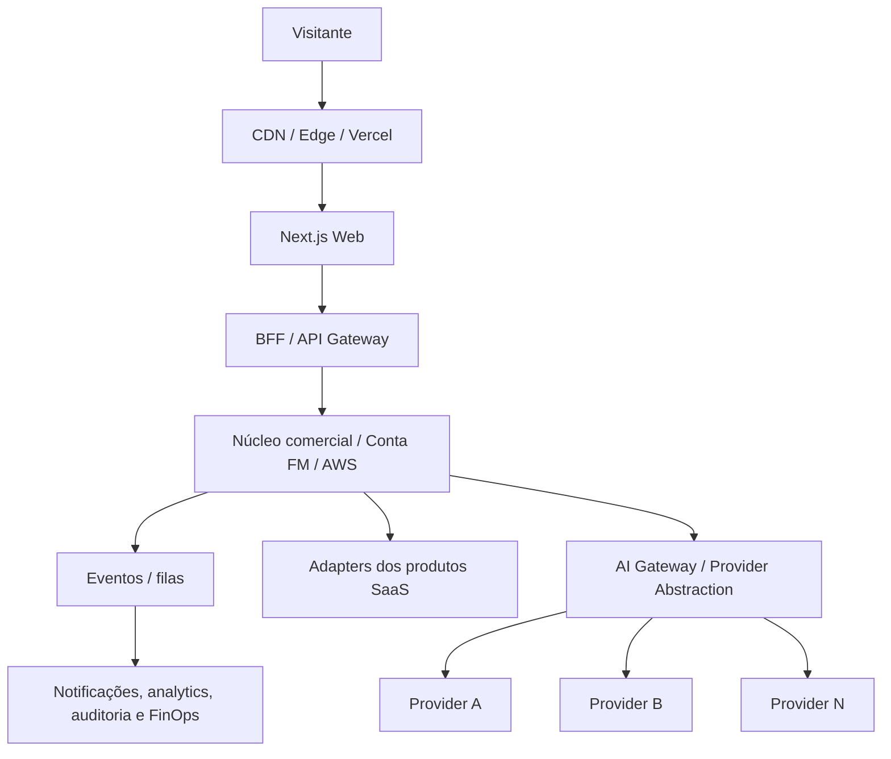

# SITE COMERCIAL FM TECNOLOGIA

## FASE 0 — INVENTÁRIO E READINESS

**Documento mestre de diagnóstico, decisões e liberação de execução** 
**Versão:** 1.3 
**Data:** 08 de setembro de 2026 
**Status:** FASE 0 ATUALIZADA — NO-GO PARA PROGRAMAÇÃO DEFINITIVA 
**Repositório auditado:** `faabio3131/fm-tecnologia-web-platform` 
**Autoridade documental:** hierarquia formal definida na seção 1.4

---

## 0. Sumário executivo

O projeto não deve ser tratado como um site institucional isolado. A arquitetura oficial determina a construção progressiva de uma **FM Technology Commerce Platform**, composta por experiência corporativa, marketplace de produtos, demonstrações, aquisição, Conta FM, trial, onboarding, provisionamento, billing, entitlement, CRM, analytics, suporte e governança.

O desenho conceitual é sólido e coerente com a ambição de suportar dezenas de produtos. A separação entre identidade central, domínio comercial e dados operacionais dos SaaS está explicitamente protegida. A arquitetura também autoriza começar com um monólito modular, desde que contratos e limites de domínio estejam claros.

A versão 1.3 incorpora novas decisões executivas do Diretor sem apagar o histórico da v1.2. Foram fechados o domínio desejado, pricing público de Kordena e Iron Fit, modelo de trial, validações de cadastro, estratégia de aquisição, direção de infraestrutura, estrutura legal/LGPD, canais de atendimento, posicionamento institucional e regra arquitetural de IA multi-provider/multi-modelo. Essas decisões reduzem blockers, mas **não substituem certificação, contratos técnicos, registro efetivo do domínio, threat model, dossiês completos, assets reais dos produtos nem homologação**.

O portfólio inicial conhecido permanece composto por seis produtos/tecnologias: **Kordena, Iron Fit, Vendedor IA, CampaIA, Super Core Extreme e ERP Core**. **Kordena é o nome canônico oficial**; “Coordena” é nomenclatura antiga/erro documental e não deve ser usada como marca ativa.

**Decisão de readiness:**

- **FASE 0 documental:** atualizada para **v1.3**.
- **Readiness para iniciar código definitivo:** **NO-GO**.
- **Principal avanço da v1.3:** domínio, trial, pricing, aquisição, infraestrutura, legal, suporte, institucional e princípio multi-provider possuem direção executiva formal.
- **Blockers ainda relevantes:** registro efetivo/titularidade do domínio; dossiês e certificação de Kordena e Iron Fit; assets reais; contratos de provisionamento/entitlement/SSO; IdP; threat model/NFRs; sitemap/URLs; detalhes de operação/legal e backlog reconciliado.
- **Primeiro bloco de programação após o GO:** fundação do repositório, contratos arquiteturais e Design System FM — sem implementar trial, billing ou integrações operacionais antes dos respectivos contratos.

---

## 1. Escopo, fontes e método

### 1.1 Fontes efetivamente encontradas

| ID | Fonte | Estado | Autoridade no diagnóstico |
|---|---|---:|---|
| FONTE-01 | `01 - ARQUITETURA MESTRE - SITE COMERCIAL FM TECNOLOGIA.pdf`, versão 1.0, setembro de 2026 | Lida integralmente, 7 páginas | Nível 2 — Arquitetura Mestre |
| FONTE-02 | Pasta “07 — ARQUITETURA DO SITE COMERCIAL FM TECNOLOGIA” | Inventariada; contém FONTE-01 | Contêiner documental da FONTE-01 |
| FONTE-03 | Repositório `faabio3131/fm-tecnologia-web-platform`, branch `main` | Estado técnico inicial | Evidência do estado do repositório |
| FONTE-04 | README do repositório | Confirma o propósito da plataforma | Evidência suplementar, consistente com FONTE-01 |
| FONTE-05 | Documentação oficial do Next.js, NestJS, PostgreSQL e OpenID Connect | Consulta de viabilidade da stack | Suporte à recomendação técnica; não altera a arquitetura oficial |
| FONTE-06 | Decisões executivas expressas do Diretor, registradas em 08/09/2026 | Incorporadas nas versões 1.1, 1.2 e 1.3 | Nível 1 — autoridade superior para decisões expressamente fechadas |

### 1.2 Legenda de classificação

- **[FATO]** Informação declarada em fonte oficial ou observada diretamente no repositório/pasta.
- **[INFERÊNCIA]** Interpretação coerente com os fatos, mas ainda não formalmente aprovada.
- **[PENDENTE]** Decisão, dado, contrato ou asset necessário que não foi encontrado ou concluído.
- **[RECOMENDAÇÃO]** Proposta deste inventário para fechar lacunas sem alterar silenciosamente a arquitetura.
- **[DECISÃO OFICIAL]** Deliberação fechada pelo Diretor e incorporada à fonte de verdade documental.

### 1.3 Limites respeitados

- Nenhum código de produto, frontend, backend, infraestrutura, banco ou migration é autorizado por esta atualização documental.
- Nenhuma decisão de produto, preço, domínio, trial, suporte, legal, infraestrutura ou provedor foi inventada; somente decisões expressamente aprovadas pelo Diretor foram promovidas a **[DECISÃO OFICIAL]**.
- Escolher `fmtecnologia.ai` não equivale a comprovar compra, registro ou titularidade; esse passo permanece pendente.
- Aprovar preço e trial não equivale a certificar produto, liberar produção ou provar margem líquida.
- Aprovar Next.js/Vercel + AWS como direção de infraestrutura não elimina a necessidade de ADRs, NFRs, threat model, ambientes e estimativas de custo.
- A arquitetura multi-provider/multi-modelo é um princípio de fundação e não autoriza acoplamento direto a qualquer fornecedor específico.
- A estrutura legal/LGPD pode ser preparada agora, mas razão social, CNPJ e demais dados formais somente serão preenchidos após a abertura oficial da empresa.
- O GitHub permanece sob governança documental até o fechamento dos gates de programação.

### 1.4 Hierarquia de autoridade documental

| Nível | Fonte | Papel e regra de prevalência |
|---:|---|---|
| 1 | Decisões executivas expressas do Diretor | Autoridade superior; prevalece quando fecha ou revisa uma decisão |
| 2 | `01 - ARQUITETURA MESTRE - SITE COMERCIAL FM TECNOLOGIA.pdf` | Arquitetura-mãe oficial, subordinada apenas às decisões executivas expressas |
| 3 | `docs/FASE_0_INVENTARIO_E_READINESS.md` | Consolidação executiva e diagnóstico vigente; fonte de verdade documental da Fase 0 |
| 4 | `docs/baseline-executivo/**` | Tradução estruturada/executável das decisões aprovadas, sem autoridade para contradizer os níveis superiores |

**Regra de reconciliação:** em caso de divergência entre o Baseline Executivo e este documento mestre da Fase 0, a divergência deve ser reconciliada antes de qualquer programação. Não podem existir duas fontes independentes de verdade.

**Regra de versionamento:** novas decisões materiais não devem alterar silenciosamente uma versão anterior. Esta atualização é formalmente **Fase 0 v1.3**, sucessora da v1.2.

---

# A) ESTADO ATUAL

## 2. Estado documental, técnico e comercial

### 2.1 Diagnóstico por dimensão

| Dimensão | Estado observado | Readiness | Evidência / impacto |
|---|---|---:|---|
| Arquitetura conceitual | Existe e cobre camadas, jornadas, serviços, eventos e roadmap | Parcialmente pronta | Boa direção; contratos detalhados ainda pendentes |
| Inventário de produtos | Portfólio inicial de seis produtos/tecnologias formalmente identificado | Resolvido para identificação | Dossiês e evidências comerciais/técnicas continuam pendentes |
| Posicionamento dos produtos | Classificação executiva e labels públicos definidos | Parcialmente pronto | Público/proposta de valor por produto ainda precisam de dossiê completo |
| Estágio comercial | Kordena e Iron Fit são produtos principais; quatro itens permanecem em desenvolvimento/P&D | Parcialmente pronto | “Produto principal” não equivale a homologação ou certificação |
| Arquitetura da informação | Organização Home/Marketplace aprovada | Parcialmente pronta | Sitemap, slugs e rota canônica ainda pendentes |
| Marca e Design System | Identidade oficial aprovada | Resolvido | Connected Modular refinado v1.0, Brand Baseline v1.0, paleta, tipografia, tokens e dark/light aprovados |
| Assets | Pacote institucional produzido | Parcialmente pronto | Incorporar ao repositório e completar assets reais por produto |
| Domínio e subdomínios | `fmtecnologia.ai` escolhido | Parcialmente pronto | Compra/registro/titularidade ainda precisam ser comprovados; subdomínios permanecem em ADR |
| Trial e onboarding | Kordena e Iron Fit: 30 dias, sem cartão; Iron Fit limitado a 15 alunos no trial | Parcialmente pronto | Contrato detalhado, elegibilidade/antiabuso, expiração e adapter ainda pendentes |
| Cadastro / Conta FM | E-mail e WhatsApp devem ser validados antes de efetivar a conta | Parcialmente pronto | IdP, MFA, sessão, recuperação e federação ainda pendentes |
| Aquisição | Modelo híbrido aprovado | Resolvido conceitualmente | Autosserviço para trial + fluxo consultivo para Enterprise/contas maiores |
| Pricing | Preços públicos mensal/anual aprovados para Kordena e Iron Fit | Resolvido para pricing-base | Billing, impostos, gateway e regras de mudança/cancelamento ainda pendentes |
| Billing | Limites arquiteturais definidos | Bloqueado | Provedor, impostos, meios de pagamento e reconciliação pendentes |
| Entitlement | Separação e entidades conceituais definidas | Bloqueado | Contrato técnico por produto inexistente |
| Provisionamento | Necessidade e evento `TenantProvisioned` definidos | Bloqueado | Adapter, SLA, idempotência e rollback pendentes |
| Infraestrutura | Direção Next.js/Vercel para Web + AWS para núcleo comercial/Conta FM/provisionamento aprovada | Parcialmente pronta | ADRs, ambientes, regiões, topologia e custos ainda precisam ser fechados |
| IA / provedores | Arquitetura multi-provider/multi-modelo provider-agnostic aprovada como regra de fundação | Parcialmente pronta | Gateway, adapters, roteamento, fallback e telemetria FinOps precisam de contrato técnico |
| Legal e LGPD | Preparar estrutura agora; dados formais da empresa entram após abertura | Parcialmente pronto | Textos finais, base legal, mapa de dados, cookies e responsáveis ainda pendentes |
| CRM e automação | Requisitos conceituais definidos | Pendente | Ferramentas, owner, funil e cadências ainda pendentes |
| Analytics | Métricas conceituais definidas | Pendente | Taxonomia, ferramenta e consent mode pendentes |
| Suporte | WhatsApp + e-mail; automação 24/7 aprovada | Parcialmente pronto | SLA, ownership, escalonamento e ferramentas ainda pendentes; não prometer humano 24/7 |
| Institucional | Site centrado na empresa, missão e valores; sem página pessoal do fundador | Resolvido conceitualmente | Copy institucional final ainda precisa de aprovação |
| Repositório | Criado e sob baseline documental | Pronto para documentação | Programação definitiva permanece bloqueada pelos gates |
| CI/CD e ambientes | Exigidos pela arquitetura | Ausentes | Dev/staging/prod, previews, gates e rollback ainda não configurados |

### 2.2 O que já está decidido oficialmente

1. **[FATO]** A plataforma será a porta comercial do ecossistema FM Tecnologia, não apenas presença institucional.
2. **[DECISÃO OFICIAL]** A aquisição será híbrida: autosserviço para quem deseja testar sozinho + fluxo consultivo para clientes maiores/Enterprise.
3. **[FATO]** A plataforma deve escalar para dezenas de produtos sem redesenho estrutural.
4. **[FATO]** O produto precisa aparecer por catálogo e por solução/segmento.
5. **[FATO]** A Conta FM será uma identidade central capaz de acessar vários produtos.
6. **[FATO]** Identidade, billing, trial e entitlement não podem ser misturados às bases operacionais dos SaaS.
7. **[FATO]** O site não terá acesso direto irrestrito às bases dos produtos.
8. **[FATO]** O frontend comercial será protegido por BFF/API Gateway.
9. **[FATO]** O provedor de pagamentos ficará atrás de uma camada de integração.
10. **[FATO]** Conteúdo comercial não controla permissões; entitlement é regra separada.
11. **[FATO]** O CMS não controla billing ou entitlement.
12. **[FATO]** O início pode usar monólito modular, desde que contratos e limites sejam explícitos.
13. **[FATO]** Operações financeiras devem ser idempotentes e auditáveis.
14. **[FATO]** A identidade deve suportar MFA, especialmente para administradores e Enterprise.
15. **[FATO]** O site público deve continuar disponível em falhas parciais de serviços internos.
16. **[FATO]** A experiência deve ser premium, limpa, tecnológica, humana, rápida e confiável, sem estética genérica de template de IA.
17. **[FATO]** Não podem ser publicados números, clientes, credenciais ou certificações inventadas.
18. **[FATO]** Antes do código definitivo devem ser confirmados domínio, produtos, status comercial, público, trial, preços, identidade, assets, legal, suporte, stack/hosting e integração com os produtos.
19. **[DECISÃO OFICIAL]** Kordena é o nome canônico; “Coordena” é nomenclatura antiga/erro documental.
20. **[DECISÃO OFICIAL]** A identidade visual oficial foi aprovada: símbolo Connected Modular refinado v1.0, Brand Baseline v1.0, paleta, tipografia, tokens e versões dark/light.
21. **[DECISÃO OFICIAL]** O pacote de assets institucional foi produzido e deve ser incorporado ao repositório oficial.
22. **[DECISÃO OFICIAL]** O portfólio inicial conhecido é composto por Kordena, Iron Fit, Vendedor IA, CampaIA, Super Core Extreme e ERP Core.
23. **[DECISÃO OFICIAL]** Kordena e Iron Fit são os produtos principais e terão página pública e destaque na Home/Marketplace; sua disponibilidade comercial final depende de certificação/evidência específica.
24. **[DECISÃO OFICIAL]** Vendedor IA, CampaIA e ERP Core terão comunicação pública **“Em desenvolvimento · Em breve”**, sem disponibilidade comercial.
25. **[DECISÃO OFICIAL]** Super Core Extreme terá comunicação pública **“Tecnologia & P&D · Em desenvolvimento”**, sem ser apresentado como SaaS comercial disponível.
26. **[DECISÃO OFICIAL]** Existência no portfólio, lifecycle, visibilidade no website, prontidão técnica, certificação, disponibilidade comercial, trial, pricing e ambiente de produção/homologação são estados independentes.
27. **[DECISÃO OFICIAL]** A Home/Marketplace será organizada em Produtos Principais, O que estamos construindo e Tecnologia & P&D.
28. **[DECISÃO OFICIAL]** A hierarquia de autoridade documental da seção 1.4 está aprovada.
29. **[DECISÃO OFICIAL]** O domínio escolhido é `fmtecnologia.ai`; compra/registro/titularidade ainda precisam ser efetivamente concluídos e verificados.
30. **[DECISÃO OFICIAL]** Kordena terá trial de **30 dias**, **sem cartão**.
31. **[DECISÃO OFICIAL]** Iron Fit terá trial de **30 dias**, **sem cartão**, limitado a **15 alunos** durante o período gratuito.
32. **[DECISÃO OFICIAL]** O cadastro exige validação obrigatória de **e-mail e WhatsApp antes de efetivar a conta**.
33. **[DECISÃO OFICIAL]** Os preços serão públicos, com ciclo mensal e anual.
34. **[DECISÃO OFICIAL]** Kordena: **R$ 299/mês** ou **R$ 2.990/ano**.
35. **[DECISÃO OFICIAL]** Iron Fit: **R$ 269/mês** ou **R$ 2.690/ano**.
36. **[DECISÃO OFICIAL]** Enterprise: **preço sob consulta**.
37. **[DECISÃO OFICIAL]** Direção de infraestrutura: **Next.js/Vercel para a camada Web + AWS para o núcleo comercial, Conta FM e provisionamento**, mantendo os SaaS isolados por contratos/adapters.
38. **[DECISÃO OFICIAL]** A estrutura legal/LGPD deve ser preparada agora; razão social, CNPJ e demais dados formais entram após a abertura oficial da empresa.
39. **[DECISÃO OFICIAL]** Atendimento: **WhatsApp + e-mail**, com **automação 24/7**. A comunicação pública não pode prometer atendimento humano 24/7 enquanto isso não existir.
40. **[DECISÃO OFICIAL]** O conteúdo institucional será centrado na empresa, missão e valores; **não haverá página pessoal do fundador**.
41. **[DECISÃO OFICIAL]** Todos os produtos FM e o site devem permanecer **multi-provider e multi-modelo**, sem dependência arquitetural de um único fornecedor de IA.
42. **[DECISÃO OFICIAL]** Funcionalidades de IA do site devem consumir uma camada abstrata de IA/Gateway com adapters de provedores; não devem chamar diretamente SDKs/APIs específicas a partir do frontend ou da lógica de domínio.
43. **[DECISÃO OFICIAL]** Chaves e segredos de provedores de IA permanecem no backend; nenhum segredo pode ser exposto no navegador.
44. **[DECISÃO OFICIAL]** O roteamento de IA poderá considerar capacidade, qualidade, custo, latência, disponibilidade e contexto, com fallback governado quando compatível.
45. **[DECISÃO OFICIAL]** A camada FinOps/AI Cost Governance deverá registrar, quando aplicável: tenant, produto, tarefa, provedor, modelo, tokens/consumo, custo, latência, resultado e falha.
46. **[DECISÃO OFICIAL]** A arquitetura deve permitir incluir/trocar Google, OpenAI, Anthropic, NVIDIA e outros provedores sem reescrever o domínio consumidor; o uso atual de Google API nos produtos não cria lock-in para o site.
47. **[DECISÃO OFICIAL]** Meta de custo operacional por tenant para proteção de margem: Kordena com alvo de até **R$ 50/mês** e limite de atenção de **R$ 75/mês**; Iron Fit com alvo de até **R$ 45/mês** e limite de atenção de **R$ 67/mês**. Esses valores devem considerar IA + infraestrutura variável/compartilhada alocável e são metas de engenharia financeira, não garantia de lucro líquido.

### 2.3 O que ainda não está decidido ou comprovado

Apesar do avanço da v1.3, o projeto ainda não possui o **baseline executável completo**. Permanecem pendentes: registro/titularidade efetiva do domínio; dossiês completos e evidências de certificação/comercialização; assets reais por produto; detalhes de TrialPolicy (antiabuso, elegibilidade e expiração); contratos de identidade, provisionamento e entitlement; provider de identidade; billing/gateway/impostos; mapa de dados e textos jurídicos finais; SLA/ownership de suporte; ADRs de ambientes/regiões/topologia; threat model/NFRs; sitemap/URLs e backlog reconciliado.

---

# B) INVENTÁRIO CONSOLIDADO

## 3. Inventário da arquitetura oficial

### 3.1 As 15 camadas canônicas

| # | Camada oficial | Responsabilidade | Estado de especificação |
|---:|---|---|---|
| 1 | Corporate Experience | Marca, Home, empresa, confiança e entrada dos funis | Macro definida; institucional centrado na empresa; copy final pendente |
| 2 | Product Marketplace | Catálogo escalável e navegação por categorias | Macro/grupos definidos; taxonomia detalhada pendente |
| 3 | Product Experience / Demos | Páginas, screenshots, vídeos, tours e demos | Estrutura definida; assets reais pendentes |
| 4 | Trial & Conversion Engine | Elegibilidade, período, limites, expiração, conversão e grace period | 30 dias sem cartão aprovados para Kordena/Iron Fit; Iron Fit com 15 alunos; contrato detalhado pendente |
| 5 | FM Identity / Account | Usuário, organização, memberships, papéis, segurança e acesso multiproduto | E-mail + WhatsApp validados antes de efetivar conta; IdP/MFA/federação pendentes |
| 6 | Onboarding | Configuração orientada à ativação por produto | Conceitual; definições por produto pendentes |
| 7 | Billing & Subscription | Catálogo financeiro, assinatura, invoices, ciclos e webhooks | Pricing-base aprovado; provedor/regras fiscais pendentes |
| 8 | CRM / Sales | Lead, origem, campanha, estágio, owner e Enterprise | Aquisição híbrida aprovada; ferramenta/processo pendentes |
| 9 | Marketing Automation | Mensagens e campanhas orientadas a eventos | Conceitual; canais/consentimentos pendentes |
| 10 | Analytics / Product Telemetry | Web, funil comercial, ativação e custos | Métricas macro + FinOps de IA aprovados; taxonomia/ferramenta pendentes |
| 11 | Support / Help Center | Autoatendimento, suporte e roteamento | WhatsApp + e-mail e automação 24/7 aprovados; SLA/ownership pendentes |
| 12 | Trust, Security & Legal | Segurança, confiança, LGPD, termos e políticas | Estrutura autorizada; dados legais finais e textos pendentes |
| 13 | Integration / API Layer | BFF, adapters, webhooks, IA provider adapters, retries, DLQ e observabilidade | Princípios definidos; contratos pendentes |
| 14 | Administration / CMS | Conteúdo, catálogo, trial policies, leads, flags e auditoria | Escopo definido; RBAC/UX/ferramenta pendente |
| 15 | Observability & Operations | Logs, métricas, traces, uptime, alertas, custos e saúde comercial | Requisitos + metas FinOps definidos; implementação pendente |

### 3.2 Topologia lógica oficial

O “núcleo comercial” representa Identity, Organization, Catalog, Trial, Entitlement, Billing, Onboarding, CRM Adapter e governança operacional. A simplificação visual não elimina limites oficiais entre domínios nem transforma Vercel em núcleo de negócio.

### 3.3 Serviços lógicos inventariados

- Next.js Web Frontend.
- BFF/API Gateway.
- Identity Service / Conta FM.
- Organization Service.
- Product Catalog.
- Trial Service.
- Entitlement Service.
- Billing Service.
- Onboarding Service.
- Lead/CRM Adapter.
- Notification Service.
- CMS.
- Analytics/Event Collector.
- AI Gateway / Provider Abstraction Layer.
- AI Provider Adapters.
- AI Cost Governance / FinOps.
- Media Service.
- Support Adapter.
- Admin Portal.
- Audit/Observability.

### 3.4 Eventos oficiais recomendados

- `LeadCreated`
- `AccountCreated`
- `EmailVerified`
- `WhatsAppVerified`
- `OrganizationCreated`
- `TrialStarted`
- `TenantProvisioned`
- `OnboardingStepCompleted`
- `ActivationReached`
- `TrialExpiring`
- `SubscriptionCreated`
- `PaymentConfirmed`
- `SubscriptionCanceled`
- `ProductEnabled`
- `ProductDisabled`
- `AIRequestCompleted`
- `AIRequestFailed`
- `AICostRecorded`

**[PENDENTE]** Para implementação, os eventos precisam de versão, owner, schema, campos obrigatórios, dados pessoais permitidos, idempotency key, ordering, retenção, consumidor, retry e compatibilidade retroativa.

### 3.5 Modelo conceitual oficial

| Relação | Significado |
|---|---|
| User → Verification → Membership → Organization | Conta só é efetivada após validações exigidas e pessoa pode participar de organizações com papéis específicos |
| Organization → Trial/Subscription | Trials e assinaturas pertencem à organização, não somente ao usuário |
| Trial/Subscription → Product/Plan | Acesso comercial está ligado a produto e plano |
| Product/Plan → Entitlements | Capacidades efetivas são concedidas por direitos explícitos |
| Organization → ProductTenantRef | A plataforma mantém referência segura ao tenant no SaaS, não seus dados operacionais |
| Lead/Opportunity → Person/Organization/Product | Funil preserva contexto da intenção e suporta autosserviço/Enterprise |
| AIRequest → Provider/Model/UsageCost | Consumo de IA é abstraído e mensurado sem tornar o domínio dependente do fornecedor |
| Consent, AuditEvent, CampaignAttribution, OnboardingProgress | Governança, compliance, atribuição e ativação completam o núcleo |

---

## 4. Inventário dos produtos e tecnologias do portfólio

### 4.1 Resultado objetivo

**[DECISÃO OFICIAL]** O portfólio inicial conhecido da FM Tecnologia contém seis produtos/tecnologias: **Kordena, Iron Fit, Vendedor IA, CampaIA, Super Core Extreme e ERP Core**. Isso não significa que todos estejam comercialmente disponíveis nem que possuam dossiê, certificação ou produção homologada.

**Reconciliação com a arquitetura original:** AI Web Builder permanece apenas como capacidade futura citada no PDF e não integra o portfólio inicial de seis itens. Sua eventual promoção a produto exige nova decisão executiva.

### 4.2 Product Registry Mestre

| Produto | Lifecycle / comunicação | Website | Prioridade | Disponibilidade comercial | Trial aprovado | Pricing aprovado | Certificação | Página própria | Pendências principais |
|---|---|---:|---|---|---|---|---|---:|---|
| Kordena | Produto principal; lifecycle técnico ainda requer evidência | SIM | Destaque Home/Marketplace | PENDENTE_EVIDENCIA até certificação/homologação | **30 dias; sem cartão** | **R$ 299/mês; R$ 2.990/ano; Enterprise sob consulta** | PENDENTE_EVIDENCIA | SIM | Certificação, homologação, dossiê, TrialPolicy detalhada, integração |
| Iron Fit | Produto principal; lifecycle técnico ainda requer evidência | SIM | Destaque Home/Marketplace | PENDENTE_EVIDENCIA até certificação/homologação | **30 dias; sem cartão; máximo 15 alunos** | **R$ 269/mês; R$ 2.690/ano; Enterprise sob consulta** | PENDENTE_EVIDENCIA | SIM | Certificação, homologação, dossiê, integração |
| Vendedor IA | `in_development` — **Em desenvolvimento · Em breve** | SIM | O que estamos construindo | NÃO | NÃO DISPONÍVEL | NÃO PUBLICAR OFERTA | PENDENTE_EVIDENCIA | SIM | Dossiê, evidências e critérios de evolução |
| CampaIA | `in_development` — **Em desenvolvimento · Em breve** | SIM | O que estamos construindo | NÃO | NÃO DISPONÍVEL | NÃO PUBLICAR OFERTA | PENDENTE_EVIDENCIA | SIM | Dossiê, evidências e critérios de evolução |
| Super Core Extreme | `research_and_development` — **Tecnologia & P&D · Em desenvolvimento** | SIM | Tecnologia & P&D | NÃO; não tratar como SaaS comercial disponível | NÃO DISPONÍVEL | NÃO PUBLICAR OFERTA | PENDENTE_EVIDENCIA | SIM | Dossiê e critérios de evolução |
| ERP Core | `in_development` — **Em desenvolvimento · Em breve** | SIM | O que estamos construindo | NÃO | NÃO DISPONÍVEL | NÃO PUBLICAR OFERTA | PENDENTE_EVIDENCIA | SIM | Dossiê, evidências e critérios de evolução |

Regras vivas do registry:

1. Somente nomes aprovados entram como produtos identificados.
2. “Coordena” pode aparecer apenas em histórico, migração ou correção documental, sempre remetendo a Kordena.
3. Página pública não equivale a produto comercialmente disponível.
4. Pricing e trial aprovados não substituem certificação/homologação.
5. Cada novo produto exige dossiê, owners e estado comercial antes de entrar no marketplace.
6. Todos os produtos e o site preservam arquitetura multi-provider/multi-modelo; nenhum provider específico faz parte da identidade do produto.

### 4.3 Governança obrigatória de estados independentes

Os seguintes estados devem ser registrados de forma independente:

- existência no portfólio;
- estágio de desenvolvimento/lifecycle;
- visibilidade no website;
- prontidão técnica;
- certificação;
- disponibilidade comercial;
- disponibilidade e regras de trial;
- pricing;
- produção/homologação.

Nunca converter automaticamente “produto principal”, “produto pronto”, “trial aprovado” ou “preço aprovado” em “produção homologada” ou “certificação concluída”. Cada transição exige evidência e decisão próprias.

### 4.4 Arquitetura escalável de lifecycle

`research_and_development` → `in_development` → `beta` → `available`

| Lifecycle / disponibilidade | Comunicação obrigatória | CTAs permitidos | CTAs proibidos enquanto indisponível |
|---|---|---|---|
| `research_and_development` | **Tecnologia & P&D · Em desenvolvimento** | Conhecer o projeto; Demonstrar interesse; Falar com a FM | Comprar; Começar trial; Assinar; alegar disponibilidade imediata |
| `in_development` | **Em desenvolvimento · Em breve** | Conhecer o projeto; Demonstrar interesse; Acompanhar lançamento; Falar com a FM | Comprar; Começar trial; Assinar; alegar disponibilidade imediata |
| `beta` | Escopo, elegibilidade e limitações aprovados | Somente CTAs autorizados pela política de beta | Compra/assinatura/trial público não autorizados |
| `available` | Disponibilidade sustentada por certificação e decisão comercial | CTAs aprovados para compra, trial, assinatura ou contato | Qualquer CTA sem política comercial vigente |

### 4.5 Dossiê obrigatório para cada produto

Antes de qualquer alegação de disponibilidade comercial, compra, assinatura ou trial efetivamente liberado, cada produto deve possuir ficha aprovada com: nome canônico, categoria, lifecycle, público, problema, proposta de valor, benefícios, funcionalidades, workflows, integrações, segurança/privacidade, planos/preços, TrialPolicy, ActivationDefinition, onboarding, entitlement, provisionamento/desprovisionamento, suporte/SLA, assets, owners e URLs/ambientes.

---

## 5. Arquitetura de páginas e navegação

### 5.1 Navegação global

Menu recomendado: `Produtos | Soluções | Preços | Recursos | Empresa | Entrar`, com CTAs persistentes `Comece grátis` e, quando apropriado, `Fale com a FM`.

O modelo de aquisição é híbrido: o usuário pode iniciar trial sozinho em produto elegível, enquanto clientes maiores/Enterprise devem ter rota consultiva clara.

### 5.2 Home

**[DECISÃO OFICIAL]** A Home e o Product Marketplace usarão:

- **Produtos Principais:** Kordena e Iron Fit.
- **O que estamos construindo:** Vendedor IA, CampaIA e ERP Core — badge **“Em desenvolvimento · Em breve”**.
- **Tecnologia & P&D:** Super Core Extreme — badge **“Tecnologia & P&D · Em desenvolvimento”**.

| Ordem | Seção | Objetivo | Dependência |
|---:|---|---|---|
| 1 | Hero | Explicar a FM em segundos e apresentar software real | Mensagem + assets reais |
| 2 | Produtos em destaque | Apresentar Kordena e Iron Fit | Certificação/evidências e status comercial explícito |
| 3 | Veja funcionando | Provar valor com microdemo, vídeo ou tour | Assets reais |
| 4 | Soluções por segmento | Entrada pelo problema/mercado | Taxonomia |
| 5 | Benefícios e resultados | Comunicar impacto com claims comprováveis | Claims aprovados |
| 6 | Tecnologia FM | Demonstrar plataforma, IA multi-provider, segurança e integração sem exageros | Mensagens verificadas |
| 7 | Trial | 30 dias sem cartão nos produtos elegíveis | Produto certificado + TrialPolicy |
| 8 | Business / Enterprise | Abrir funil consultivo | Processo comercial |
| 9 | Confiança e segurança | Práticas reais, sem certificações inventadas | Evidências/políticas |
| 10 | Ecossistema / Conta FM | Acesso multiproduto | Arquitetura de identidade |
| 11 | Conteúdo / cases | Autoridade quando houver material real | Cases/autorização |
| 12 | CTA final | Converter conforme contexto | Roteamento |
| 13 | Rodapé | Legal, contato, status e recursos | Conteúdo/canais |

### 5.3 Produtos e Marketplace

O catálogo central deve organizar os seis itens nos grupos aprovados, suportar busca/filtros, status/lifecycle e CTAs coerentes. Produtos indisponíveis usam somente CTAs informativos. A decisão entre `/produtos` e `/marketplace` como rota canônica permanece pendente.

### 5.4 Página individual de produto

1. Hero e promessa verificável.
2. Demonstração/vídeo real.
3. Problema e resultado.
4. Benefícios e workflows.
5. Funcionalidades reais.
6. Screenshots/tour.
7. Integrações disponíveis versus planejadas.
8. Segurança e privacidade.
9. Planos/preços quando comercialmente autorizado.
10. FAQ.
11. Trial e política de cartão/limites.
12. Enterprise/contato.
13. CTA final.

### 5.5 Preços

**[DECISÃO OFICIAL]** Os preços serão públicos no site com ciclo mensal e anual:

| Produto | Mensal | Anual | Trial | Enterprise |
|---|---:|---:|---|---|
| Kordena | **R$ 299/mês** | **R$ 2.990/ano** | **30 dias, sem cartão** | Sob consulta |
| Iron Fit | **R$ 269/mês** | **R$ 2.690/ano** | **30 dias, sem cartão, até 15 alunos** | Sob consulta |

A página deve também explicar cobrança, limites, add-ons quando existirem, upgrade/downgrade/cancelamento e FAQ. Gateway, impostos e meios de pagamento permanecem pendentes.

### 5.6 Recursos

Hub escalável para demonstrações, ajuda, documentação, blog/knowledge hub, webinars, guias, integrações, segurança/trust center e status. Na primeira versão, publicar somente áreas com conteúdo real.

### 5.7 Empresa

**[DECISÃO OFICIAL]** O institucional será centrado na **FM Tecnologia, missão, valores, princípios, abordagem de produto, segurança, contato e informações corporativas verificáveis**. Não haverá página pessoal do fundador. Dados como razão social e CNPJ serão adicionados após abertura formal.

### 5.8 Login e cadastro

Fluxos necessários: entrar, criar conta, validar e-mail, validar WhatsApp, recuperar senha, MFA, consentimentos, convite para organização, troca de organização, sessão e logout.

**Invariante aprovado:** o cadastro não é efetivado como conta plenamente ativa antes da validação obrigatória de **e-mail e WhatsApp**.

### 5.9 Conta FM

Área autenticada central com perfil/segurança, organizações/memberships, produtos habilitados, trials, assinaturas, billing profile, convites, papéis, consentimentos, acesso aos apps, suporte e auditoria aplicável. A Conta FM gerencia identidade/direitos e não replica o backoffice operacional de cada SaaS.

---

## 6. Jornada completa do CTA “Comece grátis”

### 6.1 Regras de roteamento

| Origem | Produto conhecido? | Ação correta |
|---|---:|---|
| Página de Kordena/Iron Fit | Sim | Iniciar jornada vinculada ao produto, quando certificado/elegível |
| Card do marketplace | Sim | Confirmar produto e abrir autenticação/cadastro |
| Home genérica | Não necessariamente | Seletor leve de produto/solução |
| Página de solução | Pode haver vários | Recomendar e pedir seleção |
| Enterprise | Sim ou não | Qualificação comercial; não forçar trial de autosserviço |

### 6.2 Happy path canônico atualizado

1. Visitante clica em `Comece grátis`.
2. Plataforma registra origem/campanha/produto e consentimento aplicável.
3. Catálogo valida produto elegível e TrialPolicy ativa.
4. Usuário inicia Conta FM.
5. **E-mail é validado.**
6. **WhatsApp é validado.**
7. Conta é efetivada conforme política de identidade.
8. Usuário cria/seleciona Organization.
9. Sistema coleta dados mínimos necessários.
10. Usuário aceita termos versionados.
11. Trial Service valida elegibilidade/antiabuso.
12. Kordena recebe política de 30 dias sem cartão; Iron Fit recebe 30 dias sem cartão e limite de 15 alunos no trial.
13. É criada reserva idempotente de trial.
14. Provisioning Adapter cria o tenant/workspace no SaaS.
15. SaaS retorna `ProductTenantRef` sem replicar dados operacionais.
16. Entitlement concede direitos temporários conforme política.
17. Trial fica ativo após provisionamento confirmado.
18. Onboarding inicia definição específica do produto.
19. Usuário executa primeira ação de valor.
20. Analytics registra ativação com minimização de dados.
21. Notificações orientam uso/expiração conforme base legal/consentimento.
22. Plataforma recomenda plano mensal/anual ou rota Enterprise.
23. Billing realiza checkout por adapter.
24. Webhook assinado e idempotente confirma pagamento.
25. Entitlements pagos substituem os temporários sem interromper o tenant.
26. Conta FM exibe produto ativo.

### 6.3 Abandono, retomada e falhas

Cada passo deve persistir estado retomável sem armazenar senhas/dados desnecessários. Falhas de verificação, provisionamento, entitlement e billing devem ser reconciliáveis e auditáveis. Trial expirado restringe direitos conforme política, sem apagar dados silenciosamente.

### 6.4 Estados mínimos recomendados

- Registration: `started`, `email_verified`, `whatsapp_verified`, `account_effective`, `organization_pending`, `completed`, `abandoned`.
- Trial: `requested`, `eligibility_rejected`, `provisioning_pending`, `active`, `expiring`, `grace`, `converted`, `expired`, `canceled`, `failed`.
- Provisioning: `requested`, `in_progress`, `succeeded`, `failed_retryable`, `failed_terminal`, `compensated`.
- Subscription: `pending`, `active`, `past_due`, `suspended`, `canceled`, `expired`.
- Entitlement: `pending`, `active`, `restricted`, `revoked`.

Esses nomes permanecem **[RECOMENDAÇÃO]** até os contratos detalhados.

---

## 7. Arquitetura de identidade, trial, onboarding, provisionamento, billing e entitlement

### 7.1 Separação obrigatória de domínios

| Domínio | Fonte de verdade | Pode conhecer | Não pode controlar |
|---|---|---|---|
| Identity | Usuário, verificações, credenciais/federação, sessões, MFA | Memberships/Organizations | Dados operacionais dos produtos |
| Organization | Organizações, memberships e papéis | Usuários/produtos vinculados | Cobrança e dados operacionais |
| Product Catalog | Produtos, planos, preços e TrialPolicy | Metadata aprovada | Credenciais ou dados de tenant |
| Trial | Elegibilidade, ciclo, limites e estado | Organization/Product/Plan/TenantRef | Cobrança confirmada |
| Onboarding | Definição e progresso | Produto/tenant ref/eventos necessários | Permissões comerciais definitivas |
| Provisioning | Adapter e criação de tenant | IDs/configuração autorizada | Identidade central ou preço |
| Billing | Customer, assinatura, invoices, webhooks | Organization/Price/status financeiro | Conteúdo do site/dados operacionais |
| Entitlement | Direitos efetivos | Trial/Subscription válidos | Conteúdo comercial/dados operacionais |
| Produto SaaS | Operação do negócio | Identidade federada, tenant e entitlement necessários | Billing central/credenciais globais |
| AI Gateway | Roteamento e execução abstrata de IA | Contexto mínimo, políticas e provider adapters | Regras de negócio específicas do fornecedor |
| FinOps IA | Consumo/custo/latência/resultados | Tenant/produto/tarefa/provedor/modelo | Segredos ou dados operacionais desnecessários |

### 7.2 Contrato padronizado para qualquer produto

Cada SaaS deve entrar por `Product Integration Contract` contendo metadata/assets, pricing/TrialPolicy, onboarding/activation, entitlement, provisioning/deprovisioning, SSO/federação, events, health/reconciliation, support route, security/privacy data map, owners e SLA.

### 7.3 Invariantes de segurança

1. Nenhum CTA concede acesso antes de elegibilidade/aceites válidos.
2. E-mail e WhatsApp precisam estar validados antes da efetivação da conta.
3. Nenhum webhook financeiro é confiado sem assinatura, replay protection e idempotência.
4. CMS não altera permissões.
5. Produtos não consultam diretamente tabelas centrais; usam contratos/adapters.
6. Conta FM não recebe acesso irrestrito à base operacional.
7. Mudança sensível registra ator, horário, motivo e correlation ID.
8. Troca de organização recalcula contexto/direitos.
9. Falha de billing não apaga dados operacionais sem política aprovada.
10. Ambientes/credenciais são segregados.
11. Chaves de IA ficam no backend e nunca no navegador.
12. Nenhum domínio consumidor depende diretamente de SDK/API de um provider de IA.

### 7.4 Arquitetura multi-provider/multi-modelo de IA

**Princípio oficial:** FM Tecnologia é provider-agnostic desde a fundação. Google API é utilizada atualmente em produtos do ecossistema, mas nenhum produto e nenhum componente do site deve depender estruturalmente dela.

Fluxo conceitual:

`Feature/Agent → AI Gateway → Policy/Router → Provider Adapter → Model → Telemetry/FinOps`

O Policy/Router poderá selecionar execução por capacidade, qualidade, custo, latência, disponibilidade, contexto e política de risco. Fallback entre providers somente ocorrerá quando houver compatibilidade de contrato, segurança e política.

### 7.5 FinOps / AI Cost Governance

Telemetria mínima por execução, quando aplicável:

- tenant/organization;
- produto/feature/tarefa;
- provider e modelo;
- consumo/tokens/unidades faturáveis;
- custo estimado/real reconciliável;
- latência;
- sucesso/falha;
- rota/fallback;
- correlation ID.

Metas executivas iniciais de custo operacional alocável por tenant:

| Produto | Receita mensal | Equivalente mensal do anual | Alvo de custo | Limite de atenção | Observação |
|---|---:|---:|---:|---:|---|
| Kordena | R$ 299 | R$ 249,17 | **≤ R$ 50/mês** | **R$ 75/mês** | Meta orientada a margem bruta de infraestrutura/IA; não é lucro líquido garantido |
| Iron Fit | R$ 269 | R$ 224,17 | **≤ R$ 45/mês** | **R$ 67/mês** | Mesma regra; inclui alocação de IA/infra variável e compartilhada mensurável |

O sistema deve permitir alertas e revisão de roteamento/caching/uso quando os limites forem ultrapassados.

---

## 8. Inventário de assets

### 8.1 Estado dos assets

| Tipo | Estado atual |
|---|---|
| Documento de arquitetura | Existente |
| Símbolo FM / Brand Baseline / paleta / tipografia / tokens / dark-light | Produzidos e aprovados; incorporação ao repositório ainda pendente |
| Logos/ícones específicos dos produtos | PENDENTE_EVIDENCIA |
| Screenshots/workflows demonstráveis | PENDENTE_EVIDENCIA |
| Vídeos/microdemos/tours | PENDENTE_EVIDENCIA |
| Open Graph por rota/produto | PENDENTE_EVIDENCIA |
| Copy deck/cases autorizados | PENDENTE_EVIDENCIA |

Nenhum mockup pode sugerir funcionalidade inexistente. Dados devem ser fictícios/seguros e assets não podem conter PII, segredos ou URLs internas.

---

## 9. Domínios e subdomínios

### 9.1 Decisão executiva

**[DECISÃO OFICIAL]** Domínio principal escolhido: **`fmtecnologia.ai`**.

### 9.2 Blocker remanescente

A escolha não encerra o blocker enquanto não houver evidência de **compra/registro/titularidade**. Também permanecem pendentes:

- estratégia `www` versus apex;
- Conta FM;
- ajuda;
- status;
- staging/previews;
- URLs dos apps/produtos;
- redirects/canonical;
- DNS, CDN/WAF;
- e-mail transacional e SPF/DKIM/DMARC;
- certificados/renovação.

Subdomínios devem ser definidos por ADR, sem inventar nomes antes da decisão.

---

## 10. Integrações externas e dependências técnicas

| Integração / dependência | Direção aprovada | Estado / pendência |
|---|---|---|
| Kordena e Iron Fit | Provisionamento, SSO/identidade, entitlement, eventos, suporte por contrato | Contrato por produto pendente |
| Identidade | Conta FM com validação de e-mail + WhatsApp; OIDC/MFA desejáveis conforme arquitetura | IdP, sessão, recovery e federação pendentes |
| Pagamento | Adapter obrigatório | Provedor, impostos, PIX/cartão/boleto e reconciliação pendentes |
| CRM | Suportar autosserviço + Enterprise | Ferramenta/processo pendentes |
| E-mail | Verificação, onboarding, trial, billing e suporte | Provedor/domínio/templates pendentes |
| WhatsApp | Validação de cadastro, automação e atendimento | BSP/opt-in/templates/compliance pendentes |
| CMS | Conteúdo versionado/preview/workflow | Ferramenta pendente; não controlar regras sensíveis |
| Analytics | Aquisição/navegação/ativação | Ferramenta/taxonomia/consent mode pendentes |
| IA | **Multi-provider/multi-modelo por AI Gateway/adapters** | Contratos, adapters, roteamento e fallback pendentes |
| Media/video | CDN/streaming/transcrição | Ferramenta/custo pendentes |
| Suporte | **WhatsApp + e-mail; automação 24/7** | SLA/ownership/escalonamento/ferramenta pendentes |
| Observabilidade | Logs/métricas/traces/erros/uptime + FinOps | Stack/retenção pendentes |
| Consent/Cookies | LGPD | CMP/mapa de cookies pendentes |
| Web hosting | **Next.js/Vercel** | Configuração, ambientes e ADRs pendentes |
| Núcleo comercial | **AWS para Conta FM, core comercial e provisionamento** | Topologia/região/serviços/IaC/DR/custos pendentes |
| GitHub Actions | CI/CD, testes e previews | Workflows/proteções pendentes |

---

# C) LACUNAS ENCONTRADAS

## 11. Riscos, contradições e blockers

### 11.1 Blockers críticos — estado vivo v1.3

| ID | Blocker | Estado | Ação remanescente |
|---|---|---:|---|
| BLK-01 | Inventário canônico dos produtos | **RESOLVIDO** | Nenhuma para identificação |
| BLK-02 | Kordena versus Coordena | **RESOLVIDO** | Nenhuma |
| BLK-03 | Dossiês/público/proposta/evidências por produto | ABERTO | Completar dossiês e certificação |
| BLK-04 | Domínio principal/subdomínios | **PARCIAL** | `fmtecnologia.ai` escolhido; registrar/comprovar titularidade e fechar mapa/ADRs |
| BLK-05 | Identidade visual/Design System | **RESOLVIDO** | Incorporar assets aprovados ao repositório |
| BLK-06 | Assets reais de produto | ABERTO | Produzir/validar pacote por produto |
| BLK-07 | TrialPolicy por produto | **PARCIAL** | 30 dias sem cartão aprovados; Iron Fit até 15 alunos; completar elegibilidade, antiabuso, expiração e contrato |
| BLK-08 | Planos e preços | **RESOLVIDO PARA PRICING-BASE** | Kordena 299/2990; Iron Fit 269/2690; Enterprise sob consulta; billing permanece separado |
| BLK-09 | Provisionamento/entitlement | ABERTO | Contratos/adapters versionados |
| BLK-10 | Legal/LGPD | **PARCIAL** | Estrutura autorizada; textos, mapa de dados, cookies, owners e dados formais pendentes |
| BLK-11 | Suporte/operação | **PARCIAL** | WhatsApp/e-mail + automação 24/7 aprovados; SLA/owner/escalonamento pendentes |
| BLK-12 | Stack/hosting/threat model | **PARCIAL** | Next.js/Vercel + AWS aprovados como direção; ADRs/NFRs/threat model pendentes |
| BLK-13 | Governança de IA/custos | **PARCIAL** | Multi-provider + metas FinOps aprovados; implementar contratos/telemetria/alertas posteriormente |

### 11.2 Contradições ou ambiguidades

1. **Kordena/Coordena — RESOLVIDO:** Kordena é canônico.
2. **Produtos/Marketplace:** grupos aprovados; rota canônica ainda pendente.
3. **Trial sem cartão — RESOLVIDO no princípio comercial:** Kordena e Iron Fit terão 30 dias sem cartão; Iron Fit com limite de 15 alunos. Detalhes técnicos continuam pendentes.
4. **Pricing versus disponibilidade — regra obrigatória:** preço aprovado não autoriza publicação de CTA transacional antes de certificação/homologação do produto e do billing.
5. **Vercel/AWS versus desacoplamento:** Vercel é camada Web e AWS é direção do core; SaaS e IA continuam isolados por contratos/adapters.
6. **Provider atual versus lock-in:** uso de Google API não transforma Google em dependência arquitetural exclusiva.
7. **24/7:** somente automação pode ser comunicada como 24/7 enquanto não existir operação humana contínua.
8. **Institucional:** não criar página pessoal do fundador.

### 11.3 Riscos arquiteturais principais

- Acoplar site/core a um único provider de IA.
- Expor chaves de IA no frontend.
- Usar modelos premium em toda tarefa sem roteamento/custo governado.
- Construir autenticação própria sem maturidade de segurança.
- Acoplar site diretamente às bases dos produtos.
- Misturar catálogo comercial com permissões efetivas.
- Usar CMS como banco de regras sensíveis.
- Ignorar idempotência/reconciliação em trial/billing/provisionamento.
- Instrumentar analytics/WhatsApp sem base legal/consentimentos.
- Prometer atendimento humano 24/7 ou claims não comprovados.
- Programar antes dos contratos e gates.

---

# D) DECISÕES NECESSÁRIAS

## 12. Decision Register de decisões P0

### 12.1 Decisões P0 — obrigatórias antes de qualquer código definitivo

| ID | Decisão | Estado | Evidência / próxima ação |
|---|---|---:|---|
| DEC-01 | Nome oficial da plataforma/site e mensagem principal | ABERTO | Brand/copy brief final |
| DEC-02 | Domínio principal e mapa de subdomínios | **PARCIAL** | `fmtecnologia.ai` escolhido; registrar/titularidade + ADR de subdomínios |
| DEC-03 | Lista canônica/status comercial | PARCIAL | Seis itens definidos; certificação/disponibilidade final de Kordena/Iron Fit pendentes |
| DEC-04 | Kordena/Coordena | **RESOLVIDO** | Kordena canônico |
| DEC-05 | Produto(s) do lançamento/MVP | PARCIAL | Kordena/Iron Fit são principais; release scope/certificação formal pendentes |
| DEC-06 | Público/posicionamento/proposta por produto | PARCIAL | Grupos/labels aprovados; dossiês completos pendentes |
| DEC-07 | Política de trial | **PARCIAL** | Kordena 30 dias sem cartão; Iron Fit 30 dias sem cartão/15 alunos; detalhes de contrato pendentes |
| DEC-08 | Planos, preços e Enterprise | **RESOLVIDO** | Kordena 299/2990; Iron Fit 269/2690; Enterprise sob consulta |
| DEC-09 | Identidade visual/direção de arte | **RESOLVIDO** | Baseline aprovado |
| DEC-10 | Assets por produto | ABERTO | Asset manifest e assets reais |
| DEC-11 | Identidade, dados e consentimentos | PARCIAL | E-mail/WhatsApp obrigatórios; IdP/data map/consentimentos pendentes |
| DEC-12 | Suporte/contato | PARCIAL | WhatsApp + e-mail + automação 24/7; SLA/owner/escalonamento pendentes |
| DEC-13 | Stack/hosting/ambientes | PARCIAL | Next.js/Vercel + AWS aprovados; ADRs/ambientes pendentes |
| DEC-14 | Integração com SaaS | PARCIAL | Isolamento por contratos/adapters aprovado; contratos concretos pendentes |
| DEC-15 | Portfólio inicial de seis itens | **RESOLVIDO** | Kordena, Iron Fit, Vendedor IA, CampaIA, Super Core Extreme, ERP Core |
| DEC-16 | Produtos em desenvolvimento públicos | **RESOLVIDO** | “Em desenvolvimento · Em breve” |
| DEC-17 | Produtos principais Home/Marketplace | **RESOLVIDO** | Kordena e Iron Fit |
| DEC-18 | Super Core Extreme | **RESOLVIDO** | “Tecnologia & P&D · Em desenvolvimento” |
| DEC-19 | Estados técnicos/comerciais independentes | **RESOLVIDO** | Regra preservada |
| DEC-20 | Organização Home/Marketplace | **RESOLVIDO** | Três grupos aprovados |
| DEC-21 | Hierarquia documental | **RESOLVIDO** | Diretor → Arquitetura Mestre → Fase 0 → Baseline |
| DEC-22 | Estratégia de aquisição | **RESOLVIDO** | Autosserviço + consultivo/Enterprise |
| DEC-23 | Estrutura legal/LGPD | **PARCIAL** | Preparar agora; dados formais e textos finais depois |
| DEC-24 | Posicionamento institucional | **RESOLVIDO** | Empresa/missão/valores; sem página pessoal do fundador |
| DEC-25 | Arquitetura de IA | **RESOLVIDO NO PRINCÍPIO** | Multi-provider/multi-modelo provider-agnostic; implementação/ADRs pendentes |
| DEC-26 | FinOps de IA/infra | **RESOLVIDO NO PRINCÍPIO** | Metas 50/75 Kordena e 45/67 Iron Fit; telemetria/alertas pendentes |

### 12.2 Decisões P1 — necessárias antes dos respectivos blocos

- Provedor de identidade.
- Provedor de pagamento/meios aceitos.
- CMS.
- CRM.
- BSP/fornecedor de WhatsApp e provedor de e-mail.
- Analytics/consent management.
- Media/video/tour.
- Observabilidade/uptime/FinOps stack.
- Help desk.
- Política de Enterprise, DPA e subprocessadores.
- Adapters e política de roteamento dos providers de IA.

---

# E) PLANO MESTRE DE EXECUÇÃO

## 13. Inventário Mestre de Execução em blocos sequenciais

### Bloco 0 — Baseline executivo e fechamento dos blockers

**Objetivo:** transformar decisões em baseline aprovado. 
**Entregas:** Decision Register, Product Registry, escopo de lançamento, owners, registro do domínio, ADRs principais e calendário de aprovações. 
**Definition of Done:** decisões P0 com resposta/evidência; contradições resolvidas; Fase 0 e Baseline reconciliados. 
**Gate G0:** zero blockers P0 abertos. Sem G0, não há programação definitiva.

### Bloco 1 — Dossiês comerciais e técnicos

Dossiês completos de Kordena/Iron Fit e editoriais transparentes dos itens indisponíveis, com claims, trial, pricing, integração, suporte e assets rastreáveis.

### Bloco 2 — Incorporação da identidade visual

Versionar pacote oficial, manifest, licenças, tokens, dark/light, motion, iconografia e acessibilidade.

### Bloco 3 — Arquitetura da informação, conteúdo e SEO

Fechar sitemap, mega menu, wireframes, content model, copy deck, metadata, structured data e redirects.

### Bloco 4 — Arquitetura técnica detalhada e segurança

Entregas obrigatórias: C4, ADRs, NFRs, threat model, data classification, API/event contracts, Product Integration Contract, **AI Gateway/provider adapters/FinOps contracts**, deployment, DR e estimativas de custo.

### Bloco 5 — Fundação do repositório e plataforma

Somente após GO: Next.js Web, BFF/core modular, packages de contratos/tokens, CI, testes, previews e ambientes. A direção aprovada é Vercel para Web e AWS para core comercial/Conta FM/provisionamento.

### Bloco 6 — Corporate Experience e Home premium

Implementar experiência pública central, respeitando institucional sem página pessoal do fundador e comunicação verdadeira dos estados dos produtos.

### Bloco 7 — Marketplace, Soluções e páginas de produto

Catálogo escalável, filtros, busca, soluções e templates por fonte central.

### Bloco 8 — Media, CMS, Recursos e SEO operacional

Conteúdo versionado, mídia performática, recursos e SEO sem permitir que CMS controle regras sensíveis.

### Bloco 9 — Conta FM e identidade

Cadastro/login, validação de e-mail e WhatsApp, recuperação, MFA, organizações, memberships, sessões, consentimentos e auditoria.

### Bloco 10 — Trial, onboarding, provisionamento e entitlement

Executar trial ponta a ponta, incluindo limites específicos: Kordena 30 dias sem cartão; Iron Fit 30 dias sem cartão e até 15 alunos.

### Bloco 11 — Billing e assinatura

Checkout, webhooks, subscription lifecycle, invoices, upgrade/downgrade/cancelamento e reconciliação.

### Bloco 12 — CRM, notificações, marketing e analytics

Funil híbrido, attribution, eventos, e-mail, WhatsApp autorizado e dashboards.

### Bloco 13 — Suporte, Trust Center, legal e Enterprise

Help Center, WhatsApp/e-mail, automação 24/7, rota humana conforme disponibilidade real, políticas, DPA/subprocessadores e Enterprise.

### Bloco 14 — Área do cliente e administração

Assinaturas, organizações, acesso a produtos, billing profile, admin portal, feature flags e auditoria.

### Bloco 15 — Certificação e lançamento

Matriz final, performance, acessibilidade, segurança, custos, DR/rollback, runbooks, dashboards e go-live.

---

## 14. Gates de qualidade transversais

Todos os blocos de implementação devem provar:

- escopo/delta controlados;
- rastreabilidade a decisão/requisito;
- review de código/arquitetura;
- lint/tipagem/testes verdes;
- autorização negativa e isolamento multi-tenant;
- segurança/privacidade;
- acessibilidade/visual QA/performance/SEO;
- consentimento/minimização;
- observabilidade/correlation IDs;
- runbook/rollback/feature flags;
- claims aprovados;
- ausência de segredos/PII em assets/testes;
- **provider-agnostic AI contracts**;
- **FinOps com custo por tenant/produto/tarefa/provider/modelo**;
- alertas quando metas de custo forem excedidas.

---

## 15. Direção técnica de stack — v1.3

### 15.1 Princípio

A v1.3 promove parte da stack de recomendação para **direção executiva aprovada**: **Next.js/Vercel para a camada Web e AWS para o núcleo comercial/Conta FM/provisionamento**. Isso não congela serviços AWS específicos, banco, região, IdP, ORM, CMS ou broker sem ADR.

### 15.2 Stack/direções

| Camada | Direção | Estado |
|---|---|---|
| Web pública | **Next.js + TypeScript** | Aprovado como direção |
| Hosting/Edge Web | **Vercel** | Aprovado como direção |
| Núcleo comercial/Conta FM/provisionamento | **AWS** | Aprovado como direção |
| BFF/API | Modular, protegido; tecnologia final por ADR | Parcial |
| Persistência central | PostgreSQL gerenciado recomendado | Não congelado |
| Cache/filas | Gerenciado conforme necessidade | Não congelado |
| Identidade | OIDC/OAuth/MFA | Provedor não escolhido |
| Billing | Payment Adapter | Provedor não escolhido |
| IA | **AI Gateway multi-provider/multi-modelo + adapters** | Princípio aprovado; implementação pendente |
| Observabilidade/FinOps | Telemetria técnica + custo | Princípio aprovado; stack pendente |
| CI/CD | GitHub Actions/previews/staging/prod protegidos | Direção recomendada; pipeline pendente |

### 15.3 Decisões deliberadamente não congeladas

- serviços AWS específicos e região;
- IdP;
- gateway de pagamento;
- CMS;
- CRM;
- analytics;
- ORM;
- broker;
- lista fixa de providers/modelos de IA;
- regras finais de roteamento/fallback;
- fornecedor de WhatsApp/e-mail/help desk.

A arquitetura deve permitir evolução desses componentes sem reescrever os consumidores.

---

# F) PRIMEIRO BLOCO RECOMENDADO PARA EXECUÇÃO

## 16. Recomendação imediata

### Antes da programação: Bloco 0 + Bloco 1

1. Reconciliar Baseline Executivo com esta **Fase 0 v1.3**.
2. Registrar/comprovar compra/titularidade de `fmtecnologia.ai`.
3. Completar dossiê/certificação de Kordena.
4. Completar dossiê/certificação de Iron Fit.
5. Finalizar TrialPolicies detalhadas sem alterar 30 dias/sem cartão e o limite de 15 alunos do Iron Fit.
6. Transformar pricing aprovado em catálogo comercial versionado.
7. Incorporar assets institucionais e produzir assets reais por produto.
8. Elaborar ADRs de Vercel/AWS, identidade, integração, dados e AI Gateway/FinOps.
9. Finalizar mapa legal/LGPD e operação de suporte.
10. Atualizar Decision Register até os critérios GO estarem resolvidos.

### Primeiro bloco de código depois do GO

Após G0–G4 aprovados, executar a fundação: Next.js Web/Vercel, BFF/core modular/AWS, contracts/tokens, CI, testes, previews e ambientes — sem acoplamento direto a bancos dos SaaS ou a um provider único de IA.

---

# G) CRITÉRIOS OBJETIVOS PARA LIBERAR A PROGRAMAÇÃO

## 17. Decision Register vivo — 18 critérios GO / NO-GO

| ID | Critério | Evidência v1.3 | Estado atualizado | Bloqueio restante |
|---|---|---|---:|---|
| GO-01 | Lista canônica de produtos | Seis produtos/tecnologias definidos | **RESOLVIDO** | Nenhum para identificação |
| GO-02 | Kordena/Coordena | Kordena canônico | **RESOLVIDO** | Nenhum |
| GO-03 | Produtos do MVP/status comercial | Kordena/Iron Fit principais | PARCIAL | Certificação, release scope e disponibilidade final |
| GO-04 | Posicionamento/público/proposta | Grupos/labels aprovados | PARCIAL | Dossiês completos |
| GO-05 | Domínio/subdomínios | `fmtecnologia.ai` escolhido | PARCIAL | Registro/titularidade + mapa/ADRs |
| GO-06 | Brand/Design System | Baseline aprovado | **RESOLVIDO** | Nenhum para direção visual |
| GO-07 | Assets mínimos | Pacote institucional produzido | PARCIAL | Incorporar e completar assets por produto |
| GO-08 | TrialPolicy | 30 dias sem cartão; Iron Fit 15 alunos | PARCIAL | Elegibilidade/antiabuso/expiração/contrato |
| GO-09 | Planos/preços/Enterprise | Kordena 299/2990; Iron Fit 269/2690; Enterprise sob consulta | **RESOLVIDO** | Billing é gate separado |
| GO-10 | Conta FM/IdP/MFA/sessão | E-mail + WhatsApp obrigatórios | PARCIAL | IdP, MFA, sessão, recovery, federação |
| GO-11 | Provisionamento/entitlement | Separação/adapters exigidos | ABERTO | Contratos versionados/owners |
| GO-12 | Dados/LGPD/legal | Estrutura autorizada agora | PARCIAL | Data map, textos, cookies, owners, dados formais |
| GO-13 | Suporte/contato/SLA | WhatsApp + e-mail + automação 24/7 | PARCIAL | SLA, owner, escalonamento/ferramenta |
| GO-14 | Stack/hosting/ambientes | Next.js/Vercel + AWS aprovados | PARCIAL | ADRs, ambientes, região, IaC, custos |
| GO-15 | Threat model/NFRs | Sem nova evidência conclusiva | ABERTO | Revisão de segurança/privacidade/ops |
| GO-16 | Sitemap/URLs/content model | Organização de Home/Marketplace aprovada | PARCIAL | Sitemap/rota/slugs/content model |
| GO-17 | Backlog rastreável/estimável | Fase 0/Baseline ainda em reconciliação | ABERTO | Backlog priorizado/dependências/estimativas |
| GO-18 | DoD/gates no processo | Hierarquia/versionamento/FinOps incorporados | PARCIAL | Adoção formal no processo executivo |

**Resumo vivo v1.3:** **4 RESOLVIDOS, 11 PARCIAIS e 3 ABERTOS — 18 critérios no total.**

### Regra de liberação

- **GO:** 18/18 critérios aprovados, sem blocker P0 e com owners definidos.
- **GO CONDICIONAL:** somente para protótipos descartáveis explicitamente autorizados, sem integração real/produção/dívida arquitetural.
- **NO-GO:** qualquer blocker crítico incompatível com o bloco pretendido.

**Resultado em 08/09/2026:** **NO-GO PARA PROGRAMAÇÃO DEFINITIVA**.

---

## 18. Conclusão

A Fase 0 v1.3 fecha um bloco expressivo de decisões executivas: `fmtecnologia.ai` foi escolhido; Kordena e Iron Fit receberam pricing público e trial de 30 dias sem cartão; Iron Fit limita o trial a 15 alunos; e-mail e WhatsApp precisam ser validados antes de efetivar a conta; aquisição híbrida, direção Next.js/Vercel + AWS, estrutura legal/LGPD, atendimento WhatsApp/e-mail automatizado 24/7, institucional centrado na empresa e labels dos produtos em desenvolvimento foram formalizados.

Também fica explícito que **todos os produtos FM e o site são multi-provider/multi-modelo desde a fundação**. Provedores de IA fornecem capacidade; não definem a arquitetura. O site deverá usar AI Gateway/abstração, adapters, segredos no backend, roteamento governado e FinOps por tenant/produto/tarefa/provider/modelo. As metas iniciais de custo operacional são ≤ R$ 50/mês para Kordena e ≤ R$ 45/mês para Iron Fit, com limites de atenção de R$ 75 e R$ 67, respectivamente.

Esses avanços não autorizam programação definitiva. A disciplina permanece: **Diretor → Arquitetura Mestre → Fase 0 v1.3 → Baseline Executivo**. O próximo passo documental obrigatório é reconciliar a PR #2 com esta nova autoridade, preservando a rastreabilidade e mantendo qualquer decisão ainda não comprovada como pendente/parcial.

**Ordem mestre:** nenhum bloco posterior deve contornar os gates. Trial, billing, entitlement, provisionamento, identidade e IA provider adapters devem permanecer governados por contratos; o site não pode acessar diretamente bases operacionais dos SaaS nem se acoplar a um fornecedor único de IA.
